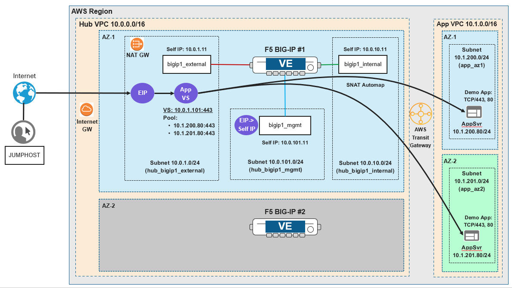

Lab Scenario
================================================================================

Two AWS VPCs are connected to an AWS Transit Gateway, which routes traffic between the VPCs. The **app** VPC contains two application server instances (each in a different availability zone). The **hub** VPC contains two BIG-IP VE instances (each in a different availability zone).

Only one of the BIG-IP instances and the two application servers are needed in this lab module.

You will use VSCode with the F5 Extension to examine a qkview and to deploy applications with AS3.

**Network Diagram**

