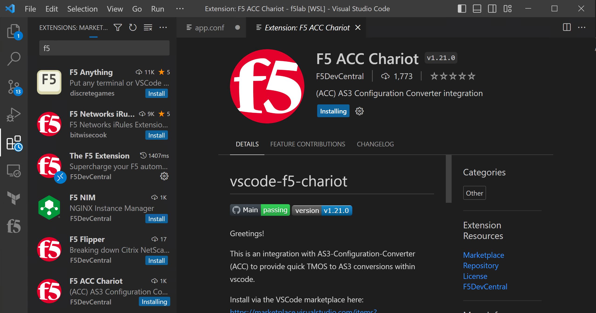

Install The F5 Extension and the F5 ACC Chariot Extension
================================================================================

Earlier in the lab you opened another VSCode window where you inspected and then edited the Terraform file.
That VSCode window shows WSL in the lower left green panel and has a blue status bar like this:

Within the VSCode window that is connected to WSL, navigate to the Extensions menu.  You may either press the Extensions icon or use the CTL + Shift + X shortcut.
Search for F5, select the extension “The F5 Extension”, then Install.

.. image:: ./images/installWithinCode_11.04.2020.gif
   :alt: Animated GUI
   :align: left
   :width: 80%

In the list of extensions related to F5, you will also see F5 ACC Chariot, click Install.

Overview of the F5 Extension
--------------------------------------------------------------------------------

The F5 Extension enhances your ability to write (A)utomated (T)ool(C)hain declarations with snippets, examples and declaration 
schema validation, and also assists with connecting, deploying, retrieving and updating declarations on F5 devices.

It can also help with iRules/iApps, BIG-IQ, and regular configuration/migration.  Below are some of the high level features:

- GET/POST/DELETE of all ATC services, including FAST/AS3/DO/TS/CF
- links to quickly open related ATC documentation
- Direct access to ATC examples from git repo
- Install/UnInstall of ATC rpms
- Convert JSON <-> YAML
- Hovers to view decoded information for (certificates/base64)
- Extract TMOS applications (per virtual server)
- Write, deploy and modify iRules/iApps (with vscode-irule extension for language support)

   .. note:: 
      Full documentation can be read here - https://f5devcentral.github.io/vscode-f5/#/README 