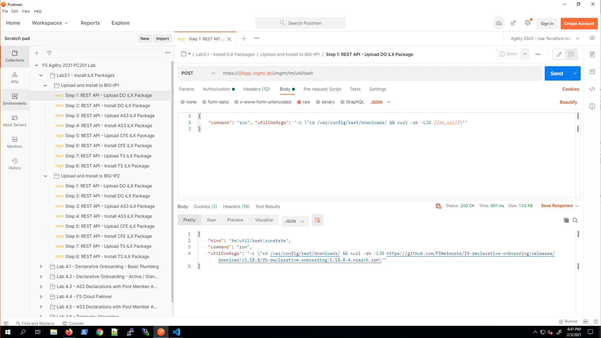
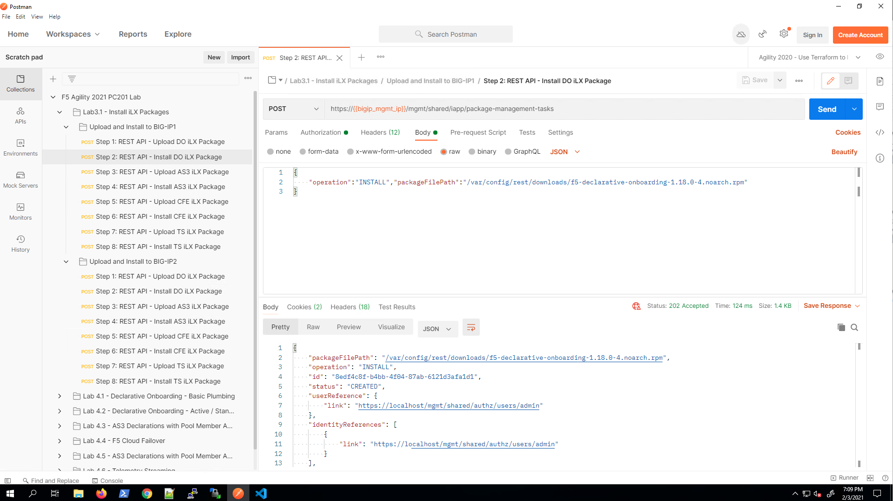
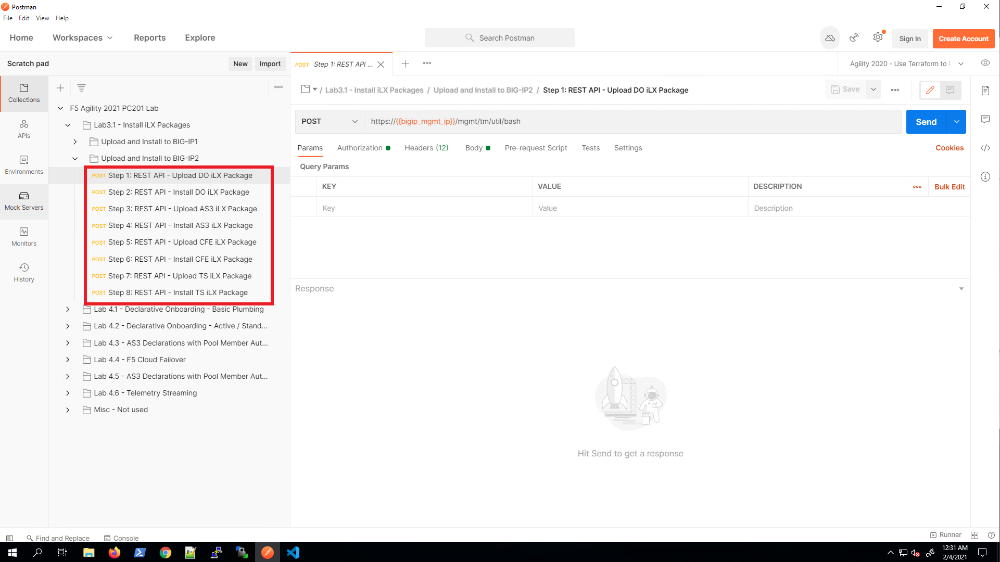
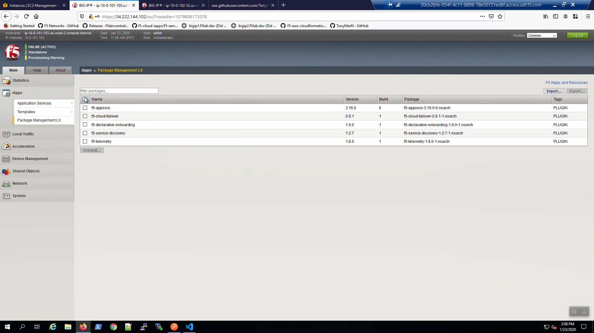
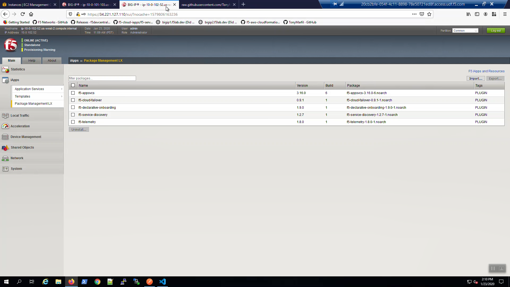

** OLD Content **
============================

Install iControl LX Extensions
-------------------------------

iControl LX Extensions are delivered as TMOS-independent RPM files. You *can* automatically install iControl LX packages using cloud-init and would probably do so in production to save this step.

More info:

https://clouddocs.f5.com/cloud/public/v1/shared/cloudinit.html

We'll install the following iControl LX Extensions via the REST API using Postman in this lab.

- Declarative Onboarding (DO): F5 Declarative onboarding uses a declarative model to initially configure a BIG-IP device with all of the required settings to get up and running. This includes system settings such as licensing and provisioning, network settings such as VLANs and Self IPs, and clustering settings if you are using more than one BIG-IP system.
- Application Services 3 Extension (AS3): Application Services 3 Extension is a flexible, low-overhead mechanism for managing application-specific configurations on a BIG-IP system. AS3 uses a declarative model: you provide a JSON declaration rather than a set of imperative commands.
- Service Discovery: Service discovery installs with AS3 and enables the BIG-IP system to automatically update members in a load balancing pool based on cloud application hosts.
- Cloud Failover Extension (CFE): The F5 Cloud Failover Extension provides L3 failover functionality in cloud environments, effectively replacing Gratuitous ARP (GARP). Cloud Failover Extension uses a declarative model: you provide a JSON declaration using a single REST API call.
- Telemetry Streaming (TS): Installing the Telemetry Streaming Extension on BIG-IP enables you to declaratively aggregate, normalize, and forward statistics and events from the BIG-IP to a consumer application by POSTing a single TS JSON declaration to TS’s declarative REST API endpoint.

Install F5 Declarative Onboarding Extension
^^^^^^^^^^^^^^^^^^^^^^^^^^^^^^^^^^^^^^^^^^^

From Postman, "Lab 3.1 - Install ILX Packages" => "Upload and Install to BIG-IP1" => "Step 1: REST API - **Upload** DO iLX Package" => [Send]

From Postman, "Lab 3.1 - Install ILX Packages" => "Upload and Install to BIG-IP1" => "Step 2: REST API - **Install** DO iLX Package" => [Send]

Install the remaing iLX Extensions (Application Services 3, Service Discovery, Cloud Failover, and Telemetry Streaming)
^^^^^^^^^^^^^^^^^^^^^^^^^^^^^^^^^^^^^^^^^^^^^^^^^^^^^^^^^^^^^^^^^^^^^^^^^^^^^^^^^^^^^^^^^^^^^^^^^^^^^^^^^^^^^^^^^^^^^^^

Upload and and install the remaining extensions by running **Steps 3-8** in Postman "Lab 3.1 - Install ILX Packages" => "Upload and Install to BIG-IP1"

.. image:: ./images/7_postman_install_remaining_bigip1.png
       :scale: 50%

Once complete, install the iLX Extensions to BIG-IP2 by running **Steps 1-8** in Postman "Lab 3.1 - Install ILX Packages" => "Upload and Install to **BIG-IP2**"

Confirm installation of the iLX Extensions
^^^^^^^^^^^^^^^^^^^^^^^^^^^^^^^^^^^^^^^^^^
Big-IP1 => iApps => Package Management LX => confirm all five packages installed. Note: f5-service-discovery comes with the f5-appsvcs package.

Do the same for Big-IP2.

