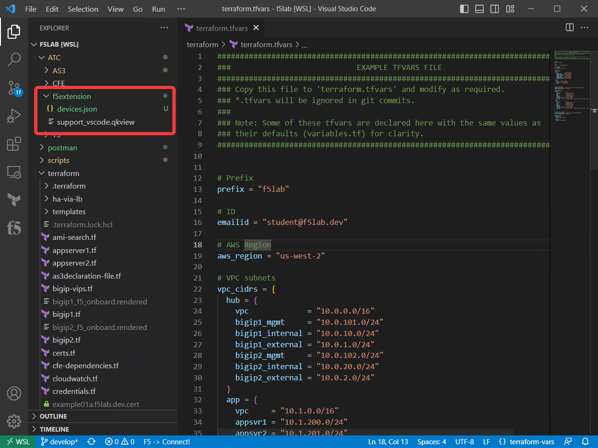
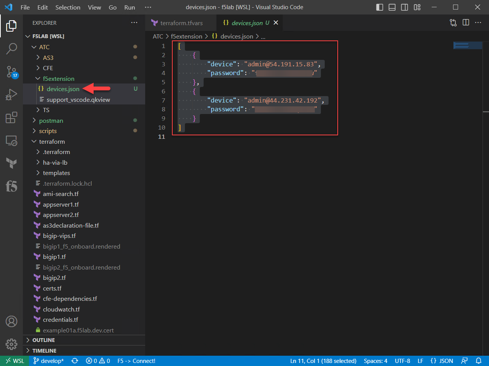
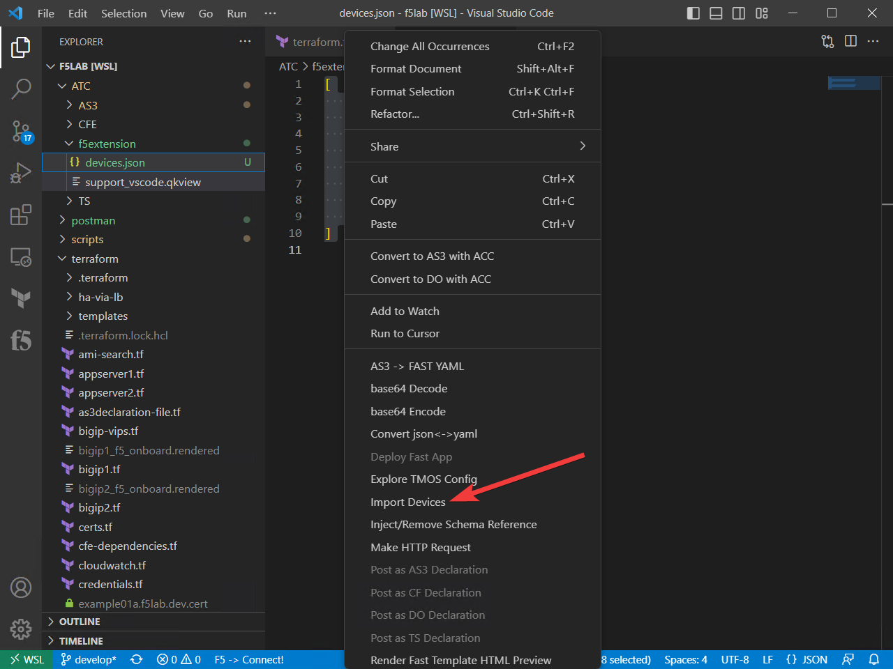

Using the F5 Extension to deploy applications and update ATC components
================================================================================

Connecting to your BIG-IP Devices
--------------------------------------------------------------------------------
Just under the VSCode icon is the explore icon, select this and navigate to the /ATC/f5extension directory.
Open the devices.json file.

Highlight all of the text in the json file.

Then right click or cmd click on the highlighted text.  Select Import Devices.

We are using this file to import multiple devices all at once, including the passwords.  This can also be 
done without the passwords, so that you would have to add the passwords manually when connecting.

Select the F5 icon in the left navigation menu.  Connect to each of the BIG-IP hosts.  Notice that upon 
successful connection that there is a hexagon with an F5 in the middle.

.. image:: ./images/4f5Extension_deviceconnect.png
  :width: 10%
  :alt: Connected devices

 

Verify AS3 configuration
-------------------------------------------------------------------------------

Deploy AS3 configuration
-------------------------------------------------------------------------------
Make sure you are connected to BIG-IP1.  

Go to the Management GUI on BIG-IP1 notice it is set to Standby. Leave it that way for now.

Switch to the file view in VSCode.

Navigate to the ATC/AS3 directory.

Step1 Basic deployment with Autodiscovery

Step2 HA deployment

Step3 HA deployment wih modern protocols

Step4 HTTPS deployment that uses ECDSA certificates

Test application access
--------------------------------------------------------------------------------
Placeholder

Updating F5 Automation Toolchain Extensions
--------------------------------------------------------------------------------

