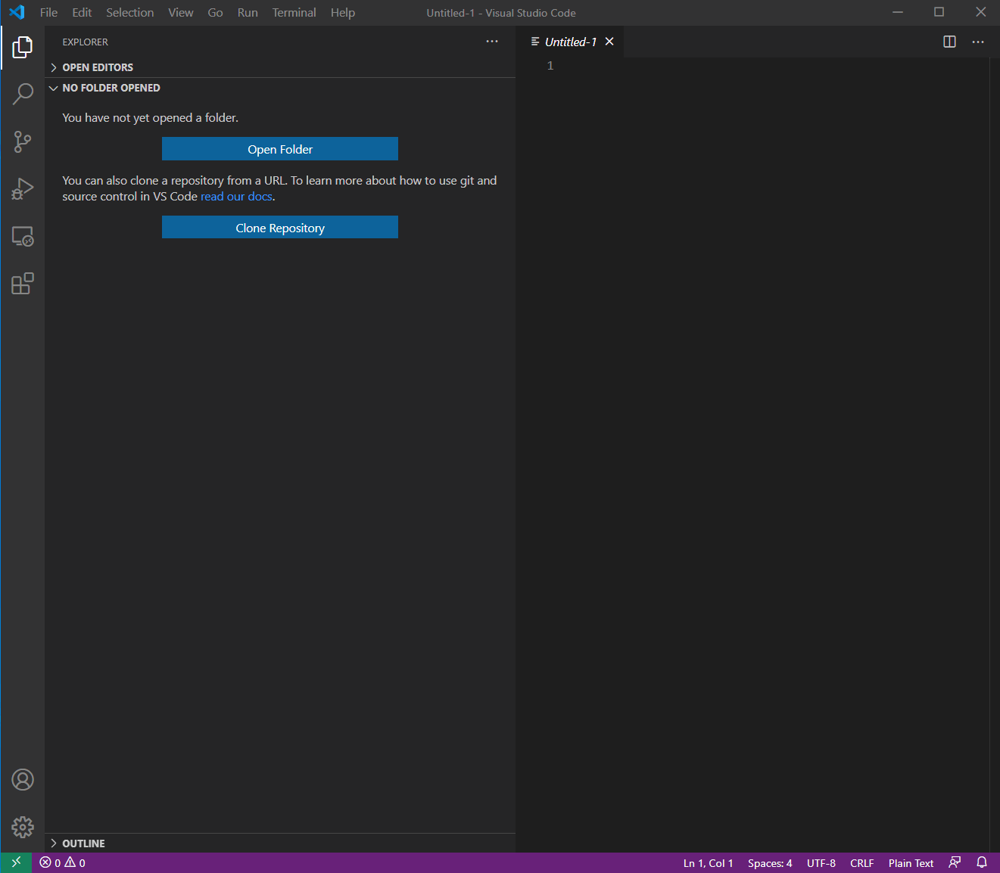

Install The F5 Extensions
================================================================================
Navigate to the Extensions manager on the VS Code left-hand menu,.  You may either click on the Extensions icon or use the <CTRL-Shift-X> shortcut.

Search for F5, select the extension “The F5 Extension”, then Install.

In the list of extensions related to F5, you should also see F5 ACC Chariot, click Install.

Click on the F5 logo in the left-hand menu.  This will launch the F5 Extension.
You should see three panels on the left, one for BIG-IP Hosts, Documentation/Examples, and Config Explorer.

Examine a qkview of an existing device
================================================================================

Use VS Code F5 Extension to convert a configuration to AS3 format
================================================================================
Placeholder

Review AS3 declaration
================================================================================
Placeholder

Connecting to your BIG-IP Devices
================================================================================
Placeholder

Updating F5 Automation Toolchain Extensions
================================================================================
Placeholder

Deploy AS3 configuration
================================================================================
Placeholder
**Create a device and connect**

Select `Add Host` in the `F5: Hosts` view.  Then type in device details in the \<user\>@x.x.x.x format, hit `Enter` to submit

 .. image:: ./images/addDeviceConnect_11.04.2020.gif
   :alt: Animated GUI
   :align: left
   :width: 80%

Test application access
================================================================================
Placeholder

