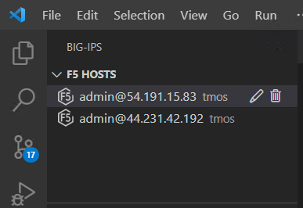

Connecting the F5 Extension to your devices and verifying the state of AS3
================================================================================

Connecting to your BIG-IP Devices
--------------------------------------------------------------------------------
Just under the VSCode icon is the explore icon, select this and navigate to the /ATC/f5extension directory.
Open the devices.json file.

.. image:: ./images/1f5Extension_deviceimport.png
  :width: 80%
  :alt: Directory image

Highlight all of the text in the json file.

Then right click or cmd click on the highlighted text.  Select Import Devices.

.. image:: ./images/3f5Extension_deviceimport.png
  :width: 80%
  :alt: Directory image

We are using this file to import multiple devices all at once, including the passwords.  This can also be 
done without the passwords, so that you would have to add the passwords manually when connecting.

Select the F5 icon in the left navigation menu.  Connect to each of the BIG-IP hosts.  Notice that upon 
successful connection that there is a hexagon with an F5 in the middle.

Verify AS3 state on each device
-------------------------------------------------------------------------------

