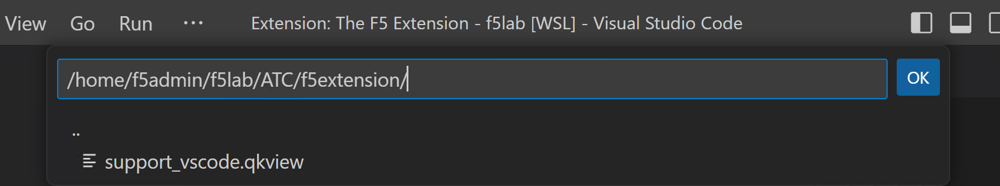
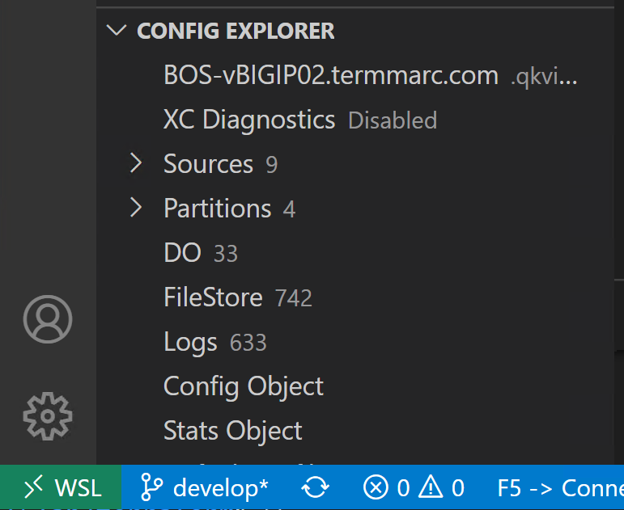

Examine a qkview of an existing device 
================================================================================

Select the F5 icon in the left navigation panel.  

.. image:: ./images/4_vscode_OpenExtension.png
   :alt: F5 Extension Icon
   :align: left
   :width: 80%

In the lower left part of the screen, select the Imoprt.conf/UCS/QKVIEW from local file.

.. image:: ./images/5_vscode_openqkviewbutton.png
   :alt: Open qkview button
   :align: left
   :width: 80%

In the toolbar that appears, navigate to the /home/f5admin/f5lab/ATC/f5extension directory.
Select the qkview file.

It will take a little while to ingest the file and read it.
When it is done, you will see the machine name of the device and a tree structure below it.

Use VS Code F5 Extension to convert a configuration to AS3 format
--------------------------------------------------------------------------------
Placeholder

Review AS3 declaration
--------------------------------------------------------------------------------
Placeholder

Use VS Code F5 Extension to convert a configuration to AS3 format
================================================================================
Placeholder

Review AS3 declaration
================================================================================
Placeholder

Connecting to your BIG-IP Devices
================================================================================
Placeholder

Updating F5 Automation Toolchain Extensions
================================================================================
Placeholder

Deploy AS3 configuration
================================================================================
Placeholder
**Create a device and connect**

Select `Add Host` in the `F5: Hosts` view.  Then type in device details in the \<user\>@x.x.x.x format, hit `Enter` to submit

 .. image:: ./images/addDeviceConnect_11.04.2020.gif
   :alt: Animated GUI
   :align: left
   :width: 80%

Test application access
================================================================================
Placeholder

