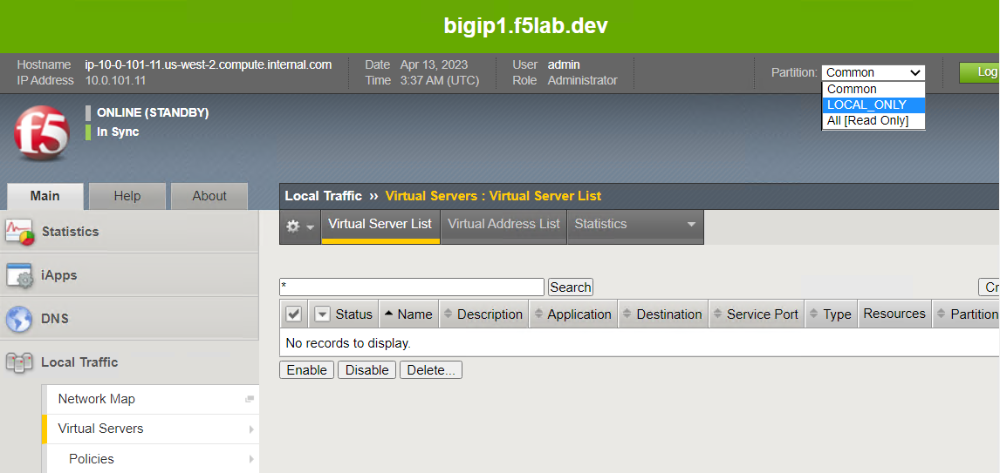
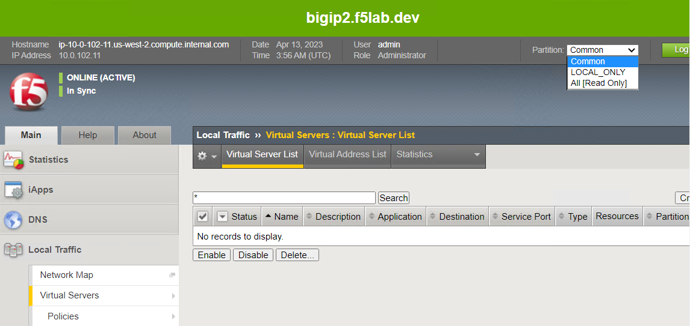
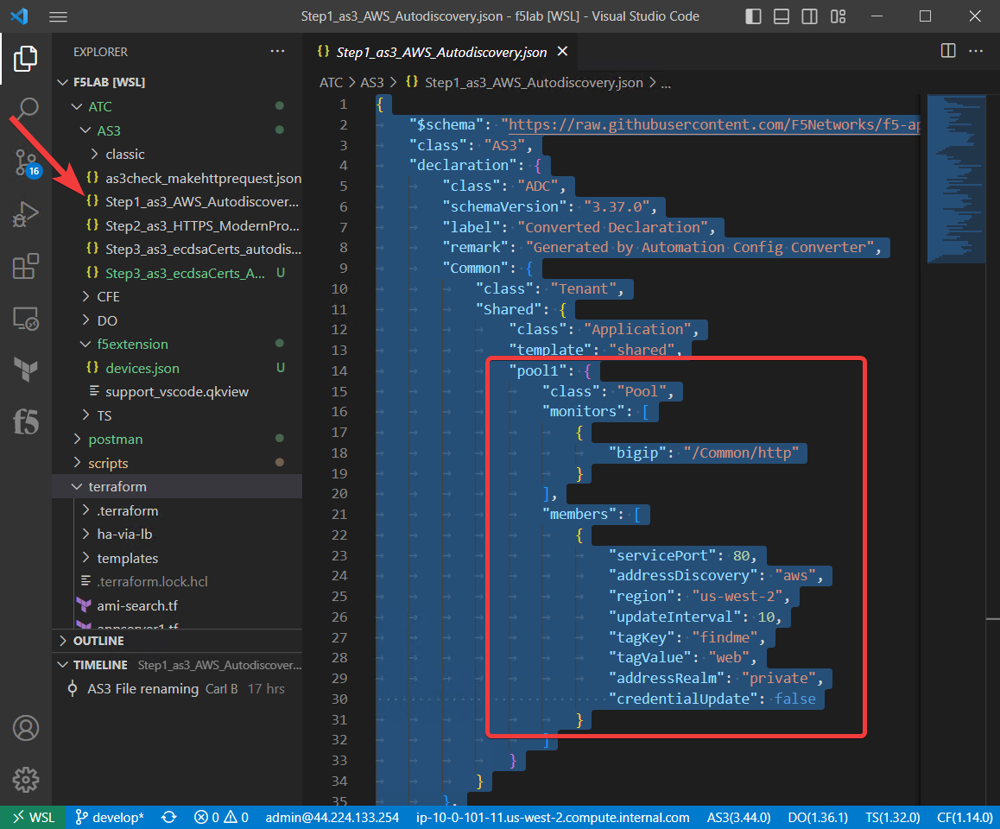
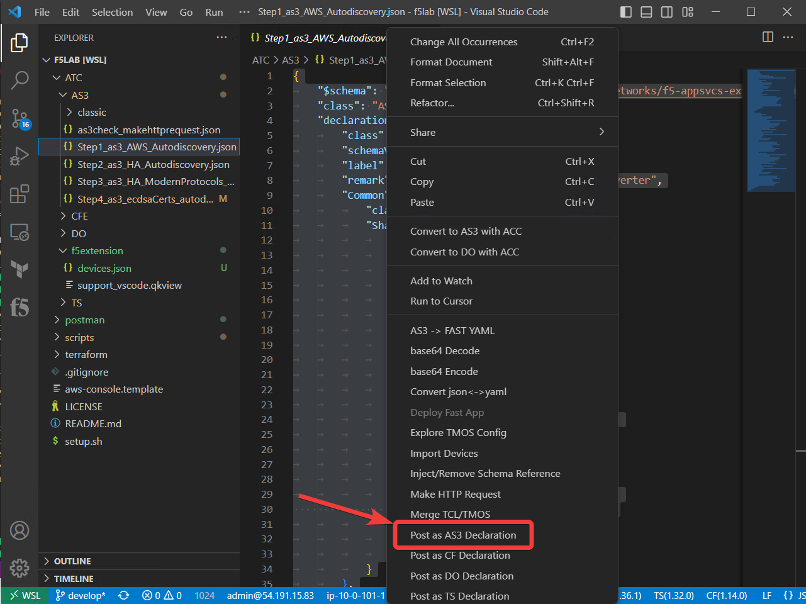
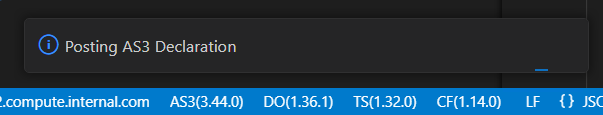
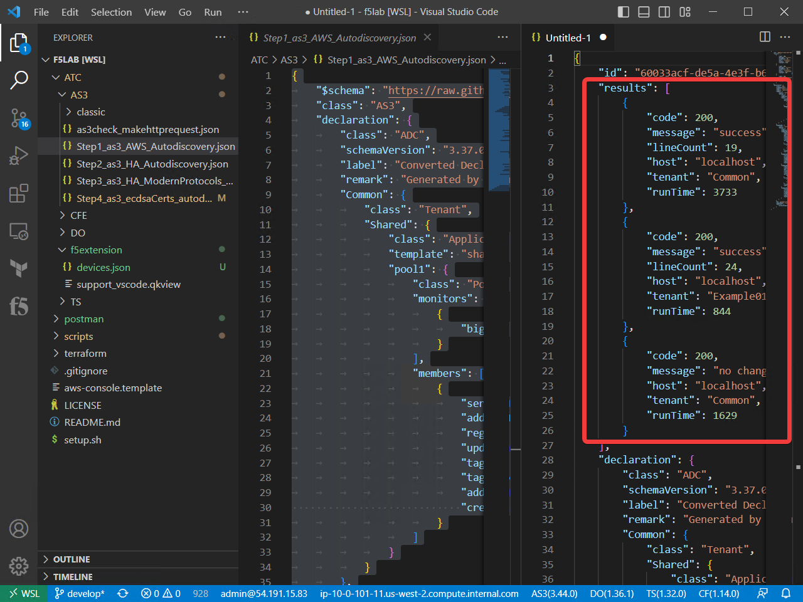
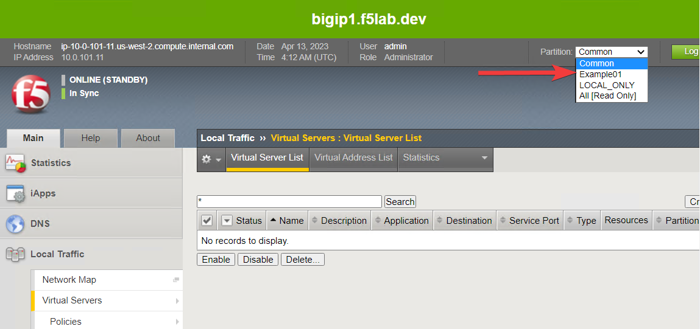
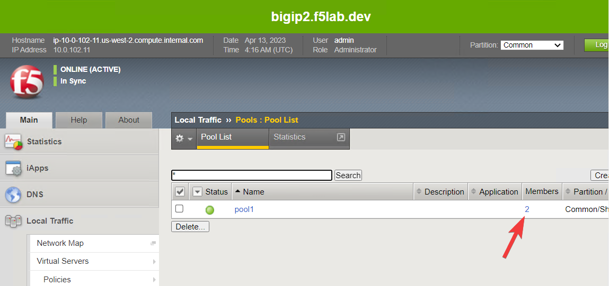
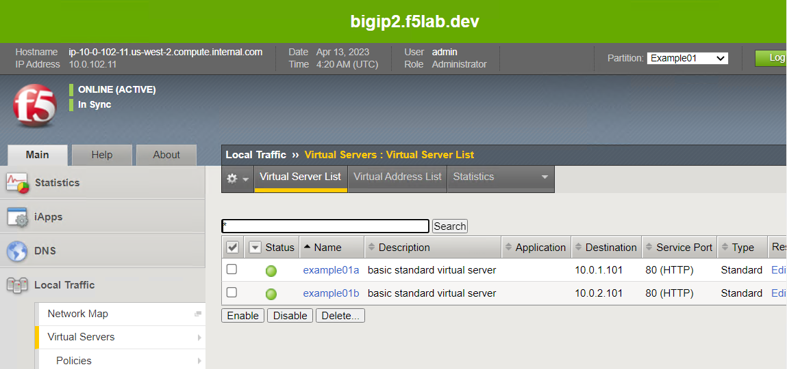

Using the F5 Extension to Deploy AS3 declarations
===============================================================================
Make sure you are connected to BIG-IP1 in the F5 Extension.

Go to the Management GUI on BIG-IP1 notice it is set to Standby. Leave it that way for now.

In the Management GUI, navigate to Local Traffic --> Virtual Servers and see that you only have two partions with no configuration.

BIG-IP1

Big-IP2

Close the json file you had open to prepare for the next steps.

Switch to the file view in VSCode.

Navigate to the ATC/AS3 directory.

Step1 Basic deployment with Autodiscovery
--------------------------------------------------------------------------------

Step2 HA deployment

Step3 HA deployment wih modern protocols

Step4 HTTPS deployment that uses ECDSA certificates

Test application access
--------------------------------------------------------------------------------
Placeholder

