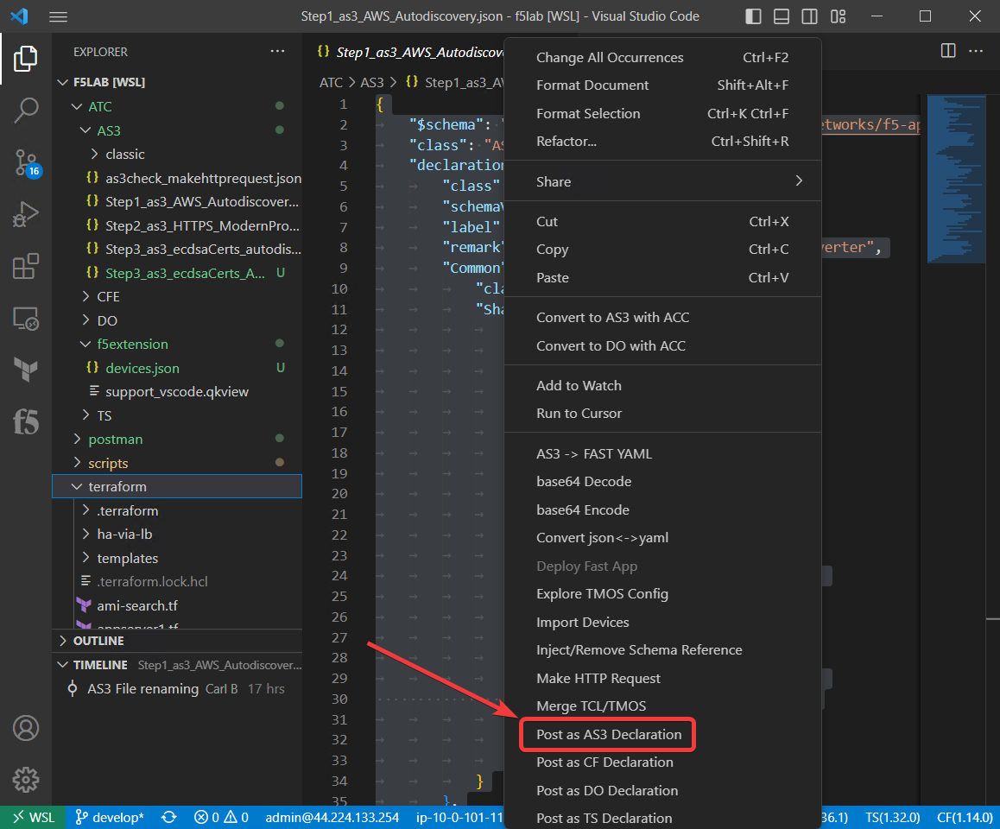
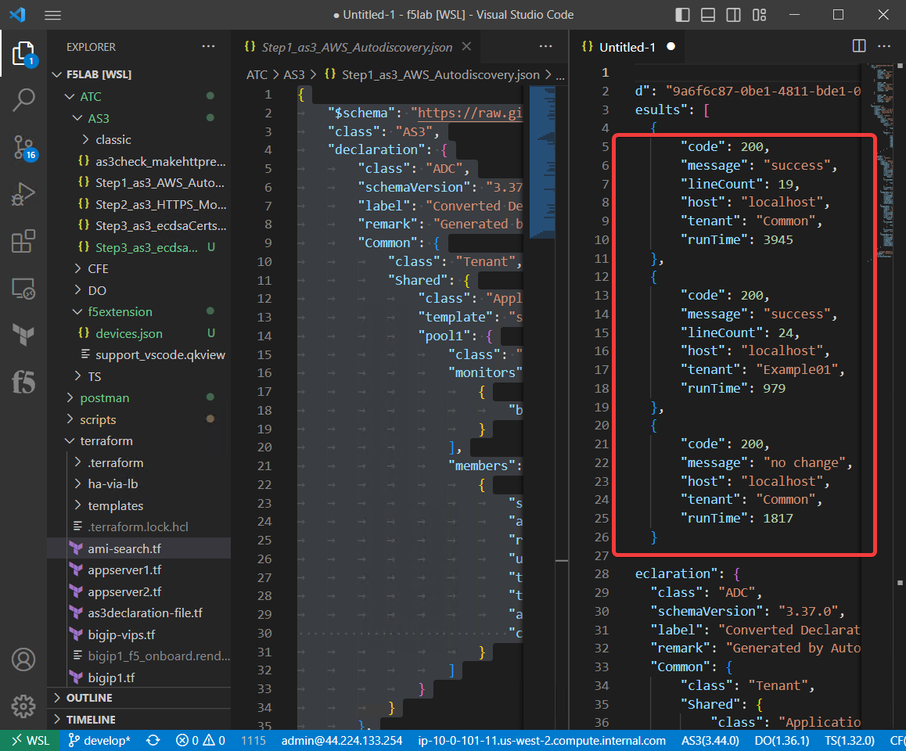
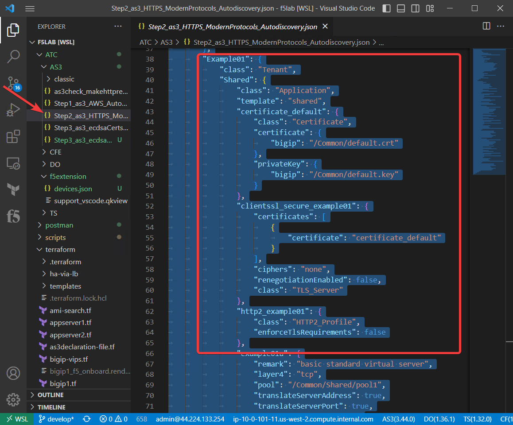
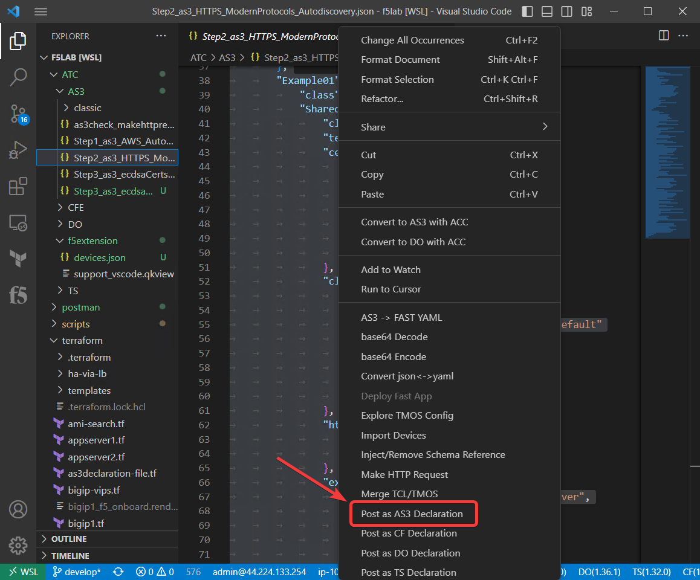
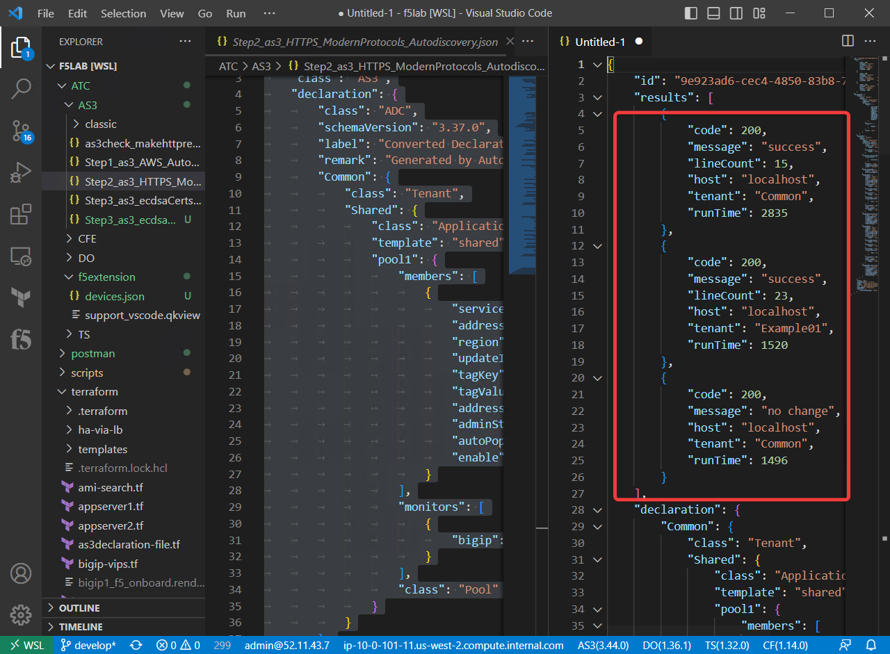

Using the F5 Extension to Deploy AS3 declarations
===============================================================================
Make sure you are connected to BIG-IP1 in the F5 Extension.

Go to the Management GUI on BIG-IP1 notice it is set to Standby. Leave it that way for now.

In the Management GUI, navigate to Local Traffic --> Virtual Servers and see that you only have two partions with no configuration.

BIG-IP1

Big-IP2

Close the json file you had open to prepare for the next steps.

Switch to the file view in VSCode.

Navigate to the ATC/AS3 directory.

Step1 Create HTTP Virtual Servers with AS3 and Service Discovery
--------------------------------------------------------------------------------

.. image:: ./images/02as3_step1verify1pool.png
    :alt: BIGIP management GUI shared pool verification
    :width: 80%

Step2 Enable modern protocols such as HTTP/2 with AS3 and Service Discovery
--------------------------------------------------------------------------------
Close the untitled panel
close the Step1 declaration.
Open Step3_as3_HTTPS_Autodiscovery.json

.. todo:: 
    screengrabs and narrative

.. image:: ./images/02as3_step2verify1.png
    :alt: BIGIP management GUI partition verification
    :width: 80%

.. image:: ./images/02as3_step2verify1pool.png
    :alt: BIGIP management GUI shared pool verification
    :width: 80%

.. image:: ./images/02as3_step2verify1vs.png
    :alt: BIGIP management GUI VS verification
    :width: 80%

.. image:: ./images/02as3_step2verify2.png
    :alt: BIGIP management GUI partition verification
    :width: 80%

.. image:: ./images/02as3_step2verify2pool.png
    :alt: BIGIP management GUI shared pool verification
    :width: 80%

.. image:: ./images/02as3_step2verify2vs.png
    :alt: BIGIP management GUI VS verification
    :width: 80%

Step3 Enable modern protocols such as HTTP/2 with AS3 and Service Discovery
--------------------------------------------------------------------------------
Close the untitled panel
close the Step1 declaration.
Open Step2_as3_HTTPS_Autodiscovery.json

.. todo:: 
    screengrabs and narrative

.. image:: ./images/02as3_step2verify1.png
    :alt: BIGIP management GUI partition verification
    :width: 80%

.. image:: ./images/02as3_step2verify1pool.png
    :alt: BIGIP management GUI shared pool verification
    :width: 80%

.. image:: ./images/02as3_step2verify1vs.png
    :alt: BIGIP management GUI VS verification
    :width: 80%

.. image:: ./images/02as3_step2verify2.png
    :alt: BIGIP management GUI partition verification
    :width: 80%

.. image:: ./images/02as3_step2verify2pool.png
    :alt: BIGIP management GUI shared pool verification
    :width: 80%

.. image:: ./images/02as3_step2verify2vs.png
    :alt: BIGIP management GUI VS verification
    :width: 80%

Test application access
--------------------------------------------------------------------------------

