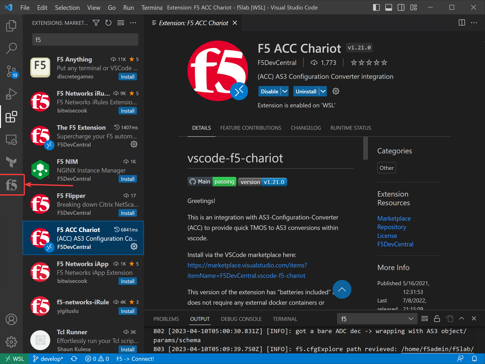
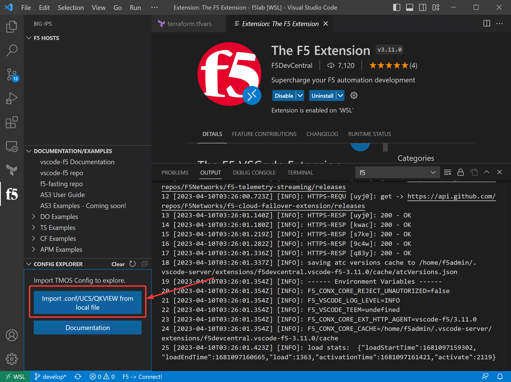

Examine a qkview
================================================================================

Select the F5 icon in the left navigation panel.  

In the lower left part of the screen, select the Imoprt.conf/UCS/QKVIEW from local file.

In the toolbar that appears, navigate to the /home/f5admin/f5lab/ATC/f5extension directory.
Select the qkview file.

.. image:: ./images/6_vscode_openqkview_file.png
   :alt: Open qkview file
   :align: left
   :width: 80%

It will take a little while to ingest the file and read it.
When it is done, you will see the machine name of the device and a tree structure below it.

.. image:: ./images/6_vscode_qkviewopened.png
   :alt: Open qkview file
   :align: left
   :width: 30%

Using the F5 Extension to Explore a qkview
--------------------------------------------------------------------------------
Lets take a quick tour of what you can see in the config explorer.

First item under the Config Explorer is the name of the system that generated the qkview.

**XC Diagnostics** is disabled by default.  Enabling this allows you to determine the readiness to migrate the configuration elements into F5's SaaS offering.

**Sources** is where all of the conf files can be examined.

**Partitions** is where you can drill down to the applications.  This is where we will do some digging.

The remaining menu items can be explored later

.. todo:: 
   Narrative and formatting

Convert an application/virtual server into an AS3 Declaration
--------------------------------------------------------------------------------

**Partitions** is where you can drill down to the applications.  This is where we will do some digging.

* pick an app
* highlight the text in the app conf window and select convert to as3 declaration.
 
   .. image:: ./images/03f5ext_qkviewImport.png
      :alt: qkview Import
      :width: 80%

   .. image:: ./images/03f5ext_importcomplete.png
      :alt: qkview Import completed
      :width: 80%

   .. image:: ./images/03f5ext_convertas3.png
      :alt: Convert itwiki3
      :width: 80%

   .. image:: ./images/03f5ext_convertas3_result.png
      :alt: AS3 output
      :width: 80%

