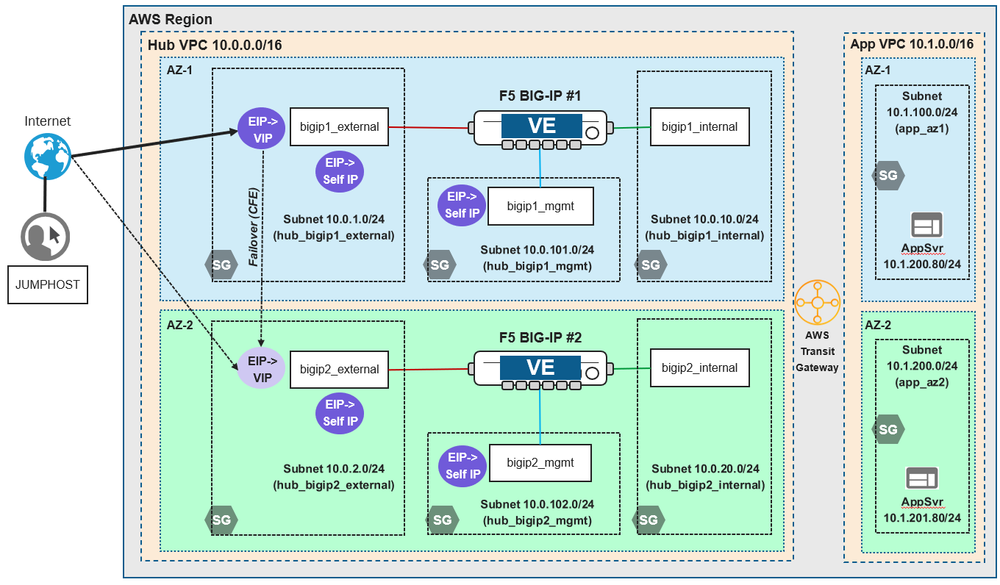

Lab Scenario
================================================================================

Two AWS VPCs are connected to an AWS Transit Gateway, which routes traffic between the VPCs. The **app** VPC contains two application server instances (each in a different availability zone). The **hub** VPC contains two BIG-IP VE instances (each in a different availability zone).

You will configure HA failover via the F5 Cloud Failover Extension (pre-installed as part of the initial onboarding) and test a failover between BIG-IP instances.

**Network Diagram**

