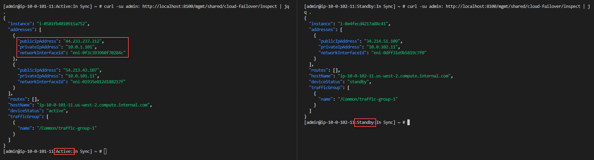
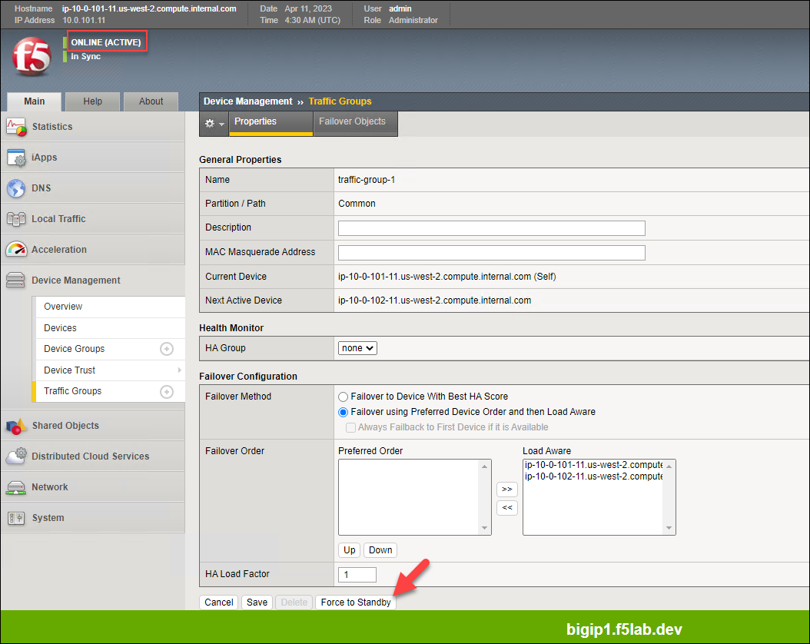
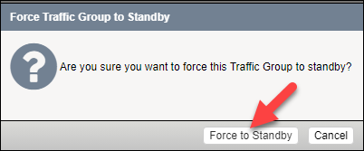
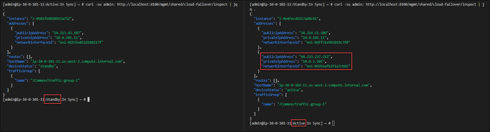

Check CFE Status
================================================================================

This was performed in module 2. ...

Configure HA cluster
================================================================================

During the initial onboarding process, the two BIG-IPs were configured as followings:

- Same Device Group
- Sync-Failover sync group
- Config sync on 'internal' interface

Configure and deploy CFE
================================================================================

.. note:: 

   Before sending the CFE declaration to the BIG-IPs, ensure that BIG-IP #1 is ACTIVE. If BIG-IP #2 is ACTIVE, then force it to STANDBY before proceeding.

use Postman to send the CFE declaration to both devices....

Application configuration (AS3)
================================================================================

AS3 config from previous module should be synchronized between the two BIG-IPs.

Test HA failover
================================================================================

...

|

|

|

Remove CFE Configuration
================================================================================

Send base declaration with no custom settings

