Configure HA cluster
================================================================================

During the initial onboarding process, the two BIG-IPs were configured as followings:

- Same Device Group
- Sync-Failover sync group
- Config sync on 'internal' interface

Configure and deploy CFE
================================================================================

.. note:: 

   Before sending the CFE declaration to the BIG-IPs, ensure that BIG-IP #1 is ACTIVE. If BIG-IP #2 is ACTIVE, then force it to STANDBY before proceeding.

On Big-IP2 make sure you are in the common partition and navigate to Device Management => Devices and select “ip-10-0-102-11.us-west-2.compute.internal.com (self)” from the list 

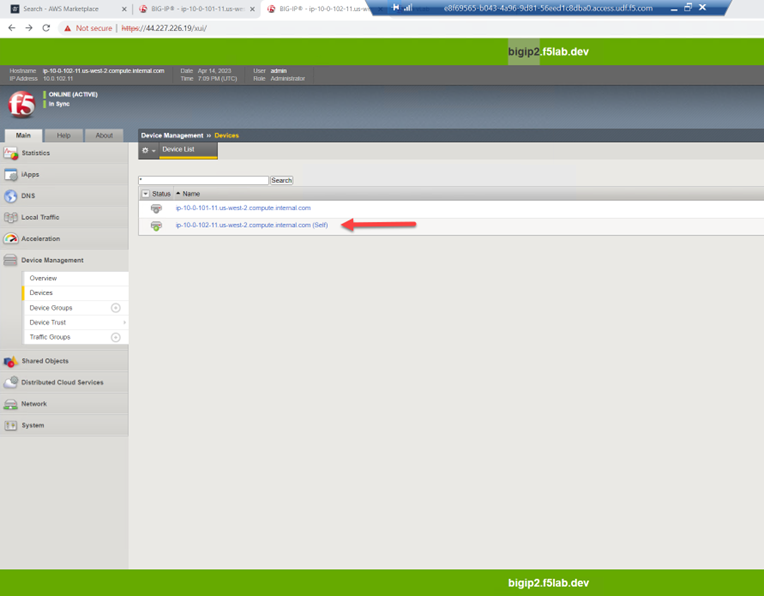

Scroll to the bottom of the page and click on [Force to Standby]

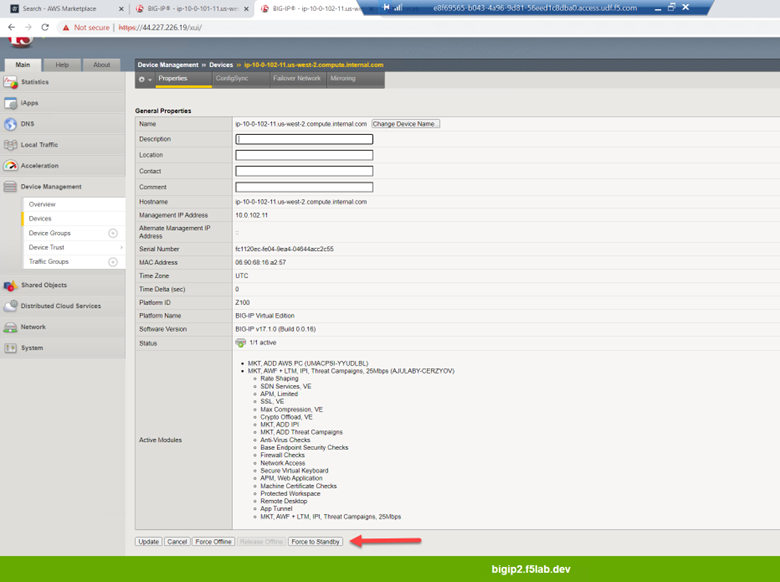

Once you have confirmed that BIG-IP1 is active, open Postman to send the CFE declaration to both devices.

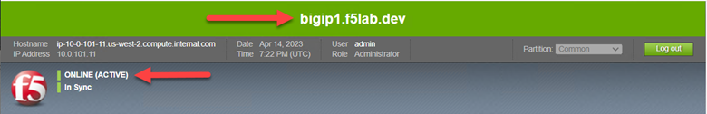

Use Postman to send the CFE declaration to both devices
================================================================================

From Postman, under Config – Cloud Failover Extension select “Step 1-A: bigip1 - CFE - Configure cloud failover” => [Send]. 

A “200 OK” response indicates the declaration was successfully posted.

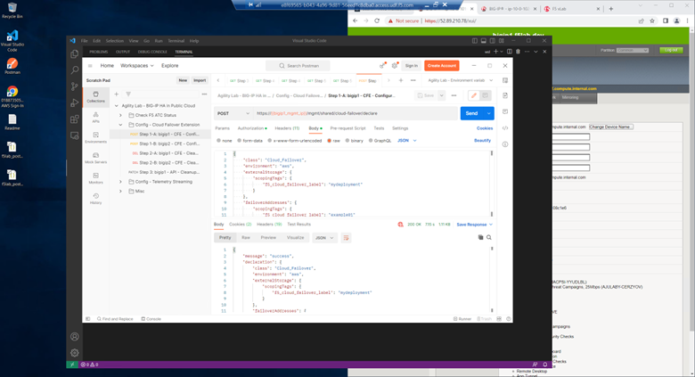

From Postman, under Config – Cloud Failover Extension select “Step 1-B: bigip2 - CFE - Configure cloud failover” => [Send]. 

A “200 OK” response indicates the declaration was successfully posted.

Test HA failover
================================================================================

From the Visual Studio Code Terminal, note the value of vip1_public_ip.

.. code-block:: bash

   terraform output vip1_public_ip

Open a new browser tab. Connect via HTTPS to vip1_public_ip or if you already have a tab open to the example application from a previous section, use that.

From the vscode terminal, SSH to the active BIG-IP and confirm the interfaces for the F5 Cloud Failover Extension is tracking:

.. code-block:: bash

   bigip1

.. code-block:: bash

   bash
   curl -su admin: http://localhost:8100/mgmt/shared/cloud-failover/inspect | jq .
   exit
   quit

From the vscode terminal, SSH to the standby BIG-IP and confirm the interfaces the F5 Cloud Failover Extension is tracking:

.. code-block:: bash

   bigip2

.. code-block:: bash

   bash
   curl -su admin: http://localhost:8100/mgmt/shared/cloud-failover/inspect | jq .
   

While still connected to the standby BIG-IP, perform a failover ‘dry-run’ to see what you can expect to happen during a failover event. Notice the “current” and “target” address mappings.

.. code-block:: bash

   curl -su admin: -X POST -d '{"action":"dry-run"}' http://localhost:8100/mgmt/shared/cloud-failover/trigger | jq .

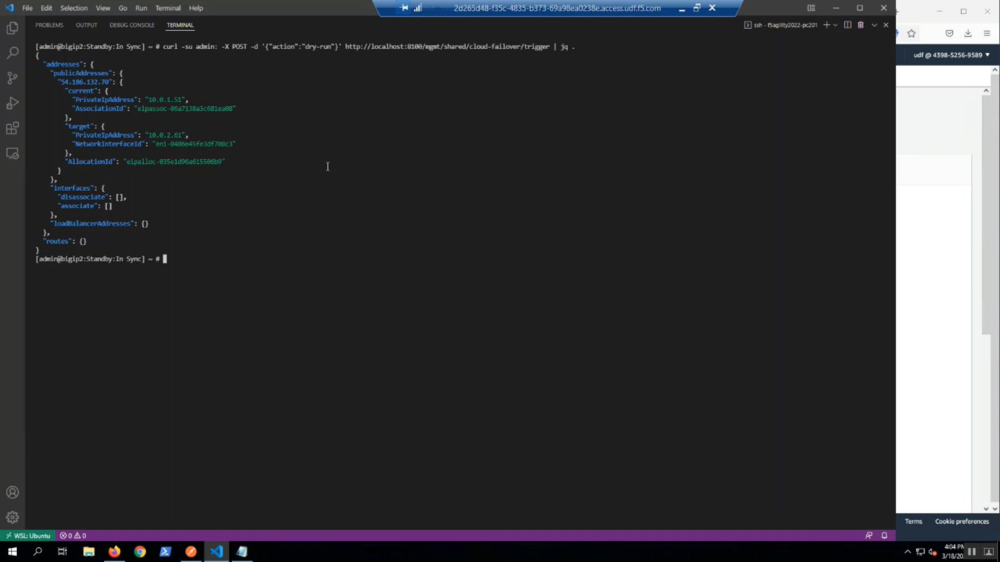

On the same standby BIG-IP, we will watch the logs before triggering a failover event.

.. code-block:: bash

   tail -f /var/log/restnoded/restnoded.log

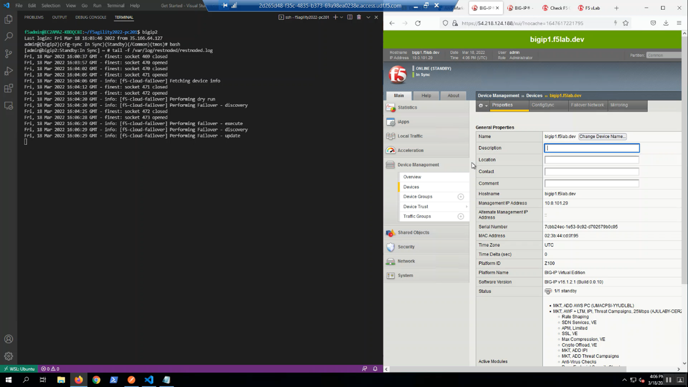

From Big-IP1, Device Management => Devices => bigip1.f5lab.dev.

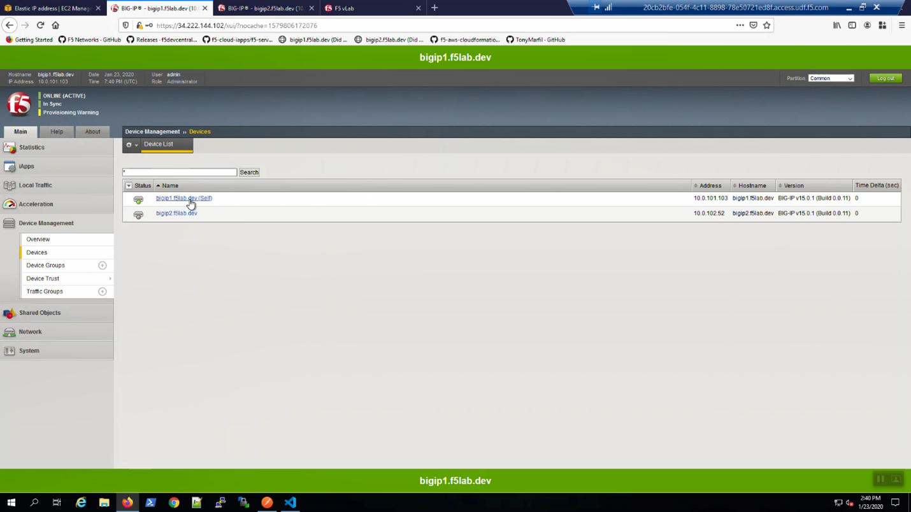

Force bigip1.f5lab.dev to standby. Click [Force to Standby].

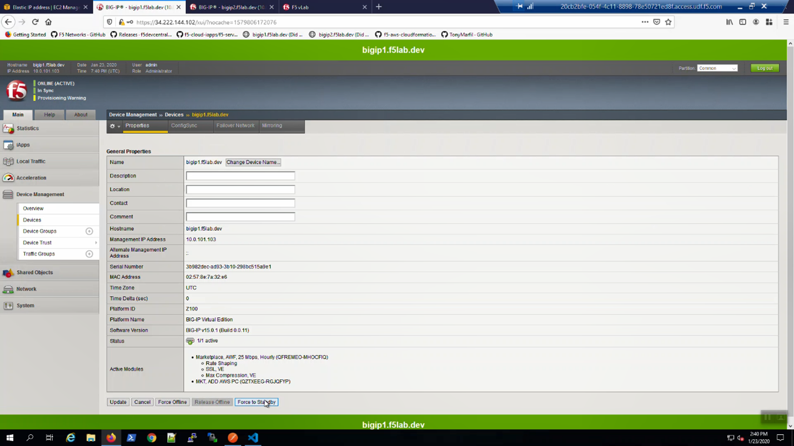

On Big-IP1, in the upper-left-hand corner, note “ONLINE (STANDBY)”.

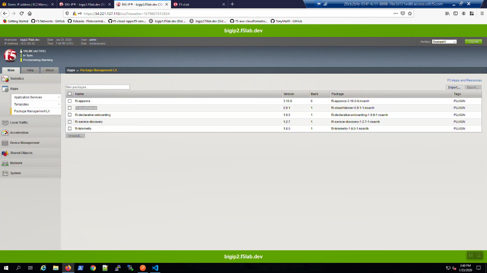

From Big-IP2, in the upper-left-hand corner, note “ONLINE (ACTIVE)”. Big-IP2 was immediately promoted to active and Big-IP1 demoted to standby.

From the AWS Console, Services => NETWORK & SECURITY => Elastic IPs. Select the Elastic IP (public IP) previously mapped to 10.0.1.51. Hit the refresh icon until you see the new mapping to 10.0.1.61 (Big-IP2).

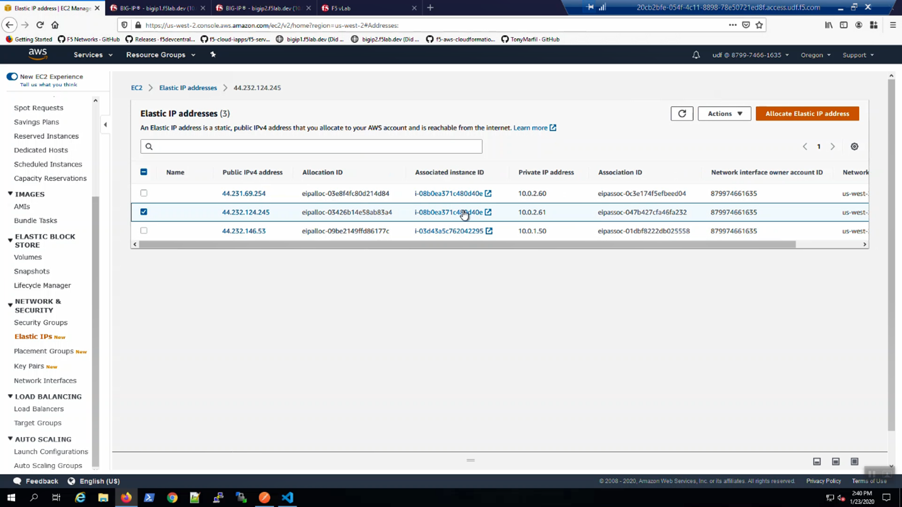

Back to the browser tab with the example application. <CTRL-F5> a few times to refresh the browser. We are using self-signed certificates in the lab. Bypass the TLS warnings. “Accept the Risk and Continue”.

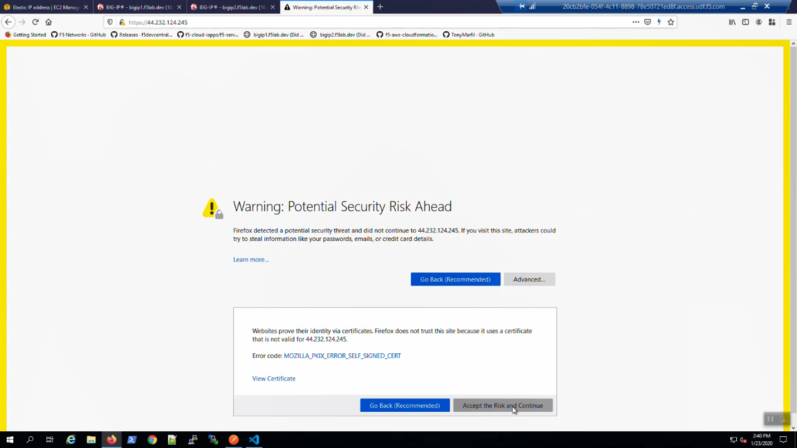

The example application reports which Availability Zone is serving up the content (pool member), not which Availability Zone is hosting the active Big-IP.

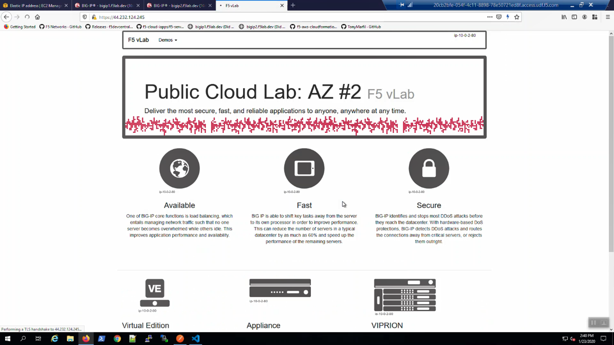

From Big-IP2, Device Management => Devices => bigip2.f5lab.dev.

Force bigip2.f5lab.dev to standby. Click [Force to Standby].

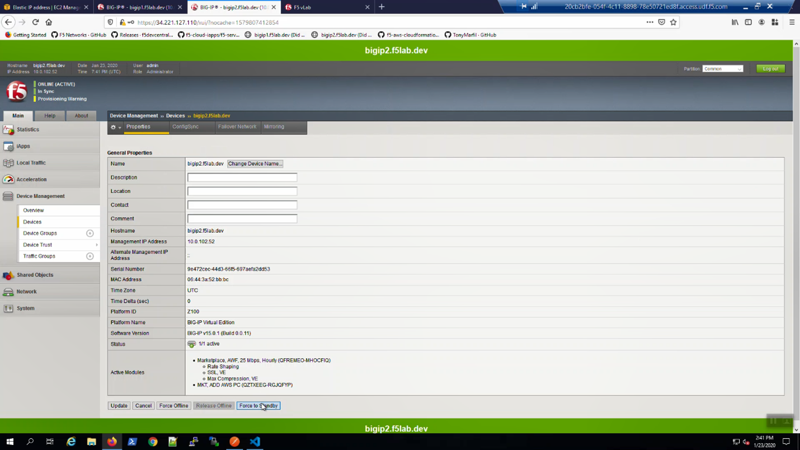

On Big-IP2, in the upper-left-hand corner, note “ONLINE (STANDBY)”.

.. image:: ./images/cfe-failover-test-9.png
   :align: left

From Big-IP1, in the upper-left-hand corner, note “ONLINE (ACTIVE)”. Big-IP1 is now back to active.

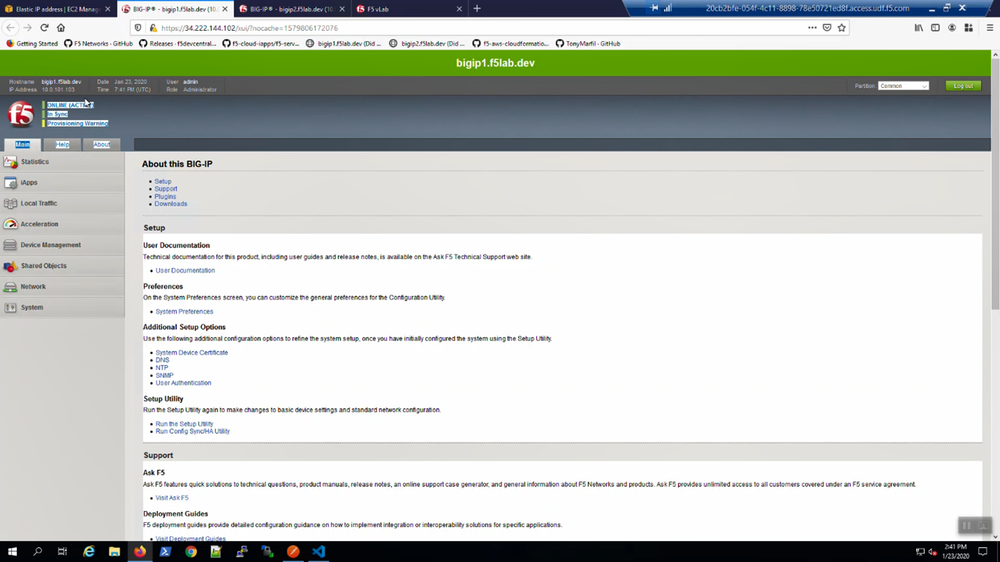

From the AWS Console, Services => NETWORK & SECURITY => Elastic IPs. Select the Elastic IP (public IP) previously mapped to 10.0.1.61. Hit the refresh icon until you see the new mapping back to 10.0.1.51 (Big-IP1).

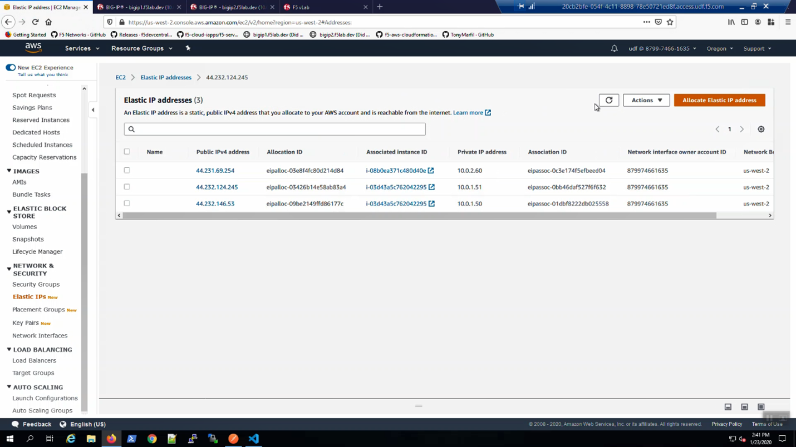

Back to the browser tab with the example application. <CTRL-F5> a few times to refresh the browser. We are using self-signed certificates in the lab. Bypass the TLS warnings. “Accept the Risk and Continue”.

|

Remove CFE Configuration and Remove BIGIP-2 from Device Group for next Module
================================================================================

From Postman, “Lab - F5 Cloud Failover” => “Step 2-A: bigip1 - CFE - Cleanup”. => [Send]. 

A “200 OK” response indicates the declaration was successfully posted.

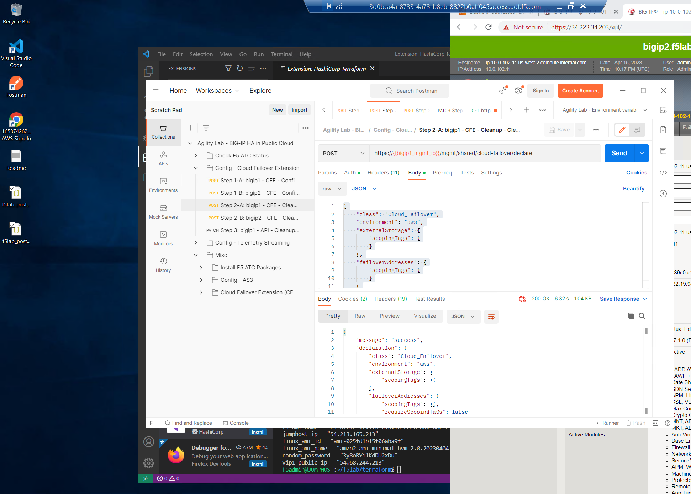

From Postman, “Lab - F5 Cloud Failover” => “Step 2-B: bigip2 - CFE - Cleanup”. => [Send]. 

A “200 OK” response indicates the declaration was successfully posted.

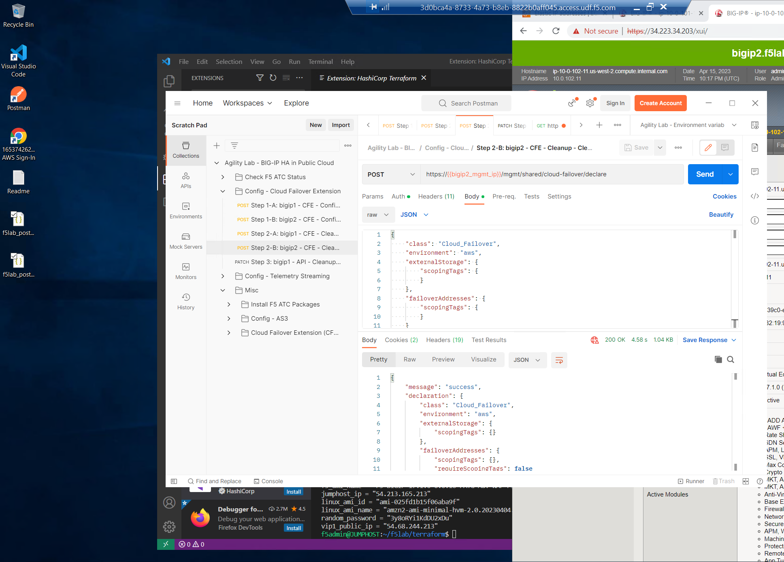

From Postman, “Lab - F5 Cloud Failover” => “Step 3: bigip1 - API - Cleanup”. => [Send]. 

A “200 OK” response indicates the declaration was successfully posted.

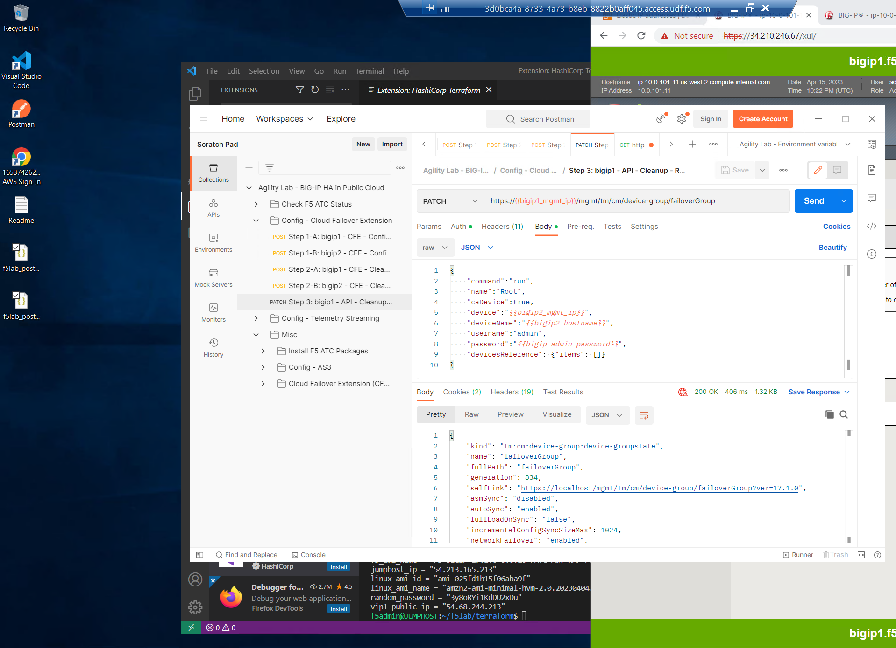

Verify that BIG-IP1 and BIG-IP2 are both in an Active state and not a member of the Device Group

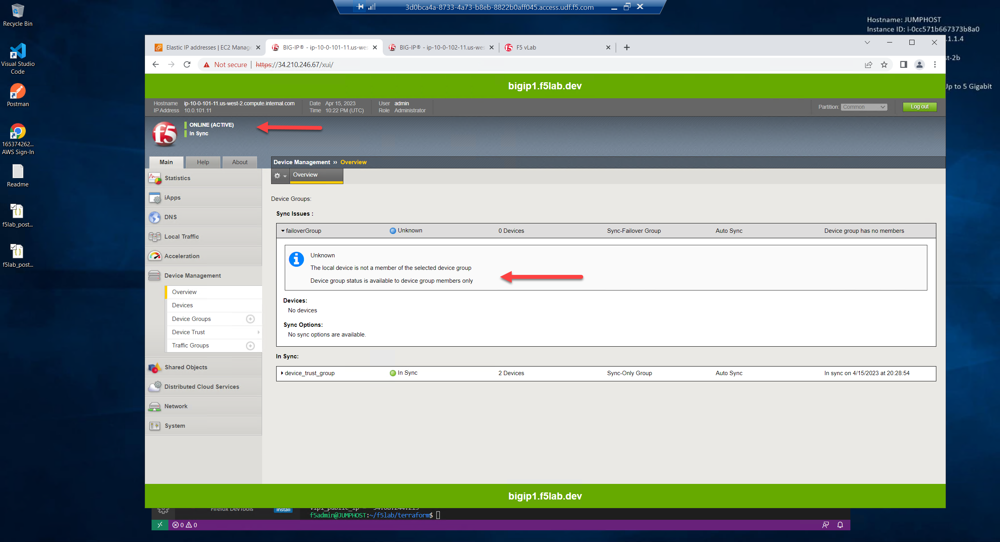
|
