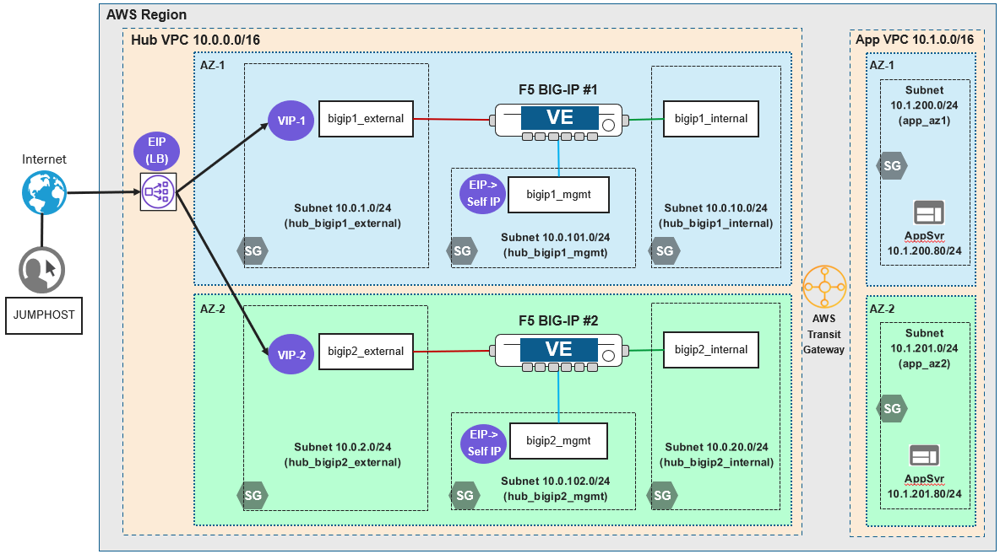

Lab Scenario
================================================================================

Two AWS VPCs are connected to an AWS Transit Gateway, which routes traffic between the VPCs. The **app** VPC contains two application server instances (each in a different availability zone). The **hub** VPC contains two BIG-IP VE instances (each in a different availability zone).

You will configure HA failover via an AWS Network Load Balancer and test a failover between BIG-IP instances.

**Network Diagram**

Active-Active BIG-IP VE Instances
================================================================================

Changing the Active/Standby setup of the two BIG-IP to an Active/Active arrangement leveraging the existing Load Balancer created in the prior labs.
This involves removing the failover group membership but retaining the configuration sync.

- Failover group has been created as "failoverGroup" with membership of both BIG-IP's.

- Create the REST api call to remove the members > PATCH https://{{bigip1_mgmt_ip}}/mgmt/tm/cm/device-group/failoverGroup

   REST body

   .. code-block:: bash

      {
         "command":"run",
         "name":"Root",
         "caDevice":true,
         "device":"{{bigip2_mgmt_ip}}",
         "deviceName":"{{bigip2_hostname}}",
         "username":"admin",
         "password":"{{bigip_admin_password}}",
         "devicesReference": {"items": []}
      }

- Login to BIG-IP 1 and BIG-IP 2

- Navigate to Device Management > Overview > failoverGroup

- Execute the PostMan Lab 4.7, the group members will be removed.

- Validate via the BIG-IP status on the top left, both should be Active and Sync.

- Go back to the web browser and refresh the page multiple times, the Lab version indicator will round-robin via "Lab1" and Lab2"

Configure cloud LB
================================================================================
use Terraform

Re-deploy application configuration (AS3)
================================================================================

.. todo:: 

   Which config pattern? Config sync versus deploy same config on each BIG-IP?

Test HA failover
================================================================================

