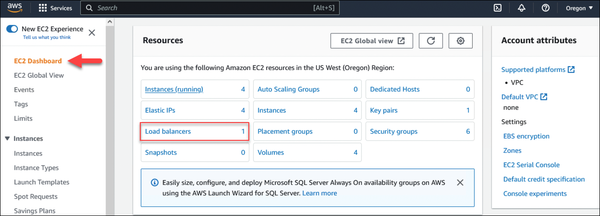

Active-Active BIG-IP VE Instances via AWS NLB
================================================================================

Changing the Active/Standby setup of the two BIG-IP to an Active/Active arrangement leveraging the AWS Network Load Balancer (NLB) created via terraform.
This involves removing the failover group membership, retaining the configuration sync, creating the NLB and re-creating the AS3 applications.

Overview of the lab steps:
   - Create the NLB.
   - Break the HA config between the BigIP's.
   - Test the NLB via stopping Virtual Servers on the BigIP's to simulate HA events.
   - Validate the NLB activity via the AWS console.

The lab will cover REST calls to BigIP and terraform to create the NLB and AS3 applications.

================================================================================
1 - Create the NLB (Network Load Balancer) via Terraform.
================================================================================
1. Copy the files from the terraform location ./ha-via-lb to the main terraform folder.
2. Re-run the "terraform init" and the "terraform apply"
3. The result a new NLB viewable via the AWS console "EC2 Dashboard" "Load Balancing" page.
4. AS3 applications will have been installed for testing via terraform AS3 method.

**EC2 Dashboard**

================================================================================
2 - Break the HA in BigIP
================================================================================
1. Run the postman collection "HA - AWS NLB", call "Remove HA > Step 1: REST API - BIGIP1 Break Device Failover Create Active Active"
2. Validate via the BigIP console, either one will show the same information. Navigate to "Device MAnagement" and "Devices". The "failoverGroup" will contain no members and the BigIP status (top left) will show Active on both.

================================================================================
3 - Check AS3 applications are serving the traffic
================================================================================
1. Validate the NLB is working correctly via the "EC2 Dashboard" and click on "Load Balancing", there will be only one entry. Click the entry.
2. Next screen, click the target groups bottom far right to view the health of each BigIP Virtual Server setup. Both should show healthy.
   
**Example Traffic Website with NLB**

=================================================================================
4 - Testing the failover via disabling the application Virtual Servers on BigIP1
=================================================================================
1. Keep the AWS console page open for the "Target Groups" and use the refresh arrow circle button to update. The health checks are set to the fastest possible and will reflect in about 10-15 seconds.
2. Disable BigIP1 virtual servers with the postman collection "Failover Test", start with "BIGIP1 > Step 2: GET - Check For Virtual Server Example01a On BIGIP1".
3. Disable the VS via postman "BIGIP1 > Step 3: PATCH - Disable Virtual Server Example01a On BIGIP1"
4. Disable the second application via "BIGIP1 > Step 4: GET - Check For Virtual Server Example01b On BIGIP1" and "BIGIP1 > Step 5: PATCH - Disable Virtual Server Example01b On BIGIP1"
5. Go back to the AWS console for the "Target Groups" and one should be shown as unhealthy.
6. Check the NLB link (use the DNS entry on the Load Balancers page), traffic should still be served.

**Example NLB Traffic Group Health Status**

=================================================================================
5 - Testing the failover via disabling the application Virtual Servers on BigIP2
=================================================================================
1. Disable BigIP2 virtual servers with the postman collection "Failover Test", start with "BIGIP2 > Step 2: GET - Check For Virtual Server Example01a On BIGIP2".
2. Disable the VS via postman "BIGIP2 > Step 3: PATCH - Disable Virtual Server Example01a On BIGIP2"
3. Disable the second application via "BIGIP2 > Step 4: GET - Check For Virtual Server Example01b On BIGIP2" and "BIGIP2 > Step 5: PATCH - Disable Virtual Server Example01b On BIGIP2"
4. Go back to the AWS console for the "Target Groups" and BOTH should be shown as unhealthy.
5. Check the NLB link (use the DNS entry on the Load Balancers page), the page will not render (can take a minute or two).

================================================================================
6 - Add back one VS group in BigIP1 to start serving traffic on BigIP1
================================================================================
1. Enable BigIP1 virtual servers with the postman collection "Failover Test", start with "BIGIP1 > Step 5: PATCH - Enable Virtual Server Example01a On BIGIP1".
2. Enable the second VS via postman "BIGIP1 > Step 6: PATCH - Enable Virtual Server Example01b On BIGIP1"
3. Go back to the AWS console for the "Target Groups" and one should be shown as healthy.
4. Check the NLB link (use the DNS entry on the Load Balancers page), traffic should now be served.

================================================================================
7 - Add back one VS group in BigIP2 to start serving traffic on BigIP2
================================================================================
1. Enable BigIP1 virtual servers with the postman collection "Failover Test", start with "BIGIP1 > Step 5: PATCH - Enable Virtual Server Example01a On BIGIP2".
2. Enable the second VS via postman "BIGIP2 > Step 6: PATCH - Enable Virtual Server Example01b On BIGIP2"
3. Go back to the AWS console for the "Target Groups" and one should be shown as healthy.
4. Check the NLB link (use the DNS entry on the Load Balancers page), traffic should now be served.

**Lab complete!**