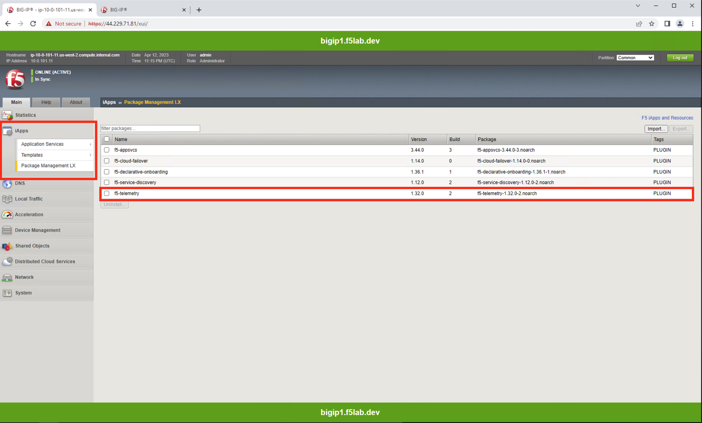
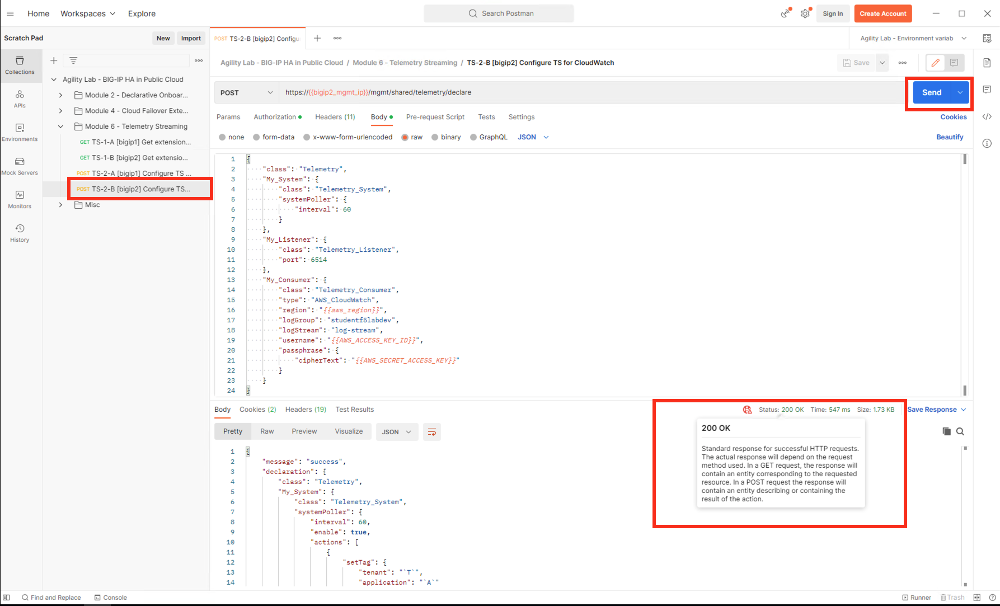
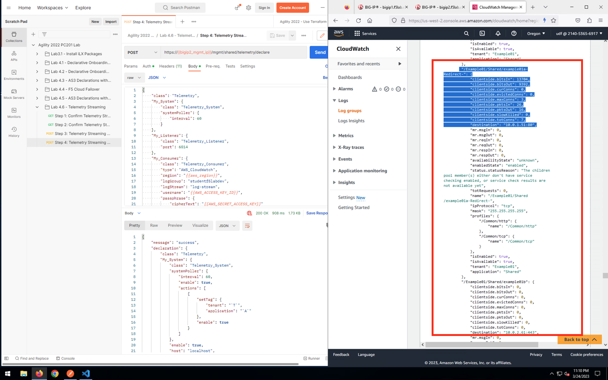

What is Telemetry Streaming
================================================================================
**F5 BIG-IP Telemetry Streaming (BIG-IP TS)** enables you to declaratively aggregate, normalize, and forward statistics and events from the BIG-IP to a consumer application. BIG-IP Telemetry Streaming is an iControl LX Extension delivered as a TMOS-independent RPM file, and uses a declarative model, meaning you provide a JSON declaration rather than a set of imperative commands. To use BIG-IP TS, you POST a single JSON declaration to BIG-IP TS’s declarative REST API endpoint.
https://youtu.be/YeEAovBvUkY

Lab Scenario
================================================================================
Placeholder

Verify installation of Telemetry Streaming
================================================================================

Verify installation via the WebUI
--------------------------------------------------------------------------------

From Big-IP1, iApps => Package Management LX. Note the f5-telemetry package is installed.

Do the same for Big-IP2.

Verify installation via the Postman
--------------------------------------------------------------------------------

From Postman, “Lab 4.6 - Telemetry Streaming” => “Step 1: Confirm Telemetry Streaming REST API - BIGIP1” => [Send].

"Status: 200 OK" response signals that the Telemetry Streaming Extension (TS) is ready on Big-IP1.

.. image:: ./images/2023_2_postman_telemetry_streaming_status_bigip1.png
	   :scale: 50%

From Postman, “Lab 4.6 - Telemetry Streaming” => “Step 2: Confirm Telemetry Streaming REST API - BIGIP2” => [Send].

"Status: 200 OK" response signals that the Telemetry Streaming Extension (TS) is ready on Big-IP2.

.. image:: ./images/2023_3_postman_telemetry_streaming_status_bigip2.png
	   :scale: 50%

Review Telemetry Streaming declaration
================================================================================
Placeholder

Deploy Telemetry configuration
================================================================================

From Postman, “Lab 4.6 - Telemetry Streaming” => “Step 3: Telemetry Streaming AWS - BIGIP1” => [Send].

.. image:: ./images/2023_4_postman_telemetry_streaming_body_bigip1.png
	   :scale: 50%

"Status: 200 OK" response signals that the Telemetry Streaming Extension (TS) declaration successfully completed processing on Big-IP1.

.. image:: ./images/2023_5_postman_telemetry_streaming_completed_bigip1.png
	   :scale: 50%

Do the same for Big-IP2. From Postman, “Lab 4.6 - Telemetry Streaming” => “Step 4: Telemetry Streaming AWS - BIGIP2” => [Send].

"Status: 200 OK" response signals that the Telemetry Streaming Extension (TS) declaration successfully completed processing on Big-IP2.

Reveiw Telemetry Streaming logs in the AWS Console using CloudWatch
================================================================================

From the AWS Console, Services => type "cloudwatch" in the search box, choose "CloudWatch" from the drop-down results.

.. image:: ./images/2023_7_aws_console_search_cloudwatch.png
	   :scale: 50%

From the AWS Console, CloudWatch => Logs => Log Groups => studentf5labdev => log-stream. Hit the refresh icon frequently.

.. image:: ./images/2023_8_aws_console_cloudwatch_logstream.png
	   :scale: 50%

Eventually you will see system telemetry data from hostname: bigip1.f5lab.dev and hostname: bigip2.f5lab.dev appearing in to the log-stream.

.. image:: ./images/2023_9_aws_console_cloudwatch_telemetry_streaming.png
	   :scale: 50%

