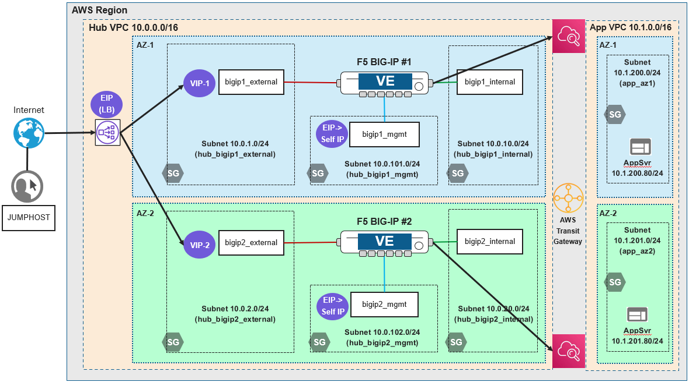

Lab Scenario
================================================================================

You will configure **F5 Telemetry Streaming** to send System log data to AWS Cloudwatch, then view the logs via the AWS Console.

.. note::

   Clarification: Due to Elastic (public) IP limitations on the ephemeral cloud accounts for this lab environment, the BIG-IPs will use the internal VLAN to reach the CloudWatch service. This route should not affect the behavior of the Telemetry Streaming extension.

Network Diagram
--------------------------------------------------------------------------------

Two AWS VPCs are connected to an AWS Transit Gateway, which routes traffic between the VPCs. The **app** VPC contains two application server instances (each in a different availability zone). The **hub** VPC contains two BIG-IP VE instances (each in a different availability zone).

