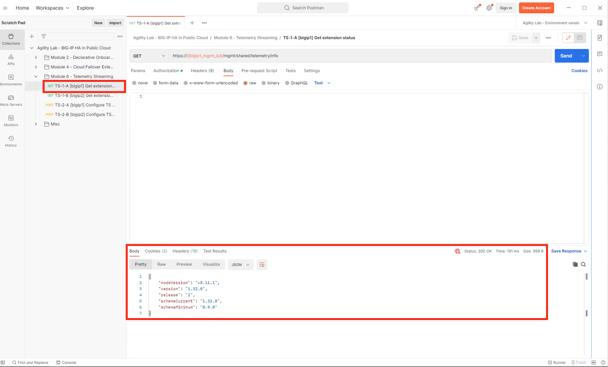
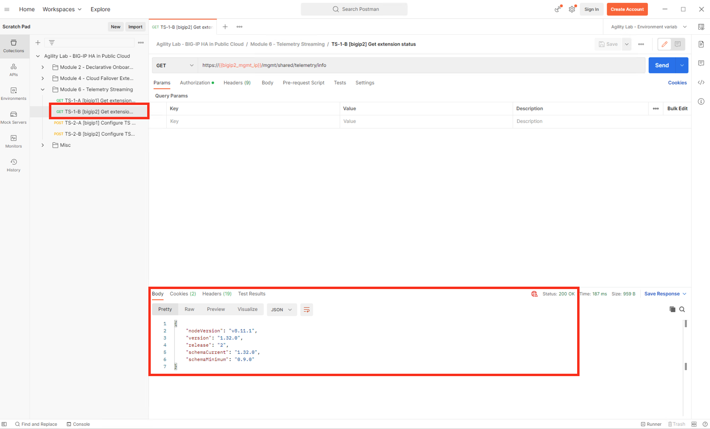

Verify installation of F5 Telemetry Streaming
================================================================================

Verify that F5 Telemetry Streaming has been installed via the WebUI and API

Verify installation via the WebUI
--------------------------------------------------------------------------------

From Big-IP1, naviagte to **iApps > Package Management LX**. Note the f5-telemetry package is installed.

Do the same for Big-IP2.

.. image:: ./images/2023_1_bigip1_telemetry_streaming_icontrol_lx_installed.png
	   :scale: 50%

Verify installation via API
--------------------------------------------------------------------------------

From Postman, naviagte to “Module 6 - Telemetry Streaming” > **“TS-1-A [bigip1] Get extension status”** > and click [Send].

"Status: 200 OK" response signals that the F5 Telemetry Streaming Extension (BIG-IP TS) is ready on Big-IP1.

From Postman, nagigate to “Module 6 - Telemetry Streaming” > **“TS-1-B [bigip2] Get extension status”** > and click [Send].

"Status: 200 OK" response signals that the F5 Telemetry Streaming Extension (BIG-IP TS) is ready on Big-IP2.

