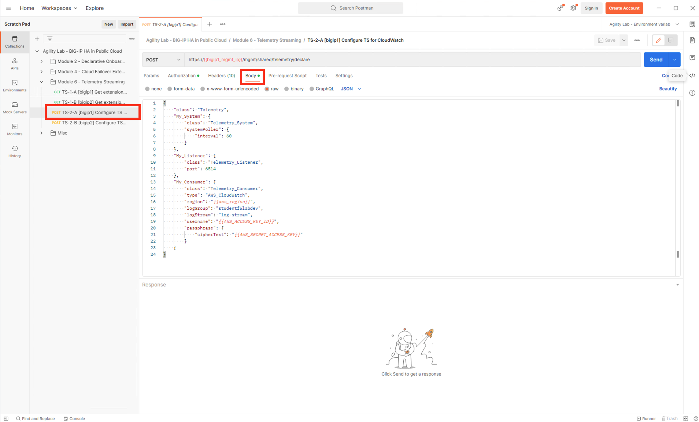
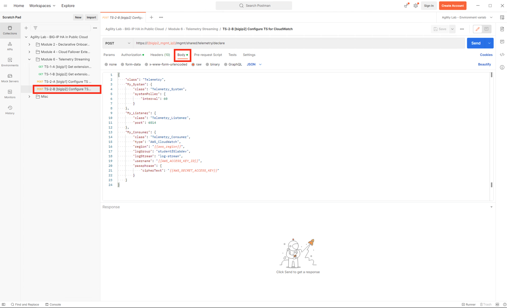
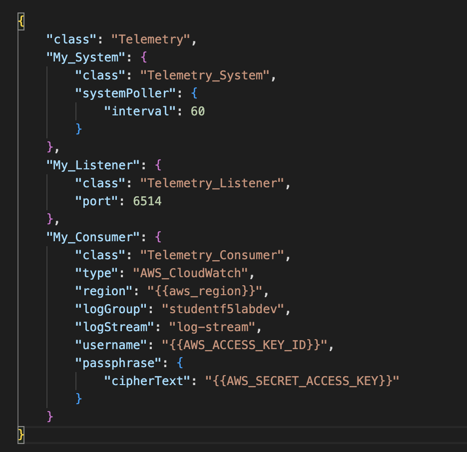

Review Telemetry Streaming Declaration
================================================================================

Use Postman to review F5 Telemetry Streaming Declaration

From Postman, naviagte to “Module 6 - Telemetry Streaming” > **“TS-2-A [bigip1] Configure TS for CloudWatch”** > and click on the Body tab.

From Postman, naviagte to “Module 6 - Telemetry Streaming” > **“TS-2-B [bigip2] Configure TS for CloudWatch”** > and click on the Body tab.

Full documentation for **F5 BIG-IP Telemetry Streaming (TS)** to AWS CloudWatch can be found at https://clouddocs.f5.com/products/extensions/f5-telemetry-streaming/latest/setting-up-consumer.html#awscloud-ref.

In the example below, My_consumer region, username, and cipherText are variables defined in the Enviorments file imported into Postman in module 2 of this lab. In Postman, you can click on Enviorments > "Agility Lab - Environment variables generated by Terraform deployment" to view each of the values.

