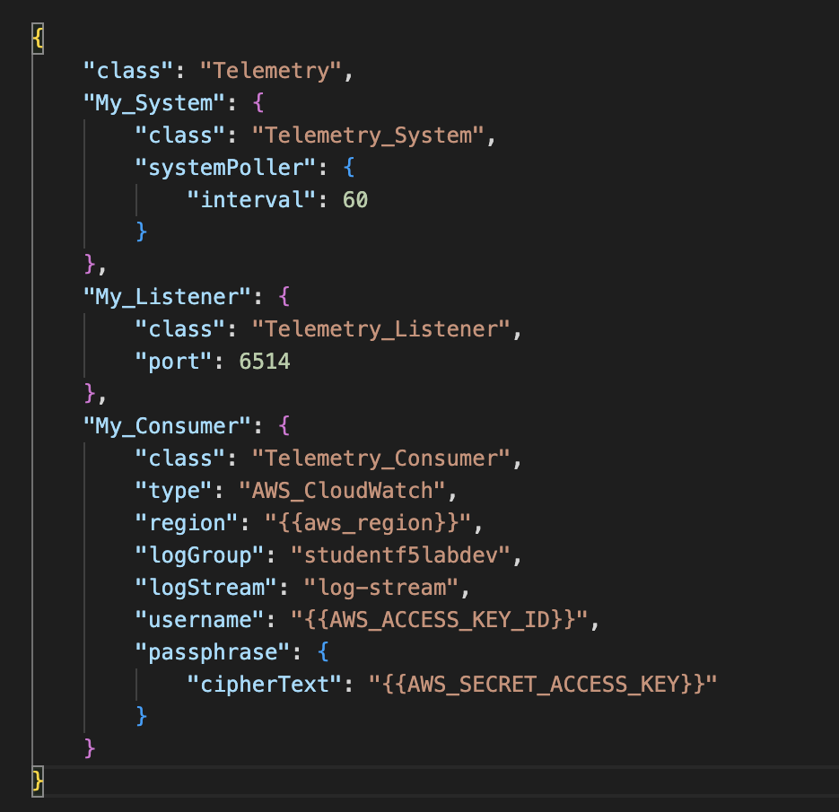

Review Telemetry Streaming Declaration
================================================================================

#. In Postman, click on the **TS-2-A [bigip1] Configure TS for CloudWatch** request.

#. Click on the **Request > Body** tab. The preview plane will show the **Telemetry Streaming** configuration that will be sent to BIG-IP #1.

   .. image:: ./images/2023_11_postman_telemetry_streaming_configuration_review_bigip1.png
      :scale: 50%

   |

#. In Postman, click on the **TS-2-B [bigip2] Configure TS for CloudWatch** request.

#. Click on the **Request > Body** tab. The preview plane will show the **Telemetry Streaming** configuration that will be sent to BIG-IP #1.

   .. image:: ./images/2023_12_postman_telemetry_streaming_configuration_review_bigip2.png
      :scale: 50%

   |

In the example below, the My_consumer **region**, **username**, and **cipherText** keys map to variables defined in the **Environment** file that you imported in Module 2.

|

In Postman, you can click on **Environments > Agility Lab - Environment variables generated by Terraform deployment** to view the values for each of these variables.

Full documentation for **F5 BIG-IP Telemetry Streaming (TS)** integration with AWS CloudWatch can be found at https://clouddocs.f5.com/products/extensions/f5-telemetry-streaming/latest/setting-up-consumer.html#awscloud-ref.

