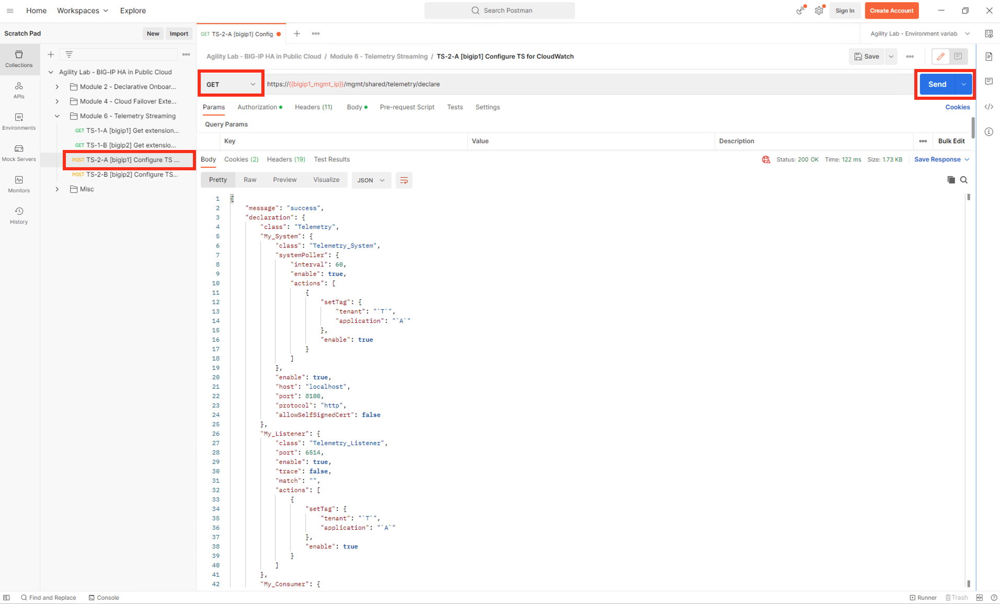

Deploy Telemetry Streaming Configuration
================================================================================

From Postman, naviagte to “Module 6 - Telemetry Streaming” > **“TS-2-A [bigip1] Configure TS for CloudWatch”** > and click [Send].

.. image:: ./images/2023_4_postman_telemetry_streaming_body_bigip1.png
	   :scale: 50%

"Status: 200 OK" response signals that the F5 Telemetry Streaming Extension (BIG-IP TS) declaration successfully completed processing on BIG-IP1.

.. image:: ./images/2023_5_postman_telemetry_streaming_completed_bigip1.png
	   :scale: 50%

Do the same for BIG-IP2. From Postman, navigate to “Module 6 - Telemetry Streaming” > **“TS-2-B [bigip2] Configure TS for CloudWatch”** > and click [Send].

"Status: 200 OK" response signals that the F5 Telemetry Streaming Extension (BIG-IP TS) declaration successfully completed processing on BIG-IP2.

.. image:: ./images/2023_6_postman_telemetry_streaming_completed_bigip2.png
	   :scale: 50%

From Postman, nagigate to “Module 6 - Telemetry Streaming” > **“TS-2-A [bigip1] Configure TS for CloudWatch”**. In the drop down, change the POST value to GET and click [Send].

"Status: 200 OK" response signals a sucsessful response F5 Telemetry Streaming, and you will be able to view the full TS configuration in the lower pane.

.. note::

   Chaning the API call from a POST to a GET using the same URL will pull the **Telemetry System** configuration currently deployed from each BIG-IP. You can use this GET to view the full **TS** configuration at anytime.

.. attention::

   Before closing the **“TS-2-A [bigip1] Configure TS for CloudWatch”** tab or the Postman application, it's best to change GET back to the original value of POST. Otherwise you will get a message asking if you would like to save changes to the declaration.