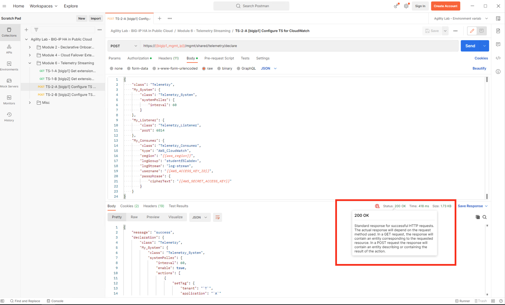

Deploy Telemetry Streaming Configuration
================================================================================

From Postman, “Lab 4.6 - Telemetry Streaming” => “Step 3: Telemetry Streaming AWS - BIGIP1” => [Send].

.. image:: ./images/2023_4_postman_telemetry_streaming_body_bigip1.png
	   :scale: 50%

"Status: 200 OK" response signals that the F5 Telemetry Streaming Extension (BIG-IP TS) declaration successfully completed processing on Big-IP1.

Do the same for Big-IP2. From Postman, “Lab 4.6 - Telemetry Streaming” => “Step 4: Telemetry Streaming AWS - BIGIP2” => [Send].

"Status: 200 OK" response signals that the F5 Telemetry Streaming Extension (BIG-IP TS) declaration successfully completed processing on Big-IP2.

.. image:: ./images/2023_6_postman_telemetry_streaming_completed_bigip2.png
	   :scale: 50%

