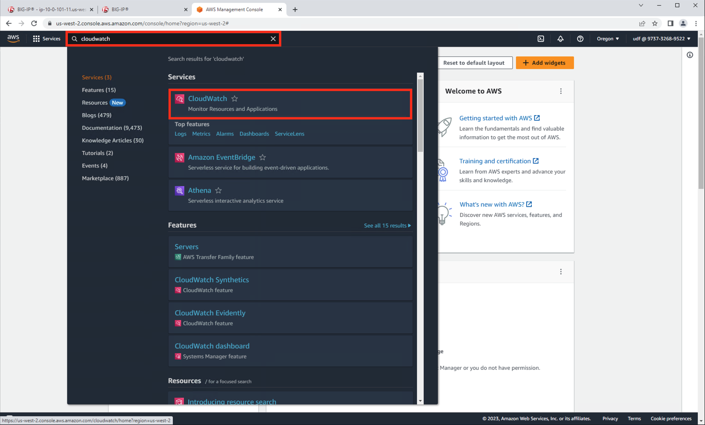

Review Telemetry Streaming Logs in the AWS Console Using CloudWatch
================================================================================

From the AWS Console, Services => type "cloudwatch" in the search box, choose "CloudWatch" from the drop-down results.

From the AWS Console, CloudWatch => Logs => Log Groups => studentf5labdev => log-stream. Hit the refresh icon frequently.

.. image:: ./images/2023_8_aws_console_cloudwatch_logstream.png
	   :scale: 50%

Eventually you will see system telemetry data from hostname: bigip1.f5lab.dev and hostname: bigip2.f5lab.dev appearing in to the log-stream.

.. image:: ./images/2023_9_aws_console_cloudwatch_telemetry_streaming.png
	   :scale: 50%

.. image:: ./images/2023_10_aws_console_cloudwatch_telemetry_streaming2.png
	   :scale: 50%
