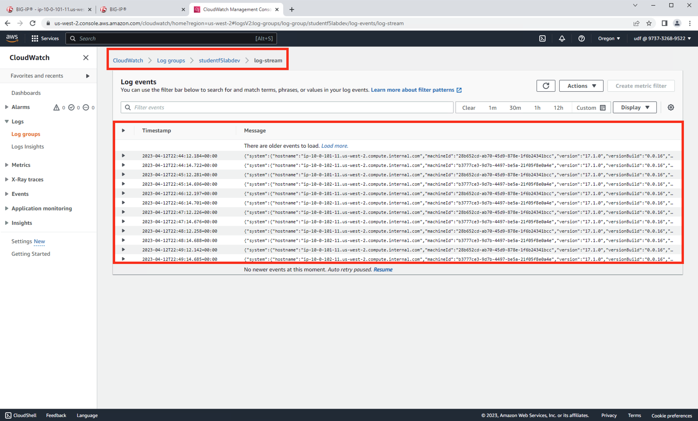
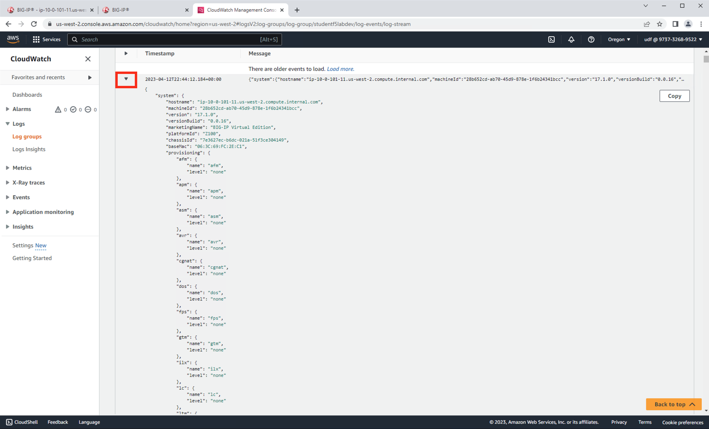

Review Telemetry Streaming Logs in the AWS Console Using CloudWatch
================================================================================

From the AWS Console in Chrome, nagigate to Services then type "cloudwatch" in the search box. Choose "CloudWatch" from the drop-down results.

.. image:: ./images/2023_7_aws_console_search_cloudwatch.png
	   :scale: 50%

From Cloudwatch in the AWS Console, navigate to Logs > Log Groups > studentf5labdev > log-stream. Hit the refresh icon until you see logs entries for each of the BIG-IP's.

Once system Telemetry data appears from hostname: **ip-10-0-101-11.us-west-2.compute.internal.com** and hostname: **ip-10-0-102-11.us-west-2.compute.internal.com**, click on the drop down for one of the log entries to examime the system data.

Scroll though the the system log data to view the system metrics being sent by each of the BIG-IP's to CloudWatch.

.. note::

   Each BIG-IP is sending Telemetry logs every 60 seconds to Cloudwatch, which is the **interval** that was defined in the **Telemetry Streaming** declaration.