Login to F5's lab platform (Unified Demo Framework)
=======================================================================================

Follow the link in your email invite and login to the lab environment.

Your Deployment => Systems => Client => VS Code.

.. image:: ./images/00_admin_pass.png
  :scale: 50%
  :alt: UDF Access

Visual Studio Code will launch as a tab in your current browser.  VS Code is running from a remote machine in your UDF environment.  Once in this tab, there will be a terminal window at the bottom of the screen.  Make sure the Terminal window indicates a "bash" shell.

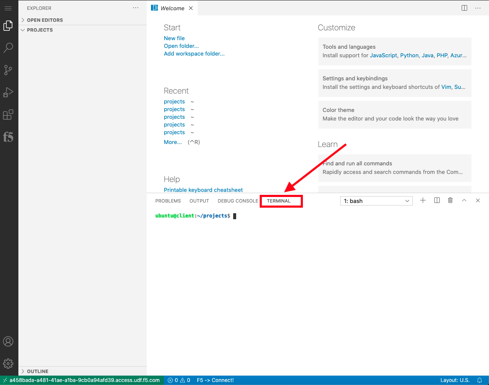

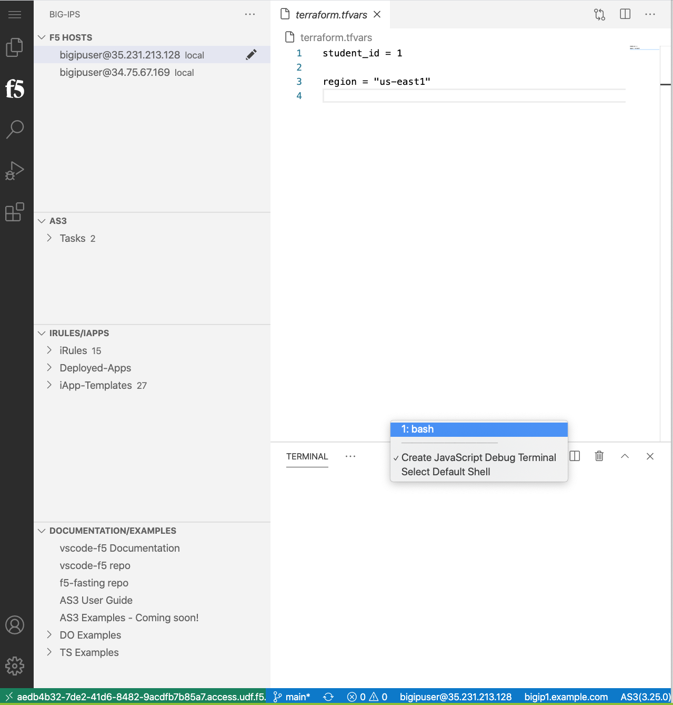

Authenticate the 'gcloud' command line utility
=======================================================================================

From the VS Code terminal run the following command:

.. code-block:: bash

   gcloud auth application-default login

This will give you a link you can click on (or CMD-click) to open up a browser, prompting you to associate your GCP account with the gcloud command utility.  The browser will give you an authentication token to copy and paste back into the VS Code Terminal.  Paste into the terminal and gcloud will be successfully authenticated and will work for Terraform.

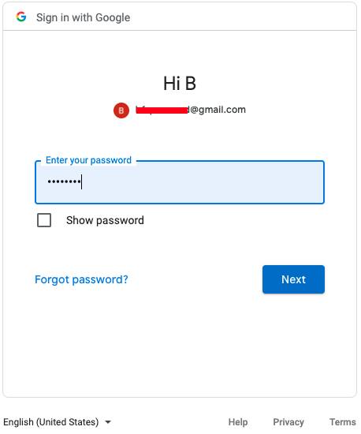

.. warning::  The GCP account you use must be identical to the user you signed up for Agility and signed into this account with.  Otherwise you will not have access to the F5 GCP Account built for this class.

Select "Allow" in order to trust this gcloud instance
 
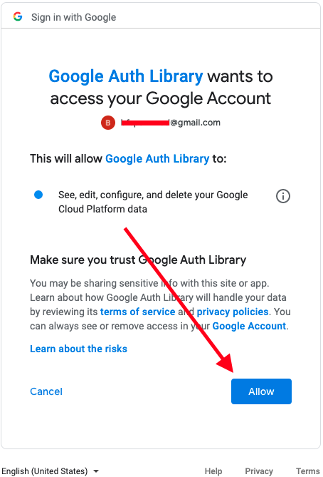

You will be given a token as a response.

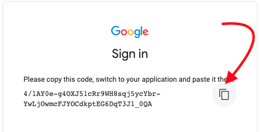

Copy the token back into the VS Code terminal window, you may get a warning to have the VS Code browser implementation to see your clipboard.  Please select "Allow" or you will have a lot of intricate typing to do.

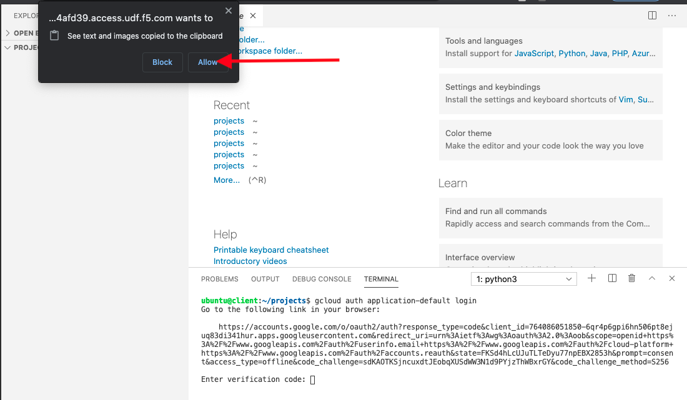

The pasted token will look like this:

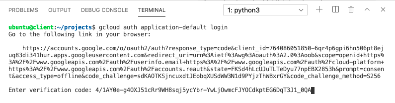

Once you click "Enter," gcloud will now be able to operate against the Agility GCP account.  The gcloud authorization will also allow Terraform to use the gcloud credentials to operate against GCP.

Deploy F5 Virtual Editions and a complete application environment to GCP with Terraform
=======================================================================================

From the Visual Studio Code Terminal, clone the github repository for this lab and change to the working directory.

.. warning:: For a smooth ride, always invoke commands from inside the cloned git repository (Agility2021_GCP_Terraform_ATC). To check you're in the right place, you can run the command ``pwd`` and the output should read ``/home/ubuntu/projects/Agility2021_GCP_Terraform_ATC``

.. code-block:: bash

   git clone https://github.com/jtylershaw/Agility2021_GCP_Terraform_ATC.git
   cd Agility2021_GCP_Terraform_ATC/

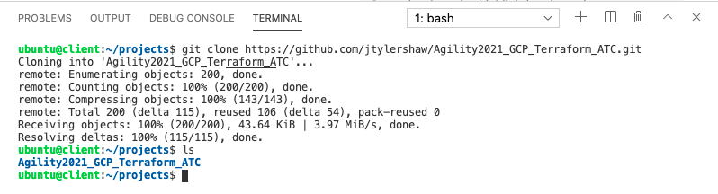

Build two BIG-IPs using Terraform
=======================================================================================

The first step that needs to be done is update the variable "student_id" in the terraform.tfvars file.  Please use the assigned Student ID.

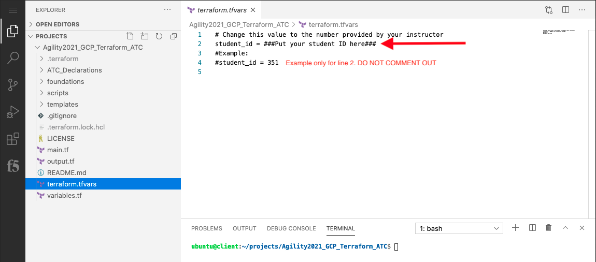

. warning:: A failure to change the value of 'student_id' on line two of terraform.tfvars to your assigned ID will result in your lab failing, or colliding with another student's lab.

You will need to initialize Terraform and allow it to download all required modules.  Do so by running:
.. code-block:: bash
terraform init

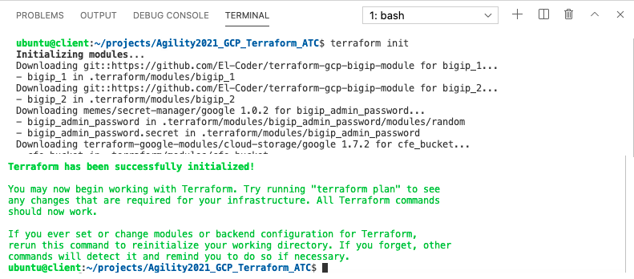

Once initialized, We will run a terraform plan which will let terraform identify the resources that it will be creating.  Please run the following:

.. code-block:: bash

   terraform plan

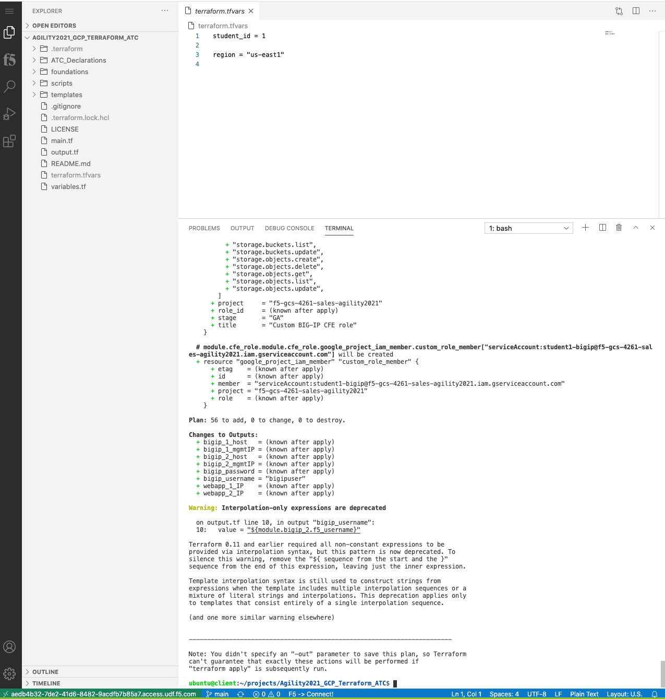

The last step of launching terraform is to "apply."  Note that this will take some time and will prompt you (by default) to proceed.  Please run the following and respond with 'yes' when prompted.

.. code-block:: bash

   terraform apply

At the end of the 'terraform apply' you will receive what terraform calls outputs.  These are defined in the terraform variables.  You can always get the 'terraform output' values again by invoking from the terminal, make sure to have bash toggled:

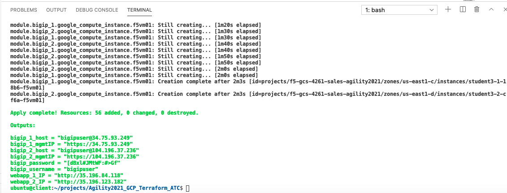

.. code-block:: bash

   terraform output

  .. image:: ./images/14_terraform_output.png
   :scale: 50%
   :alt: tf output
   
Login to GCP Console
====================

Click on "Firefox" under access methods (or use your own local browser if able) and navigate to https://console.cloud.google.com with the e-mail address that you signed up for Agility with, and you just signed in to authenticate with 'gcloud.'

Once your terraform apply has finished, navigate to "Compute Engine" -> "VM Instances" and locate your BIG-IP instances denoted by "studentX-Y-YYYY-f5vm0[1,2]."  These are your BIG-IP units running within GCP

.. warning:: We will be returning to lecture at this point of the lab.  We will allow the BIG-IPs to start up for all students during the lecture.