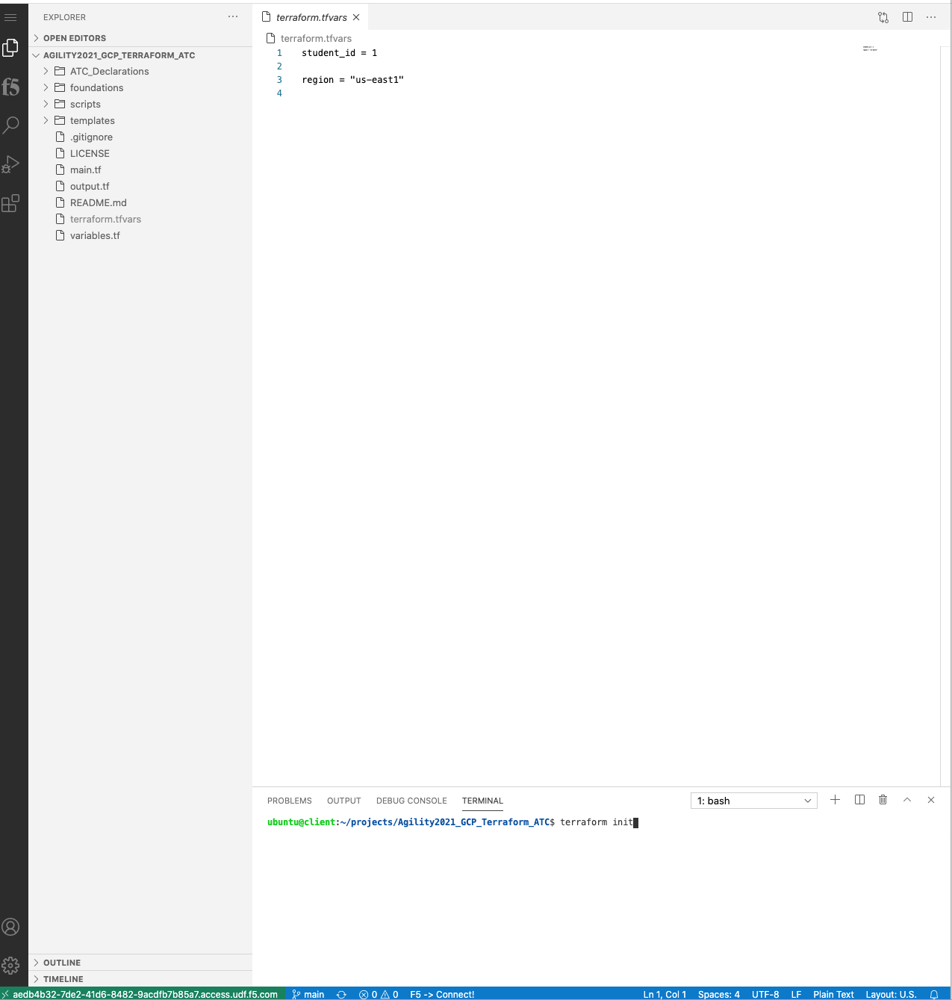
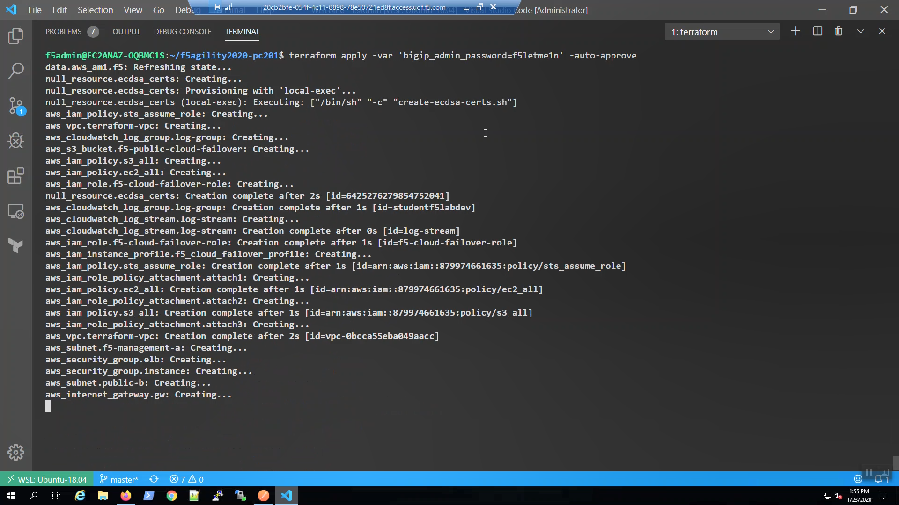
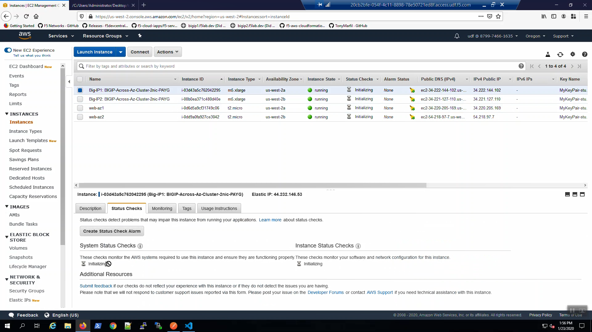

Login to F5's lab platform (Unified Demo Framework) and launch VS Code and Firefox
=======================================================================================

.. warning:: This page will need to be edited to show how to access the client, to get the flow and launch the Terraform code to start both BIG-IPs.  Some pieces have been changed

Follow the link in your email invite and login to the lab environment.

Your Deployment => Systems => client => ACCESS. Select VS Code and click on it.  VS Code will launch in another tab in your browser.

.. image:: ./images/00_admin_pass.png
  :scale: 50%

Click [Done] in the lower right-hand corner.

Login to the GCP Console
====================

A shortcut will be found on the FireFox web browser that can take you to the f5-gcs-4261-sales-agility2021 Project

If the FireFox browser is not working for you, you can use an existing browser on your desktop and proceed to https://console.cloud.google.com, login.  When you get to the GCP console, select the project in the blue bar at the top of the page and a diaglog will appear.  You will need to change the "Select from" drop down to "No organization" after which you will see and select the f5-gcs-4261-sales-agility2021 project.  You will be taken into that project and you will be able to see all of the resources allocated to it.

Deploy F5 Virtual Editions and a complete application environment to GCP with Terraform
=======================================================================================

From the Visual Studio Code Terminal, clone the github repository for this lab and change to the working directory.

.. attention::

  For a smooth ride, always invoke commands from inside the cloned git repository (AGILITY2021_GCP_TERRAFORM_ATC). To check you're in the right place, you can run the command ``pwd`` and the output should read ``/home/f5admin/AGILITY2021_GCP_TERRAFORM_ATC``

.. code-block:: bash

   git clone https://github.com/TonyMarfil/f5agility2020-pc201.git
   cd f5agility2020-pc201/

.. image:: ./images/9_vscode_git_clone.png
  :scale: 50%

Initialize Terraform modules.

.. code-block:: bash

    terraform init

Validate Terraform files.

.. code-block:: bash

    terraform validate

.. image:: ./images/12_vscode_terraform_validate.png
  :scale: 50%

From the Visual Studio Code Terminal

.. code-block:: bash

   terraform plan -var 'bigip_admin_password=f5letme1n'
   terraform apply -var 'bigip_admin_password=f5letme1n' -auto-approve

.. image:: ./images/16_vscode_terraform_plan.png
  :scale: 50%

.. image:: ./images/16_vscode_terraform_plan_complete.png
  :scale: 50%

.. image:: ./images/17_vscode_terraform_apply_complete.png
  :scale: 50%

You can always get the `terraform output` values again by invoking from the terminal:

.. code-block:: bash

   terraform output

From the AWS Console, Services => INSTANCES => Instances. Select the Big-IP1 instance.

.. image:: ./images/19_aws_console_ec2.png
  :scale: 50%
  
Select the [Status Checks] tab below. Note the System Status Checks and Instance Status Checks are both "initializing".

Do the same for Big-IP2.

.. image:: ./images/21_aws_console_bigip2_status_check.png
  :scale: 50%

.. attention::

  Return to the lecture while letting the BIG-IPs boot.