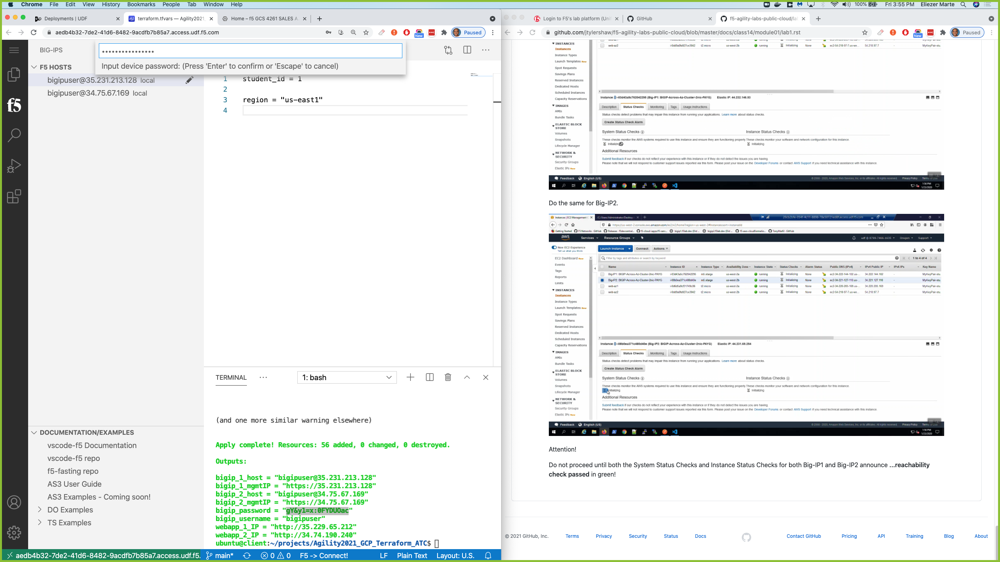
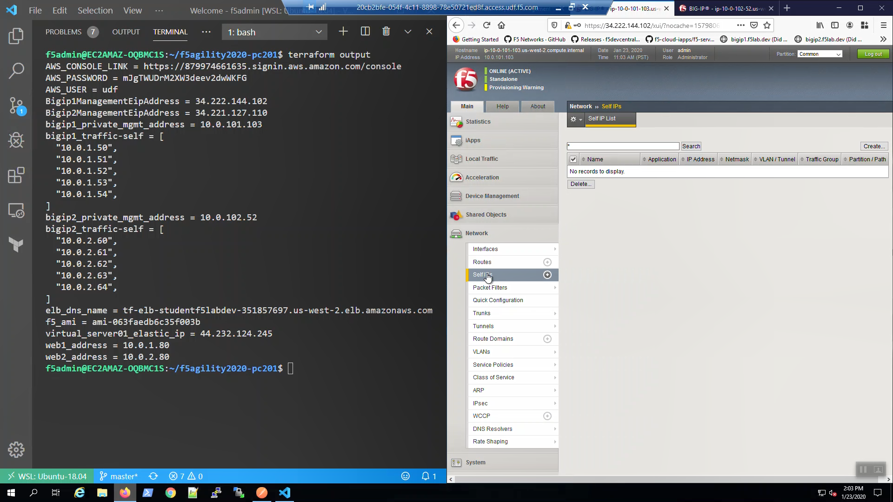
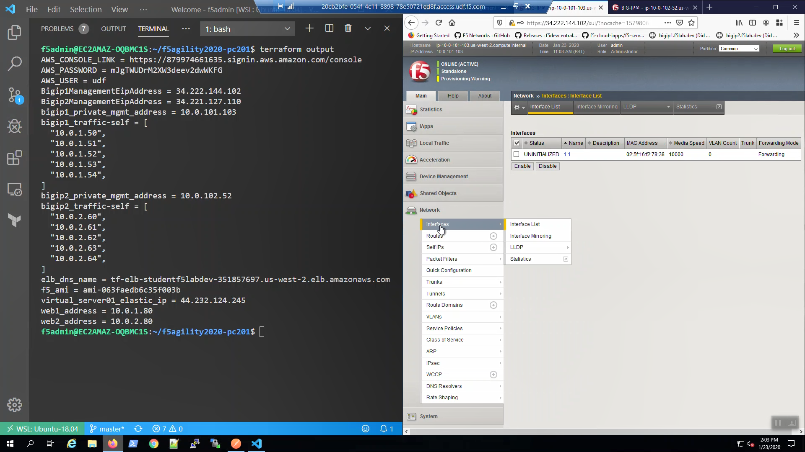

(TODO CHANGE)Check status of F5 instances before proceeding.
------------------------------------------------------------

From the AWS Web Console => Services => EC2 => INSTANCES => Instances. Select "Big-IP1...". Select the "Status Check" tab below.

.. image:: ./images/1_aws_console_bigip1_status_check.png
	   :scale: 50%

From the AWS Web Console => Services => EC2 => INSTANCES => Instances. Select "Big-IP2...". Select the "Status Check" tab below.

.. image:: ./images/2_aws_console_bigip2_status_check.png
	   :scale: 50%

.. attention::

  Do not proceed until both the System Status Checks and Instance Status Checks for both Big-IP1 and Big-IP2 announce **...reachability check passed** in green!

(Name Change?)Login to Big-IP1 and Big-IP2
------------------------------------------

.. code-block:: bash

   bigip1

.. image:: ./images/3_bigip1host.png
	   :scale: 50%

Click on F5 extension icon then add host, copy output of bigip_1_host, enter text. Then copy bigip_password and enter text.

.. code-block:: bash

   bigip2

.. image:: ./images/3_bigip2host.png
	   :scale: 50%

.. image:: ./images/3_bigip2password.png
	   :scale: 50%

(TODO) Configuration Utility (WebUI) HTTPS access to Big-IP1 and Big-IP2
-------------------------------------------------------------------------

From the Visual Studio Code Terminal, invoke `Terraform output`. Note the Bigip1ManagementEipAddress and Bigip2ManagementEipAddress values.

.. code-block:: bash

   terraform output

.. image:: ./images/4_terraform_output.png
	   :scale: 50%

Open a new browser tab and HTTPS to Bigip1ManagementEipAddress. We are using self-signed certificates in the lab. Bypass the TLS warnings. "Accept the Risk and Continue".

.. image:: ./images/5_bigip1_mgmt_ip.png
	   :scale: 50%

.. image:: ./images/6_bigip1_mgmt_bypass_warning.png
	   :scale: 50%

Login to the Big-IP1 Configuration Utility (WebUI):

  Username: admin

  Password: f5letme1n

...note the system has not been configured with anything other than a management IP address and admin account.

No self-IP.

No Routes.

.. image:: ./images/9_bigip_no_config2.png
	   :scale: 50%

Traffic interface in uninitialized state.

No Virtual Servers.

.. image:: ./images/11_bigip_no_config4.png
	   :scale: 50%

No Device Groups.

.. image:: ./images/12_bigip_no_config5.png
	   :scale: 50%

Do the same for Big-IP2.

.. image:: ./images/7_bigip2_mgmt_bypass_warning.png
	   :scale: 50%
