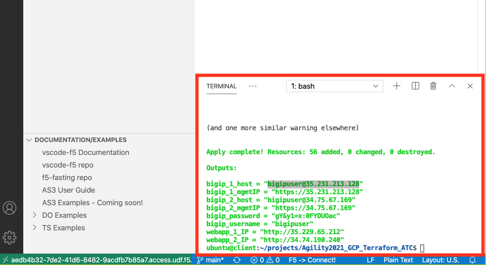
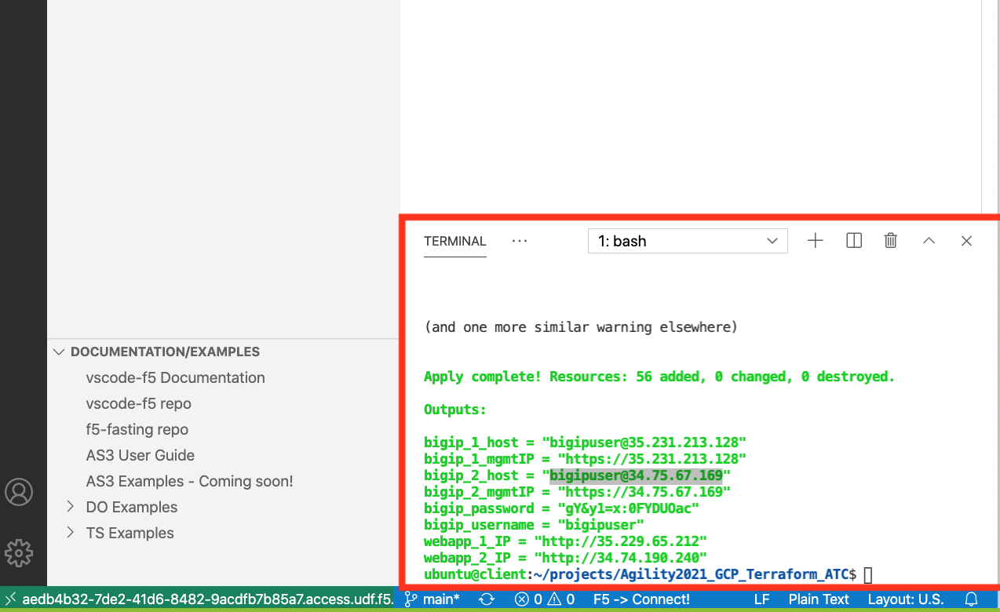
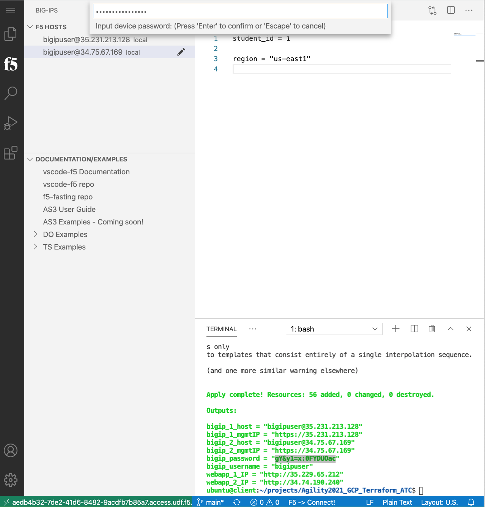
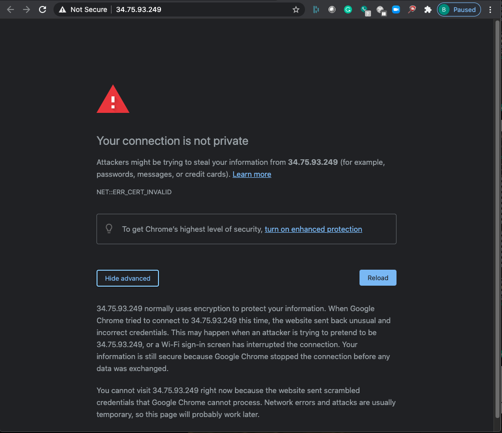

Configuration Utility (WebUI) HTTPS access to Big-IP1 and Big-IP2
=================================================================

From the terraform outputs, take the link for bigip_X_mgmtIP and open the WebUI
for each BIG-IP.  From the VS Code terminal, you can type "terraform output" to
see the outputs again.

The username and password are part of the "terraform output" results.

As is default in the BIG-IP, we are using self-signed certificates in the lab.
Bypass the TLS warnings. "Accept the Risk and Continue".

.. note::  If you are using Chrome and are not given the option to bypass the
   certificate warning you can either use a different browser, or type
   'thisisunsafe' on that tab and you'll bypass the warning.

Login to the Big-IP1 Configuration Utility (WebUI) using the values found in
"terraform output"

The system has not been configured with anything other than a management IP
address and admin account.  Here are some things to check to show you within
the GUI that you will change later:

* Network -> Self-IP addresses
* Network -> Routes
* Network -> Interfaces
* LTM -> Virtual Servers
* Device Management -> Devices

Verify the same items for Big-IP2.
