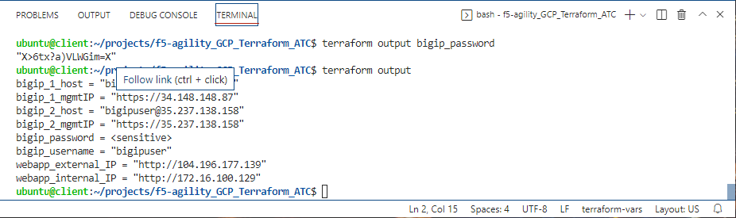
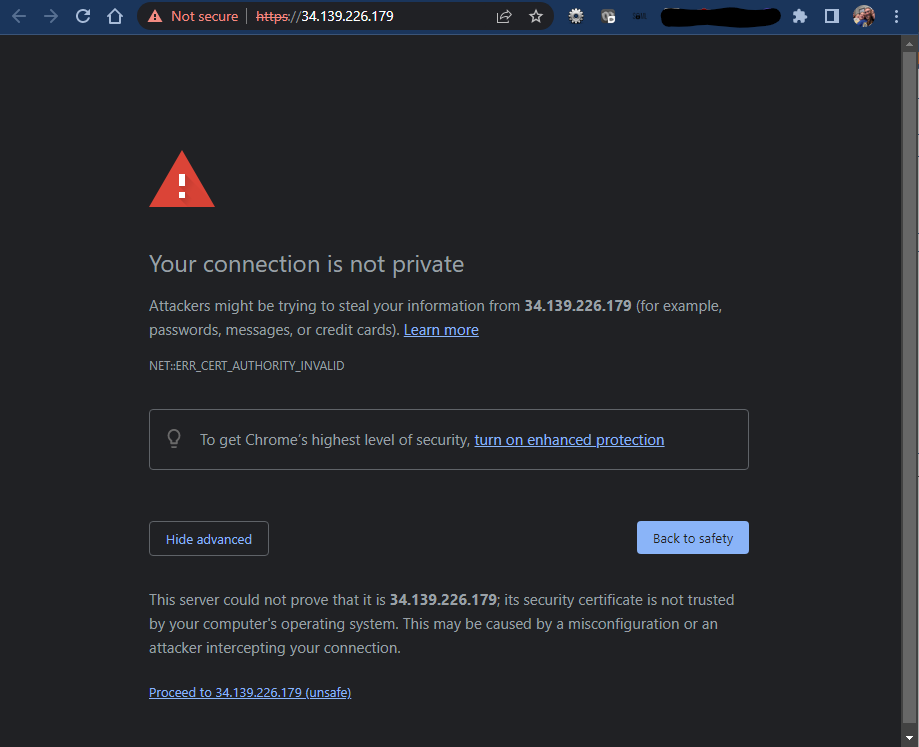
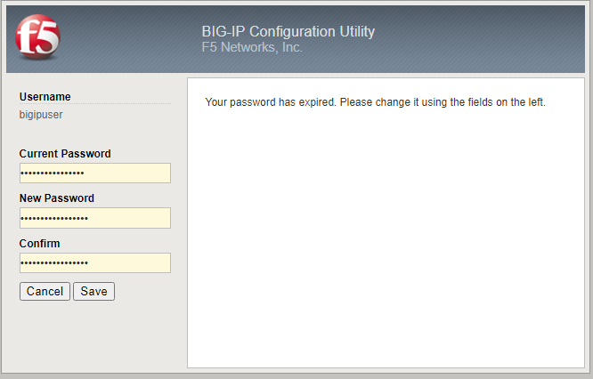

Configuration Utility (WebUI) HTTPS access to Big-IP1 and Big-IP2
=================================================================

From the terraform outputs, take the link for bigip_X_mgmtIP and open the WebUI
for each BIG-IP.  From the VS Code terminal, you can type "terraform output" to
see the outputs again.

.. note:: Below we show how to easily get the link to open the TMUI for the 
   devices you just created. As you proceed through the initial labs, you may 
   want to keep the terminal output displayed so you know which device you are 
   actually on as the names have not been set and are the same.

.. image:: ./images/module2_bigipHost2.png
   :scale: 75%
   :alt: Terraform Output CTL + CLick on management link

The username and password are part of the "terraform output" results.

.. image:: ./images/Module1_terraform_Output.png
   :scale: 75%
   :alt: Terraform Output Password

As is default in the BIG-IP, we are using self-signed certificates in the lab.
Bypass the TLS warnings. "Accept the Risk and Continue".

.. note::  If you are using Chrome and are not given the option to bypass the
   certificate warning you can either use a different browser, or type
   'thisisunsafe' on that tab and you'll bypass the warning.

Login to the Big-IP1 Configuration Utility (WebUI) using the values found in
"terraform output"

Due to new security settings you will be prompted to change your password.  Simply add your student number to the end of the pasword the system provided earlier.

The system has not been configured with anything other than a management IP
address and admin account.  Here are some things to check to show you within
the GUI that you will change later:

* Network -> Self-IP addresses
* Network -> Routes
* Network -> Interfaces
* LTM -> Virtual Servers
* Device Management -> Devices

Repeat these steps and verify the same items for Big-IP2.

.. note::  It is normal that bigip2 is also named bigip1.example.com at this time, because it is not yet configured