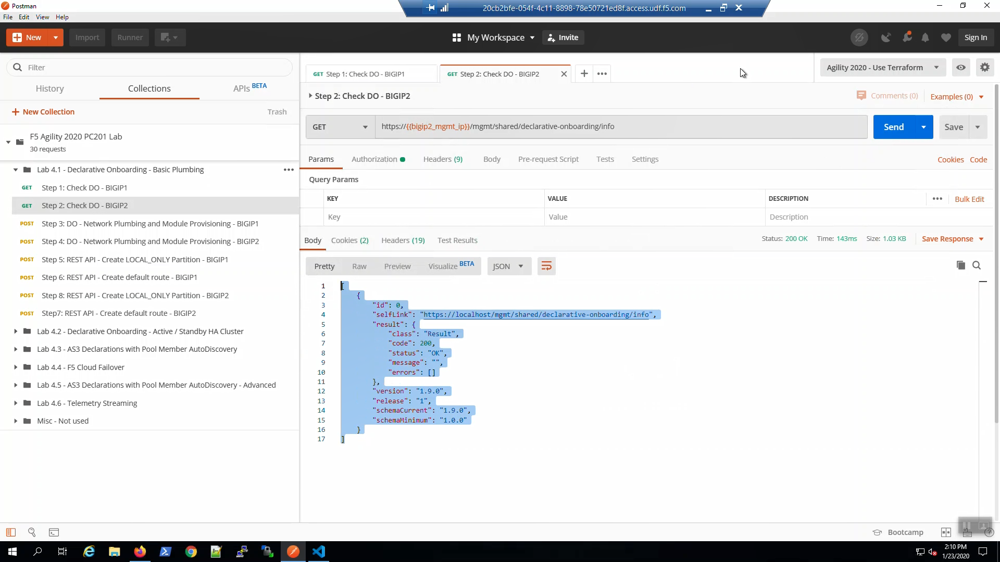

Prepare VSCode Extension
------------------------

After Terraform apply, ATC_Declarations folder will generate necessary declaration files for rest of the lab.

.. image:: ./images/14_atc.png
	   :scale: 50%

TODO Change image		 
Make sure you signed into BIG-IP Host 1. Click the bottom blue bar where it says DO(1.18.0)
This will open separate window with status is 200 OK and the Body response will indicate the DO version.

From ATC_Declarations click on Lab4.1-DO under the drop down menu, select "do_step1.json" request.
Right Click "Post as DO Declaration".
The Status is 202 RUNNING.

.. image:: ./images/15_do.png
	   :scale: 50%

Wait a few minutes until status is 200 OK

.. image:: ./images/15_do_complete.png
	   :scale: 50%

Now sign into BIG-IP Host 2. Click on Lab4.1-DO under the drop down menu, select "do_step2.json" request.
Right Click "Post as DO Declaration".

.. image:: ./images/15_do2.png
	   :scale: 50%

Wait a few minutes until status is 200 OK

.. image:: ./images/15_do2_complete.png
	   :scale: 50%

