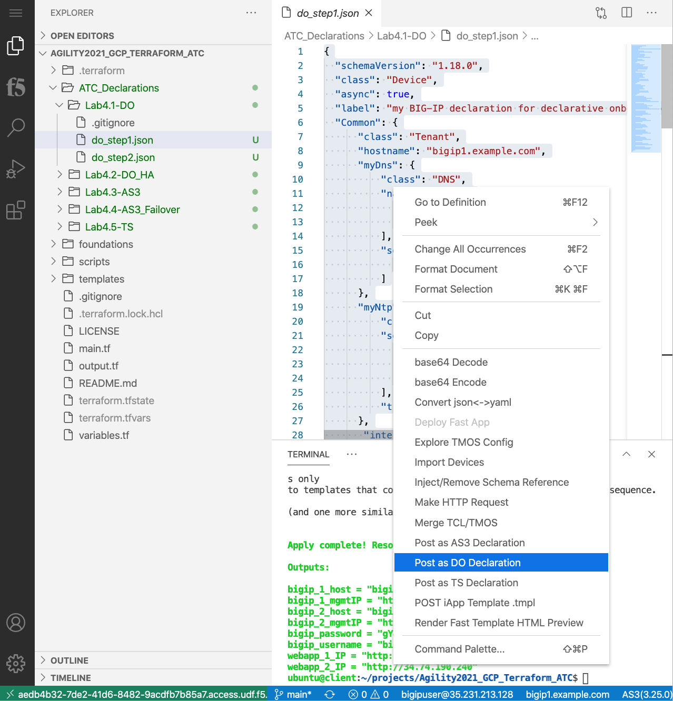
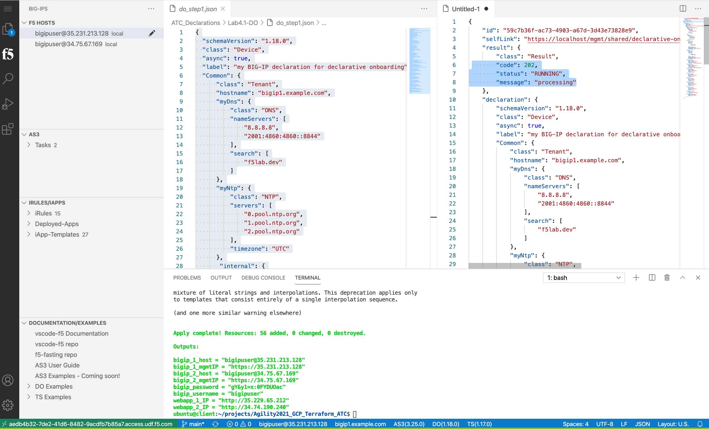

Prepare VSCode Extension
------------------------

After Terraform apply, Agility2021_GCP_Terraform_ATC folder will generate necessary declaration files for rest of the lab.

The first step will be to configure the F5 VS Code Plugin to connect to the two BIG-IPs

Copy bigip_1_host information then click on add host then paste and enter. Once the name loads on the side column click on the host and paste in the bigip_password. Do the same for big-ip 2.

note 
Make sure you are signed into BIG-IP Host 1. Click the bottom blue bar where it says DO(1.18.0)
This will open separate window with status is 200 OK and the Body response will indicate the DO version.

From Agility2021_GCP_Terraform_ATC click on Lab4.1-DO under the drop down menu, select "do_step1.json" request.
Right Click "Post as DO Declaration".
The Status is 202 RUNNING.

Wait a few minutes until status is 200 OK

At the bottom of the VS Code window in the blue bar, you can click on the DO (1.18.0) to submit a "GET" request to get the status of the DO execution.

Now sign into BIG-IP Host 2 by clicking on the F5 Plugin and left clicking on the second BIG-IP. Click on Lab4.1-DO under the drop down menu, select "do_step2.json" request.
Right Click "Post as DO Declaration".

.. image:: ./images/15_do2.png
	   :scale: 50%

Wait a few minutes until status is 200 OK

.. image:: ./images/15_do2_complete.png
	   :scale: 50%

