Prepare the F5 Extension
===========================

The rest of the lab we will be working with the F5 Automation Toolchain. This
is a set of declarative API endpoints that you can install on top of TMOS to
allow you to more simply manage BIG-IPs through an API. As part of the upcoming
GCP Terraform module, these modules will be installed by default. Navigate in
the TMUI to "iApps -> Package management LX" and you'll see four packages (The
fifth is Service Discovery and is now a subset of AS3):

.. image:: ./images/TMUI_ATCCheck.png
   :scale: 75%
   :alt: Select F5

The terraform apply you performed in the last step generated the necessary
declaration files for rest of the lab. They are located under the
f5-agility_GCP_Terraform_ATC/ATC_Declarations folder.

Connect the F5 Extension to the BIG-IPs
------------------------------------------

The first step will be to configure the F5 Extension to connect to the two
BIG-IPs

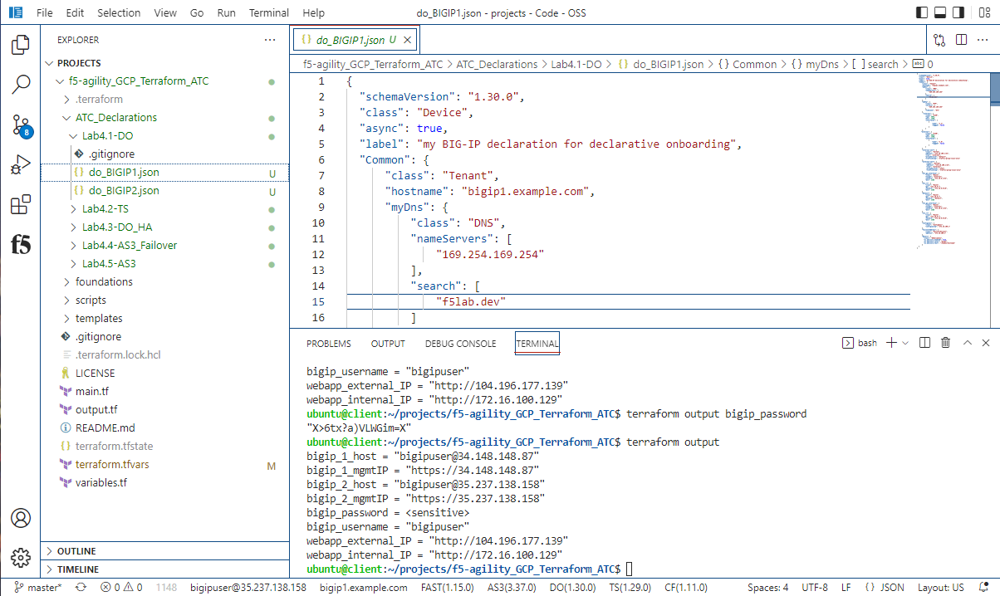

Copy bigip_1_host information then click on add host then paste and enter.

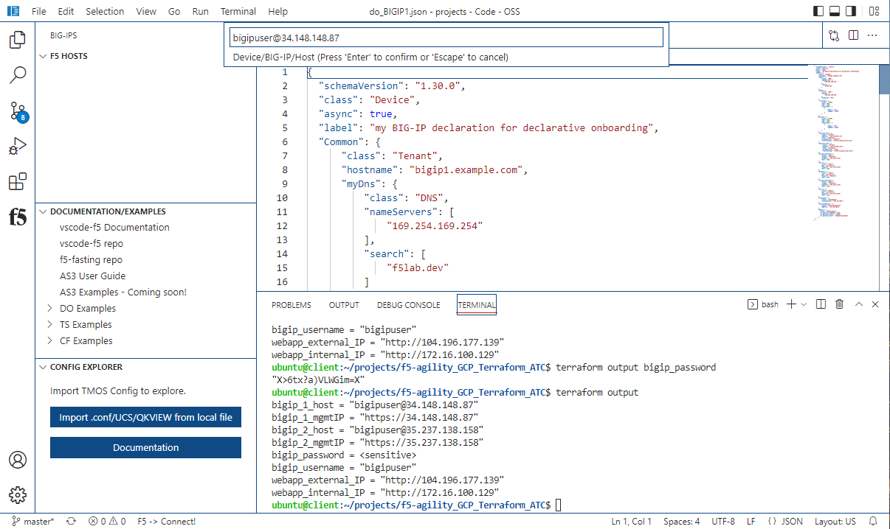

.. warning:: There is a bug that when you use the mouse buttons in the password 
   input, it will disappear without taking any information.  Should you overlook 
   this warning block, simply refresh the browser window that vscode is running in and 
   you can enter it by using the keyboard. 

Once the name loads on the side column click on the host and paste in the
bigip_password.

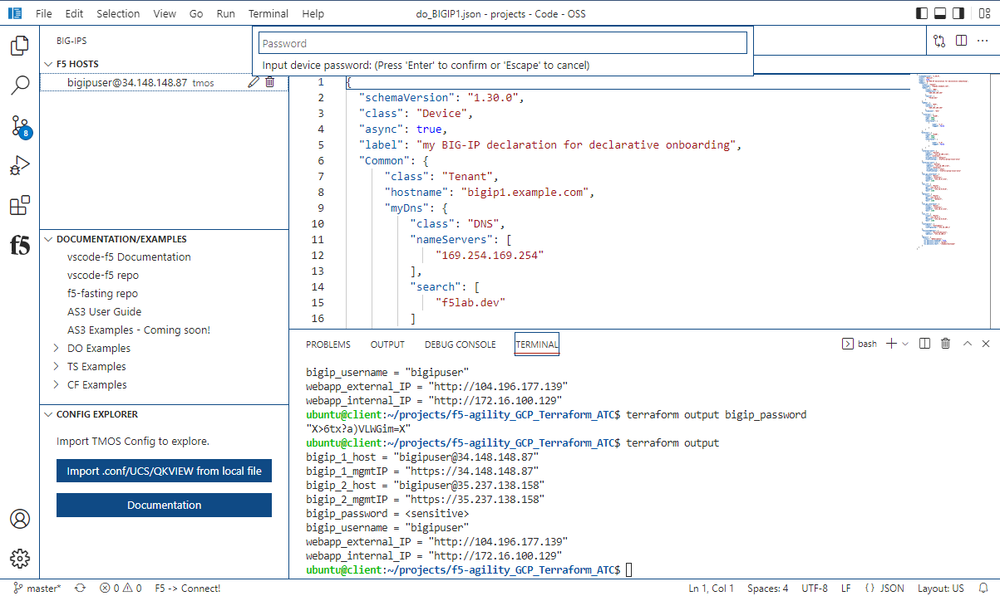

Do the same for big-ip 2.

.. note:: Make sure you are signed into BIG-IP Host 1 for the next step. Click
   the bottom white bar where it says DO(1.30.0). This will open a separate window
   with status is 200 OK and the Body response will indicate the DO version.

Submit Declarative Onboarding declarations
------------------------------------------

From f5-agility_GCP_Terraform_ATC click on Lab4.1-DO under the drop down menu,
select "do_BIGIP1.json" request.

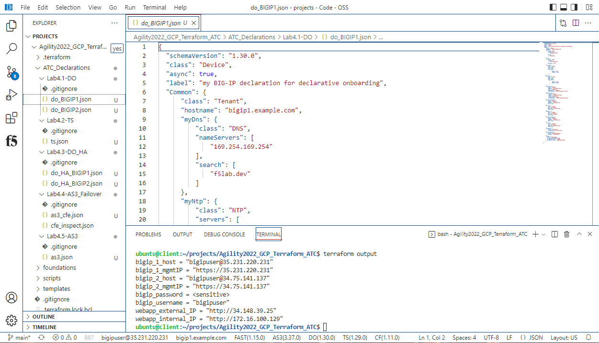

Make sure that your "target" is BIG-IP1:

.. image:: ./images/Lab4.1-DO-BIGIP1_Verification.png
   :scale: 60%
   :alt: BIG-IP1 target

Right Click "Post as DO Declaration". The Status will return as "200 SUCCESS" or "202 RUNNING".

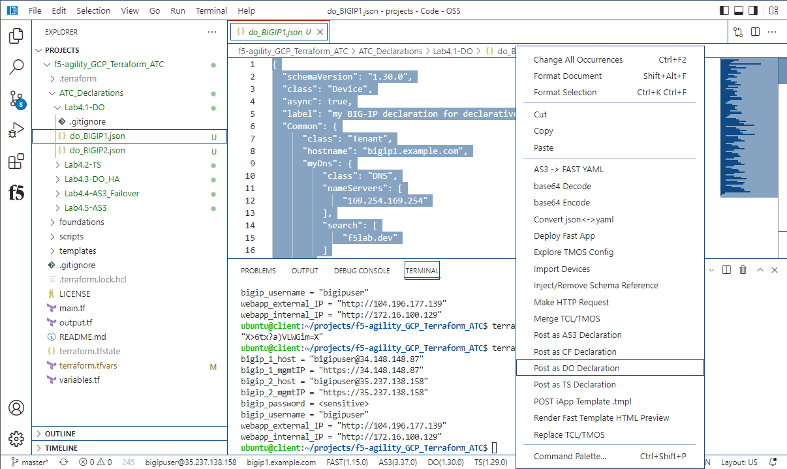

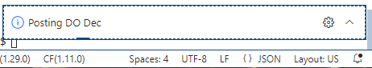

Check the status of DO by ckicking on the DO(1.30.0) in the white bar at the
bottom.

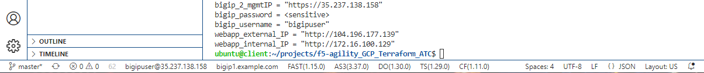

Wait a few minutes until status is 200 OK

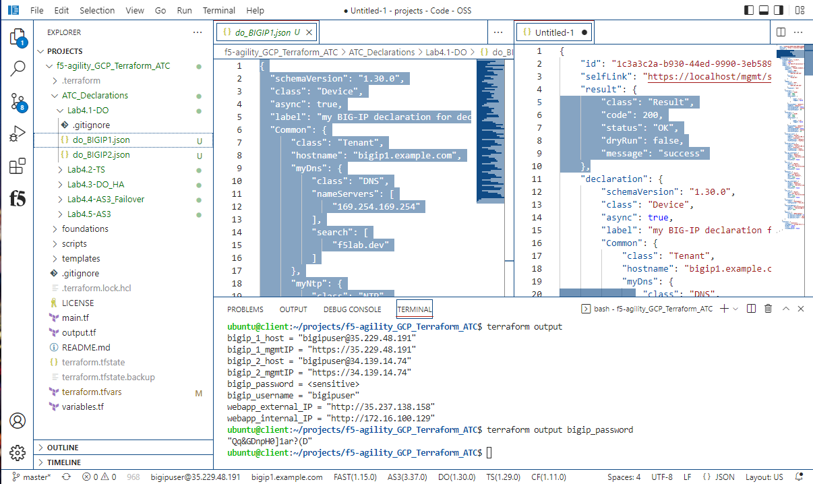

At the bottom of the VS Code window in the white bar, you can click on the DO
(1.30.0) to submit a "GET" request to get the status of the DO execution as you
did above. Wait until you get a status of "200 OK."

Now sign into BIG-IP Host 2 by clicking on the F5 Extension icon and left clicking on
the second BIG-IP. 

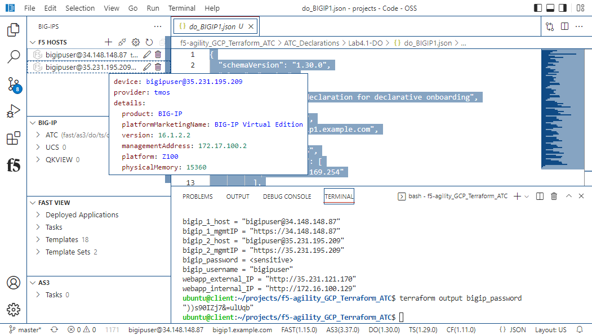

Now return to the folder explorer and click on Lab4.1-DO under the drop down menu, select
"do_step2.json" request. Right Click "Post as DO Declaration".

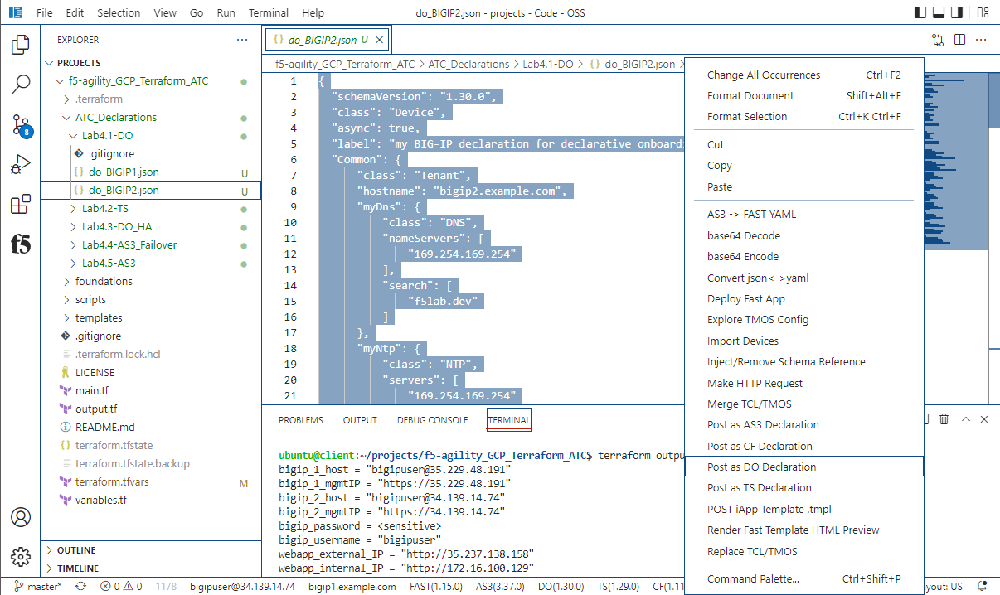

Wait a few minutes until status is 200 OK

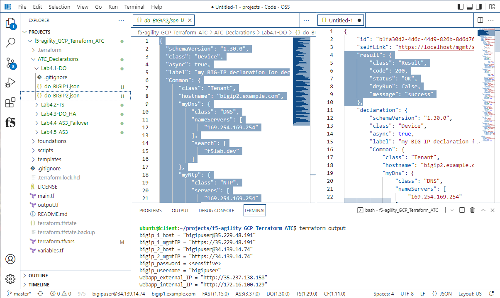

.. note:: Even though you just sent a DO declaration to the device, the status bar from 
   the F5 Extension still reflects the name set on initial start up. This will get updated 
   the next time you connect to that device.
