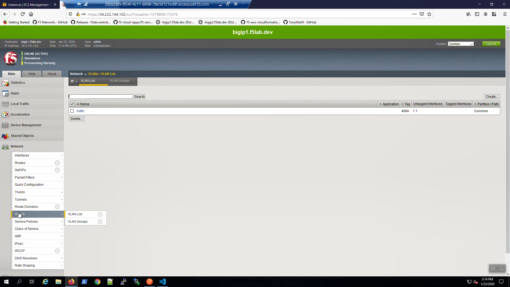
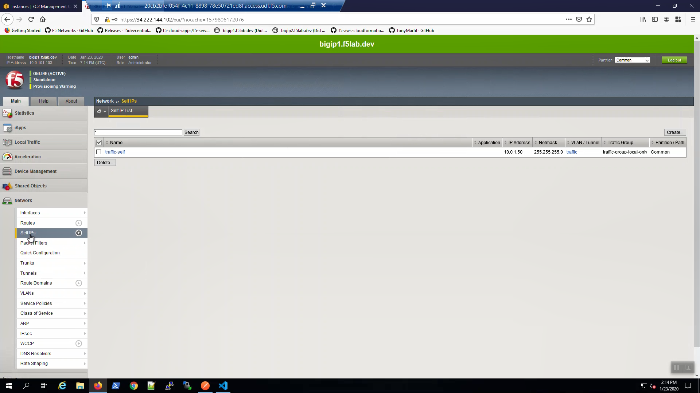

Basic network plumbing and services
-----------------------------------
TODO change images 

On Big-IP1, Network => VLANs. traffic VLAN was created via DO.

On Big-IP1, Network => Self IPs. traffic-self VLAN was created via DO.

On Big-IP1, Network => Interfaces. Interface 1.1 is UP.

.. image:: ./images/8_bigip1_do_interfaces.png
	   :scale: 50%

On Big-IP1, System => Configuration => Device => NTP was configured.

.. image:: ./images/9_bigip1_do_ntp.png
	   :scale: 50%

On Big-IP1, System => Configuration => Device => DNS was configured.

.. image:: ./images/10_bigip1_do_dns.png
	   :scale: 50%

On Big-IP1, Network => Routes. No routes.

.. image:: ./images/11_bigip1_do_no_route.png
	   :scale: 50%

On Big-IP2, Network. => Routes. No routes.

.. image:: ./images/13_postman_bigip2_get_do_status.png
	   :scale: 50%

