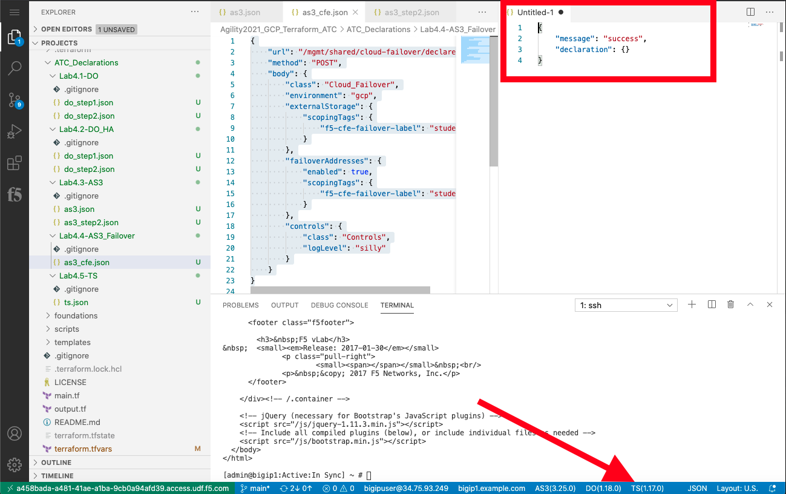
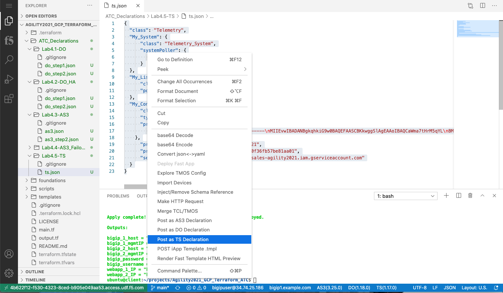
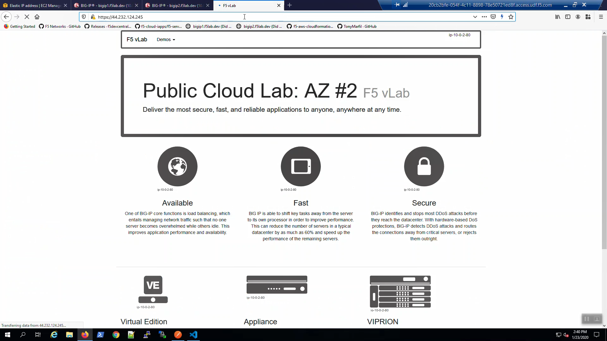
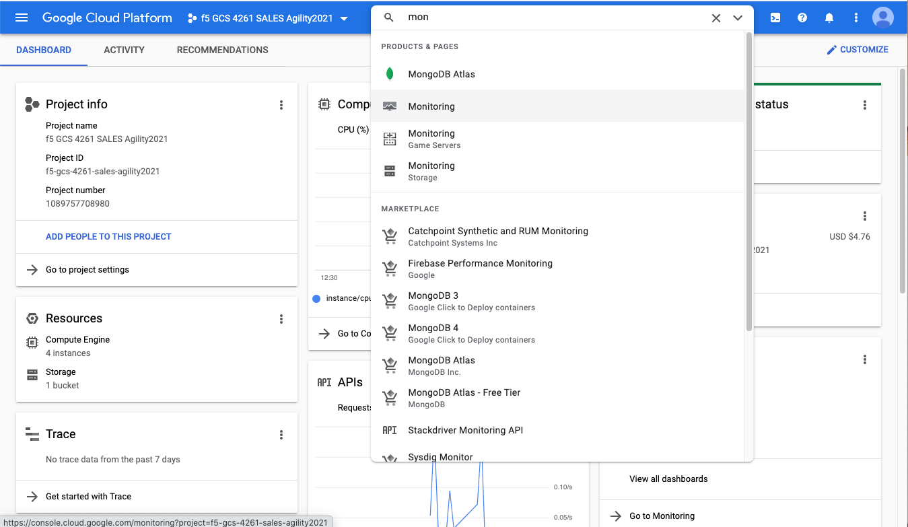
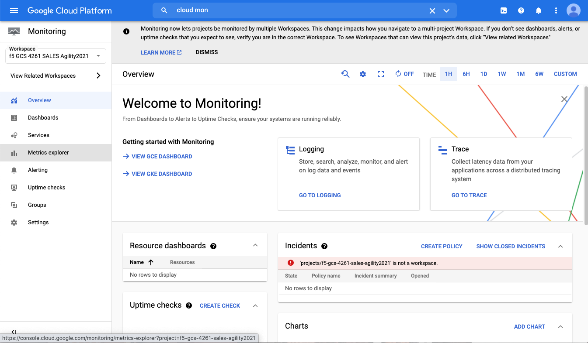

F5 Telemetry Streaming Initial Setup 
============================================================================

Telemetry Streaming was created to offload common metrics from the BIG-IP onto
external monitoring/graphing utilities, including the major cloud-native
monitoring programs. In this lab we will be sending the some basic metrics from
the BIG-IP to Cloud Monitoring - part of GCP.

The Telemetry Streaming package has been installed as part of the base image.
You can verify it is installed by going to iApps => Package Management LX where
you can note the version.

.. image:: ./images/00_bigip_ts_check.png
   :scale: 75%
   :alt: image

Make sure you are signed into BIG-IP 1, click on TS the bottom white bar.

"message:Success" response signals that the Telemetry Streaming Extension (TS)
is ready on Big-IP1.

From files tab click on Lab4.2-TS under the drop down menu, select "ts.json"
request. Right Click "Post as TS Declaration".

"message:Success" response signals that the Telemetry Streaming Extension (TS)
declaration successfully completed processing on Big-IP1.

.. image:: ./images/03_ts_success.png
   :scale: 75%
   :alt: image

In two browser tabs, go to the ip address for both webapp_1 and webapp_2 and refresh the page 10 or more times.  The intent is to create some utilization on the BIG-IP that will then be sent to the GCP monitoring infrastructure.

Now from the GCP Console, Services => type "Monitoring" in the search box,
choose the first "Monitoring" option from the drop-down results.

From Monitoring on the side panel => Metrics explorer.

Click on query editor in the editor type fetch generic_node ::
custom/system/cpu. Then click Run Query.

.. image:: ./images/10_gcp_monitoring_metrics_q_edit.png
   :scale: 75%
   :alt: image

.. image:: ./images/11_gcp_query_results.png
   :scale: 75%
   :alt: image

This may take a few minutes, but eventually you will see telemetry data start
to be shown.
