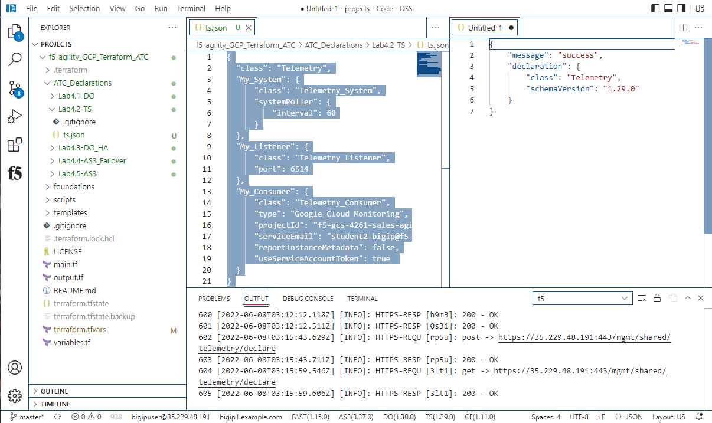
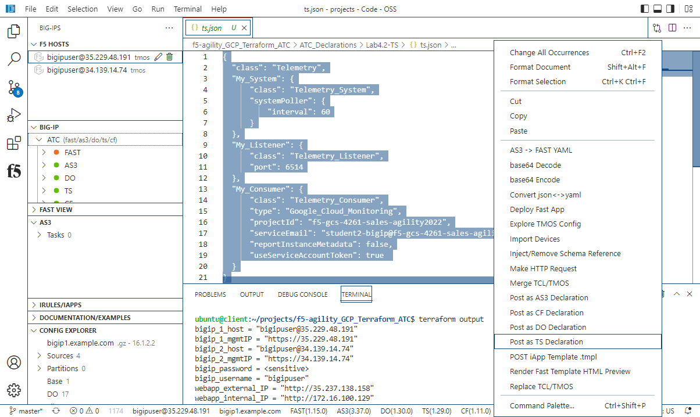
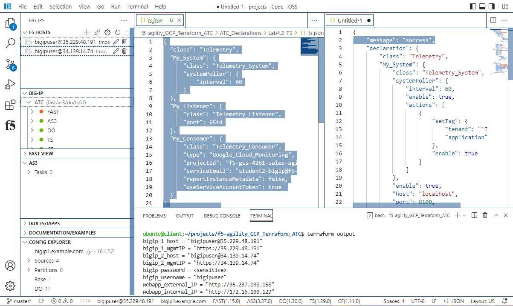
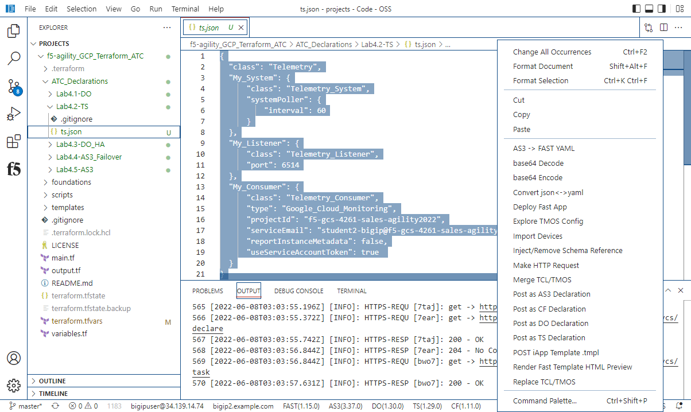
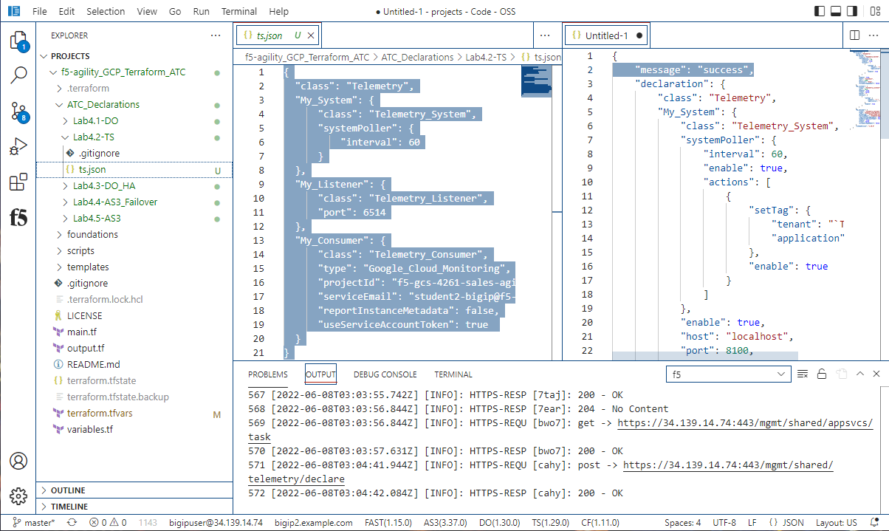

F5 Telemetry Streaming Initial Setup 
============================================================================

Telemetry Streaming was created to offload common metrics from the BIG-IP onto
external monitoring/graphing utilities, including the major cloud-native
monitoring programs. In this lab we will be sending the some basic metrics from
the BIG-IP to Cloud Monitoring - part of Google Cloud.

The Telemetry Streaming package has been installed as part of the base image.
You can verify it is installed by going to iApps => Package Management LX where
you can note the version.

.. image:: ./images/Lab4.2-TS-BIGIP1_verifyExtension.png
   :scale: 60%
   :alt: Verify TS extension

Make sure you are signed into BIG-IP 1, click on TS the bottom white bar.

"message:Success" response signals that the Telemetry Streaming Extension (TS)
is ready on Big-IP1.

From files tab click on Lab4.2-TS under the drop down menu, select "ts.json"
request. Right Click "Post as TS Declaration".

"message:Success" response signals that the Telemetry Streaming Extension (TS)
declaration successfully completed processing on Big-IP1.

Switch the connection to BIG-IP 2.

From files tab click on Lab4.2-TS under the drop down menu, select "ts.json"
request. Right Click "Post as TS Declaration".

"message:Success" response signals that the Telemetry Streaming Extension (TS)
declaration successfully completed processing on Big-IP1.

This lab has been split into two parts to ensure that the systems begin to send 
data to the Google Cloud Monitoring Solution which you can query and visualize.
