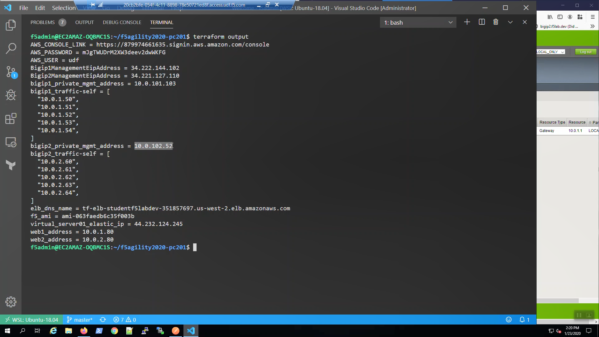
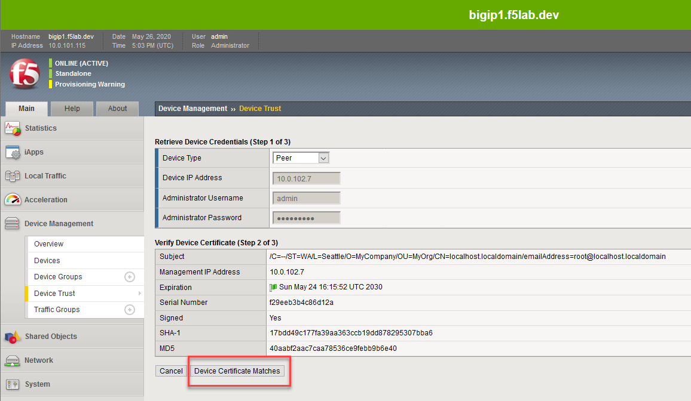
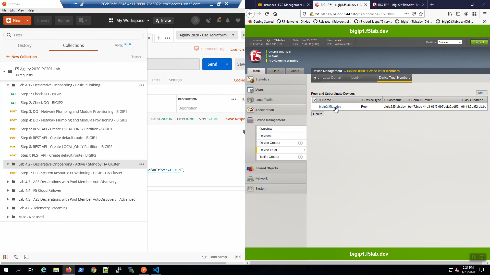
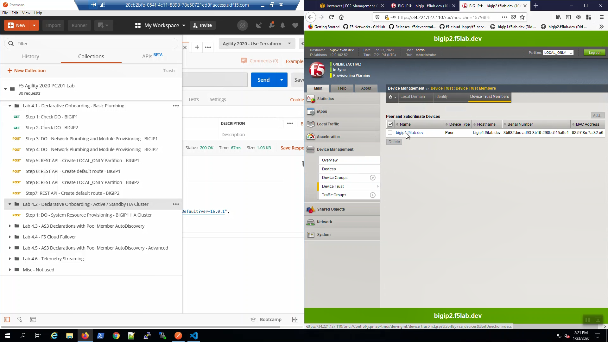

Establish Device Trust between Big-IPs.
---------------------------------------

From the Visual Studio Code Terminal, invoke ``terraform output``. Note the ``bigip2_private_mgmt_address`` value. We'll use this value to configure a Device Trust between Big-IP1 and Big-IP2.

.. code-block:: bash

   terraform output
   terraform output bigip2_private_mgmt_address

.. attention::

  Make sure you are in the /Common partition before proceeding.

From the Big-IP1 Configuration Utility (WebUI), "Device Management" => "Device Trust" => "Device Trust Members" => [Add...].

+------------------------------+----------------------------------------------------------------------+
| Parameter                    | Value                                                                |
+==============================+======================================================================+
| Device Type                  | Peer                                                                 |
+------------------------------+----------------------------------------------------------------------+
| Device IP Address            | IP address value of ``terraform output bigip2_private_mgmt_address`` |
+------------------------------+----------------------------------------------------------------------+
| Administrator Username       | admin                                                                |
+------------------------------+----------------------------------------------------------------------+
| Administrator Password       | f5letme1n                                                            |
+------------------------------+----------------------------------------------------------------------+

...[Retrieve Device Information].

.. image:: ./images/2_bigip1_device_trust1.png
	   :scale: 50%

... [Device Certificate Matches].

[Add Device]

.. image:: ./images/3_bigip1_device_trust2.png
	   :scale: 50%

Confirm that ``bigip2.f5lab.dev`` is listed under "Peer and Subordinate Devices".

From the Big-IP2 Configuration Utility (WebUI), "Device Management" => "Device Trust" => Under the "Device Trust Members" tab => Confirm that ``bigip1.f5lab.dev`` is listed under "Peer and Subordinate Devices".

Create a Config Sync Group between Big-IPs
------------------------------------------

From Postman => "Lab - Declarative Onboarding - Active / Standby HA Cluster" => "Step 1: DO - System Resource Provisioning - BIGIP1 HA Cluster" => [Send].

.. image:: ./images/6_postman_ha_cluster_202.png
	   :scale: 50%

Change the HTTP method from POST to GET and click "Send". You can do this often to track the status of the DO declaration in the Response. Status 202 indicates the declaration was successfully submitted and is being processed, Status 200 indicates the declaration has successfully completed.

.. image:: ./images/7_postman_ha_cluster_get_status.png
	   :scale: 50%

Eventually, the status will be 200 OK. Our DO declaration has successfully created a Sync-Failover Config Sync Group with both bigip1.f5lab.dev and bigip2.f5lab.dev as members.

.. image:: ./images/8_postman_ha_cluster_complete_200.png
	   :scale: 50%

.. attention::

  Make sure Big-IP1 is active and Big-IP2 is standby before proceeding. To force Big-IP2 to standby: "Device Management" => "Devices" => bigip2.f5lab.dev => [Force to Standby].

From the Big-IP1 Configuration Utility (WebUI), note that bigip1.f5lab.dev is the "ONLINE (ACTIVE)" device and "In Sync".

.. image:: ./images/9_bigip1_active.png
	   :scale: 50%

From the Big-IP2 Configuration Utility (WebUI), note that bigip2.f5lab.dev is the "ONLINE (STANDBY)" device and "In Sync".

.. image:: ./images/10_bigip2_standby.png
	   :scale: 50%
