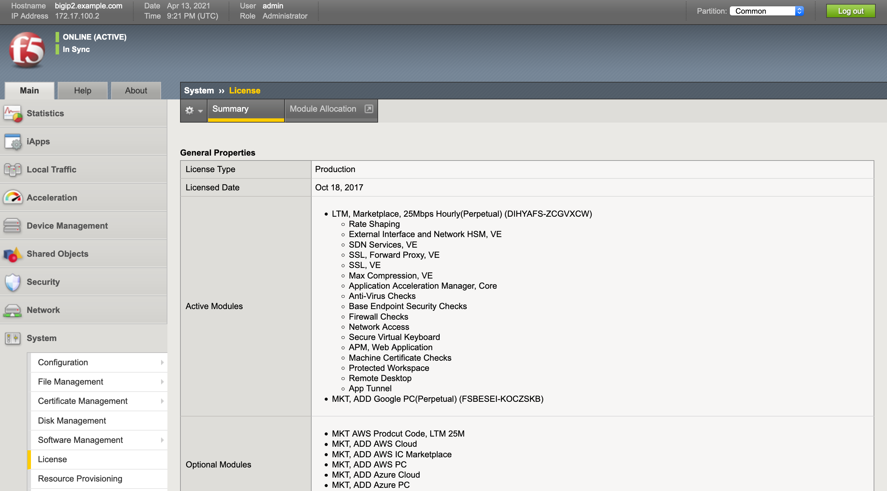
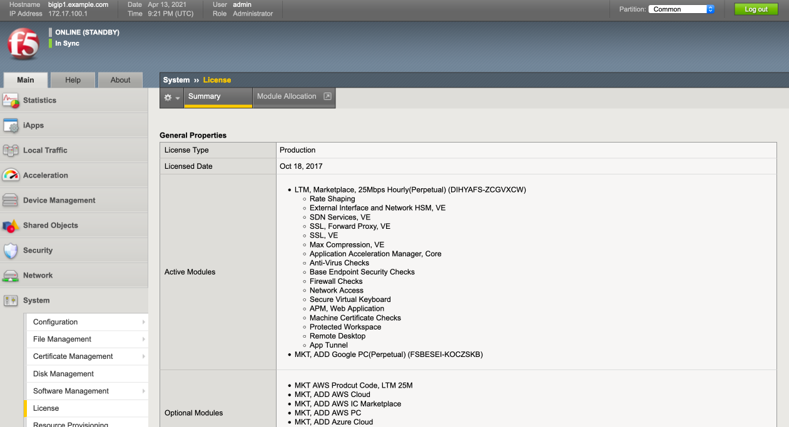

Establish Device Trust between Big-IPs
======================================

From Agility2021_GCP_Terraform_ATC click on Lab4.2-DO_HA under the drop down
menu, select "do_step1.json" request.
Right Click "Post as DO Declaration".
The Status will be 202 RUNNING.

.. image:: ./images/15_do_ha.png
   :scale: 50%

Wait a few minutes until status is 200 OK.  Use the DO verification in the blue
bar at the bottom of VS Code to refresh the status.

.. image:: ./images/15_do_ha_complete.png
   :scale: 50%

Now sign into BIG-IP Host 2 via the F5 VS Code extension. Click on Lab4.2-DO_HA
under the drop down menu, select "do_step2.json" request.
Right Click "Post as DO Declaration".
The Status will be 202 RUNNING.

.. image:: ./images/15_do2_ha.png
   :scale: 50%

Wait a few minutes until status is 200 OK

.. image:: ./images/15_do_ha_complete.png
   :scale: 50%

At the bottom of the VS Code window in the blue bar, you can click on the DO
(1.18.0) to submit a "GET" request to get the status of the DO execution.

.. warning:: Make sure Big-IP1 is active and Big-IP2 is standby before
   proceeding. To force Big-IP2 to standby: "Device Management" => "Devices" =>
   bigip2.example.com => [Force to Standby].

From the Big-IP1 Configuration Utility (WebUI), note that bigip1.example.com is
the "ONLINE (ACTIVE)" device and "In Sync".

From the Big-IP2 Configuration Utility (WebUI), note that bigip2.example.com is
the "ONLINE (STANDBY)" device and "In Sync".

