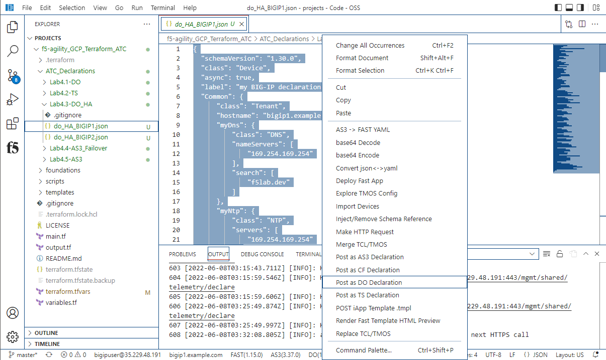
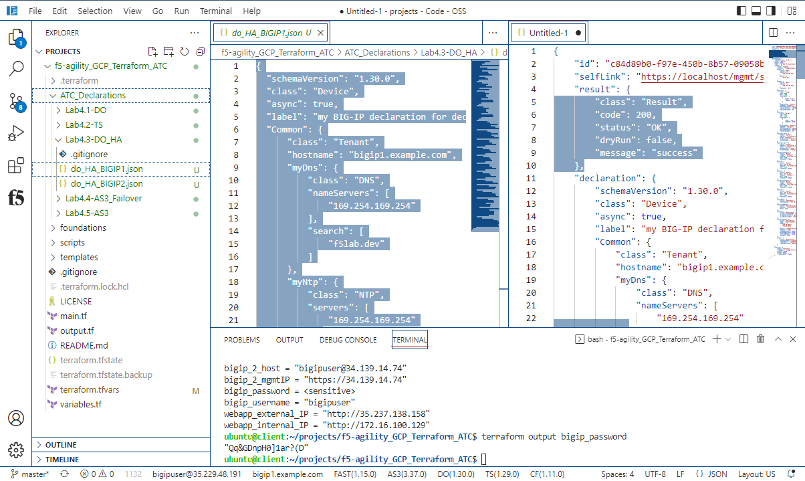
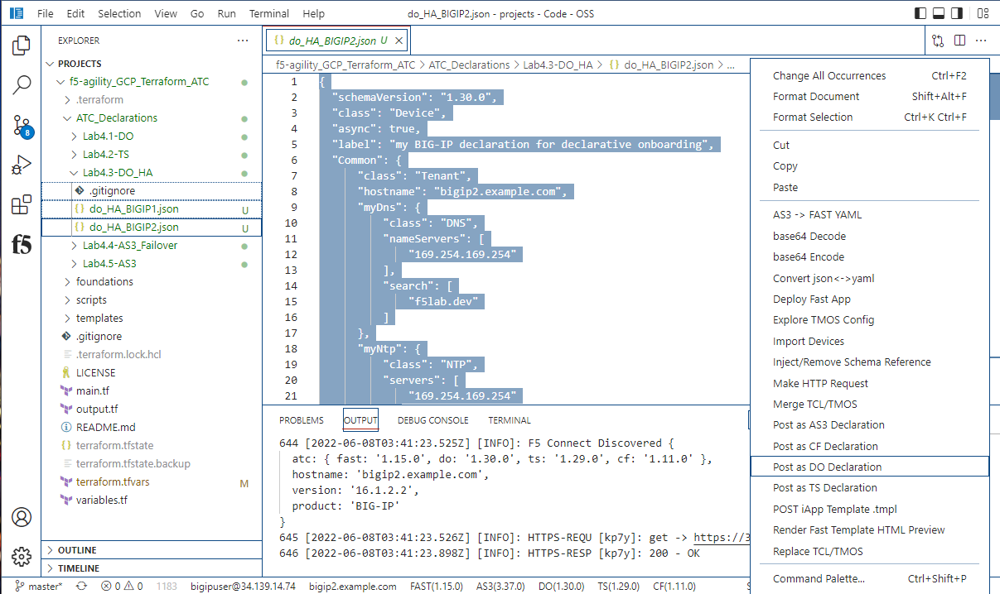
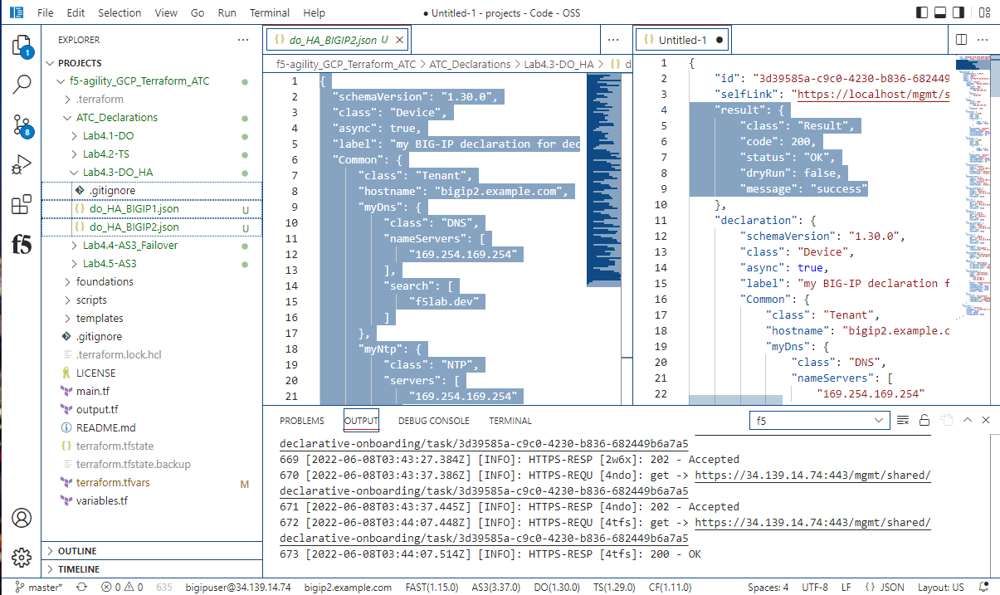
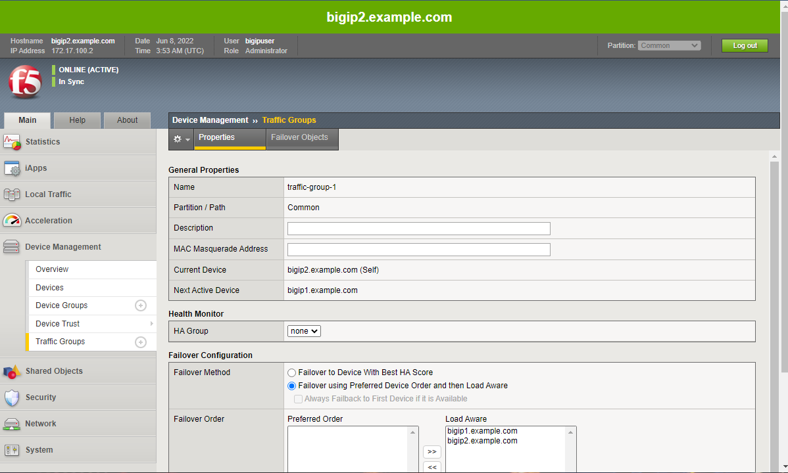
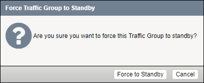
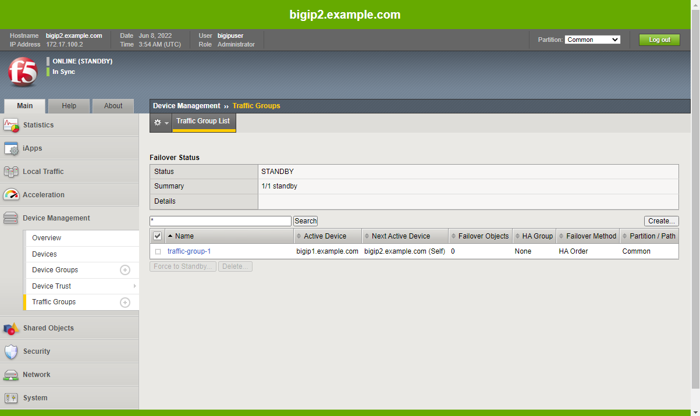

Establish Device Trust between Big-IPs
======================================

Please click on the F5 Extension icon on the left of the screen, and select bigip1.example.com.

.. warning:: Please ensure you are connected to the correct device with the F5 Extension before 
   posting a declaration.  A failure to do so may result in an error.

.. warning:: When resetting the password during the initial device gui login, if you did not 
   simply add your student number to the password, then you will need to update the declarations 
   to use the password that you used.  A failure to do so may result in an error.

From f5-agility_GCP_Terraform_ATC/ATC_Declarations click on Lab4.3-DO_HA under the drop down
menu, select "do_HA_BIGIP1.json" request.

Wait a few minutes until status returns.  A 200 or a 202 status is OK.  Use the DO verification in the white status
bar at the bottom of VS Code to refresh the status.

.. warning:: If the DO returns anything other than a "202 Accepted" or a "200 OK" 
   then it is suggested to ssh as admin@<ip address> to the BIG-IP in question, 
   and issue the command "bigstart restart restnoded" and once done, re-submit the DO declaration.

Now sign into BIG-IP Host 2 via the F5 Extension. Click on Lab4.3-DO_HA
under the drop down menu, select "do_HA_BIGIP2.json" request.

Wait a few minutes until status is 200 OK

At the bottom of the VS Code window in the white bar, you can click on the DO
(1.30.0) to submit a "GET" request to get the status of the DO execution.

.. warning:: Make sure Big-IP1 is active and Big-IP2 is standby before
   proceeding. To force Big-IP2 to standby: "Device Management" => "Devices" =>
   bigip2.example.com => [Force to Standby].

From the Big-IP2 Configuration Utility (WebUI), note that bigip2.example.com is
the "ONLINE (ACTIVE)" device and "In Sync".

From the Big-IP2 Configuration Utility (WebUI), Click the word Active
in the upper left corner.  Scroll to the bottom of the page and click the 
"Force to Standby" button.  The gui will ask you to confirm this action.

From the Big-IP2 Configuration Utility (WebUI), note that bigip2.example.com is
the "ONLINE (STANDBY)" device and "In Sync".

