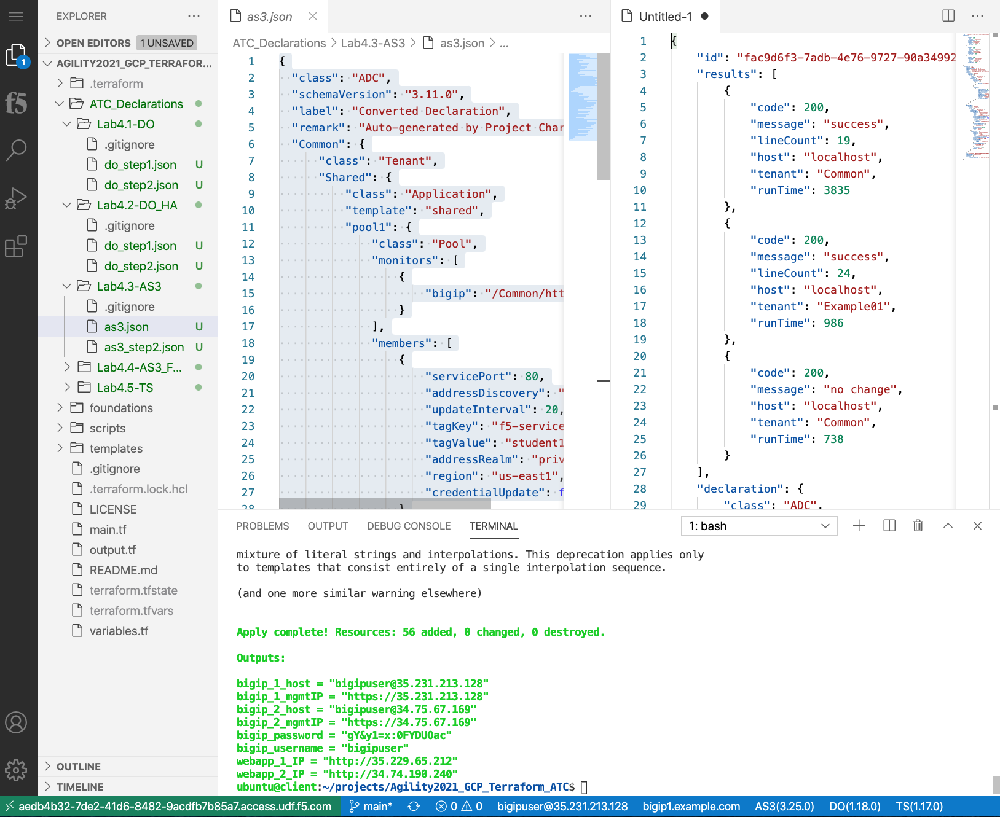
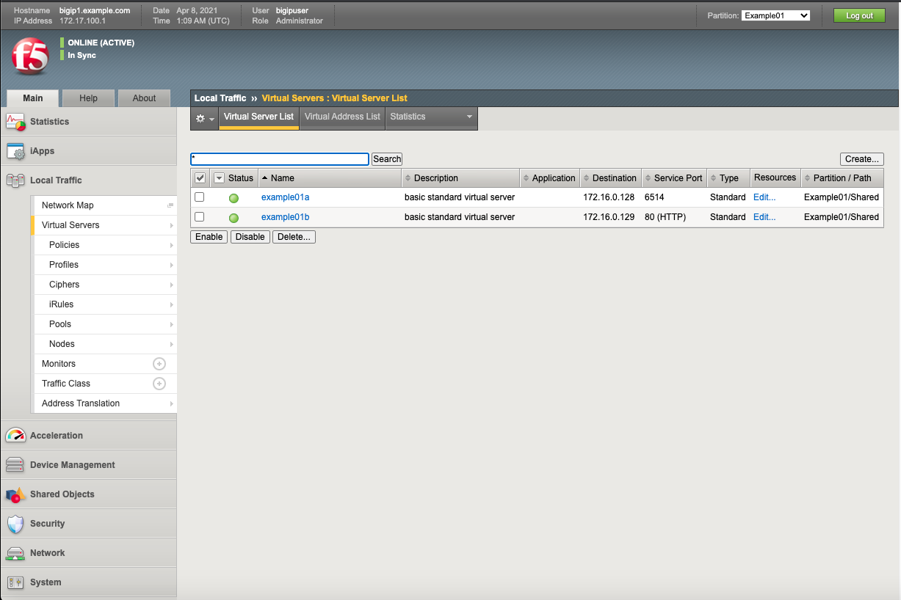
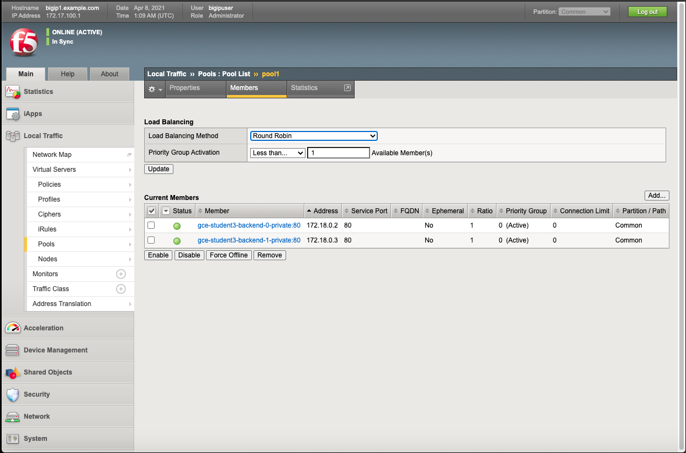

Using AS3 to create services
-----------------------------
Navigate to whichever device you want to post the AS3 declarations to.  The BIG-IPs in this lab are in a sync-failover group, with auto-sync enabled.  A change to one BIG-IP will be automatically be replicated to the other.

In the previous steps in module 2 you validated that there were no virtual servers on the BIG-IPs.  You can validate this again, but up until this point we have not modified the BIG-IPs to have any virtual servers.

Post AS3 declarations
---------------------

Click on Lab4.3-AS3 under the drop down menu, select "as3.json" request.
Right Click "Post as AS3 Declaration".

.. image:: ./images/21_as3.png
	   :scale: 50%

Status code 200 response signals that Application Services 3 Extension (AS3) is completed on Big-IP 1.

AS3 and Service Discovery
--------------------------

Review the Body of the declaration. The AS3 declaration is configured to discover pool members based on GCP labels.

Log into Big-IP1 => Local Traffic => Virtual Servers. Choose the "Example01" Partition from the Drop-down in the upper-right-hand corner. AS3 created two HTTP virtual servers: example01a and example01b.

Now within Big-IP1 => Local Traffic => Pools. Note "pool1". AS3 used GCP tags to discover and auto-populate pool1 with two web servers.

Log into Big-IP2 => Local Traffic => Virtual Servers. Choose the "Example01" Partition from the Drop-down in the upper-right-hand corner. Even though you only POSTED an AS3 declaration to Big-IP1, Config Sync replicated the Virtual Servers and all supporting configuration objects (pools, profiles, etc.) to Big-IP2.

