Verify F5 Cloud Failover is Ready
=================================

The F5 Cloud Failover Extension (CFE) is an iControl LX extension that provides 
L3 failover functionality in cloud environments, effectively replacing Gratuitous 
ARP (GARP). CFE uses a declarative model, meaning you provide a JSON declaration 
using a single REST API call rather than a set of imperative commands. The 
declaration then configures the BIG-IP system with all the required settings 
for cloud failover. 

Navigate to the GCP Compute Engine console and search for your BIG-IP1 device. It will be
named studentX-Y-ZZZZ - where X is the studentID you are using for this
lab and Y is the BIG-IP number. Select the VM instance for BIG-IP1 and then in 
the right hand panel, select the Labels tab.

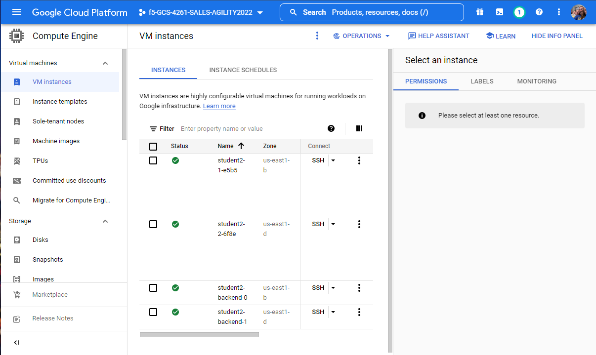

You will notice that there is a "Labels" section of this device which
contains the label of "f5-cfe-failover-label" and the value of "studenX," again
where X is the student ID you are using.

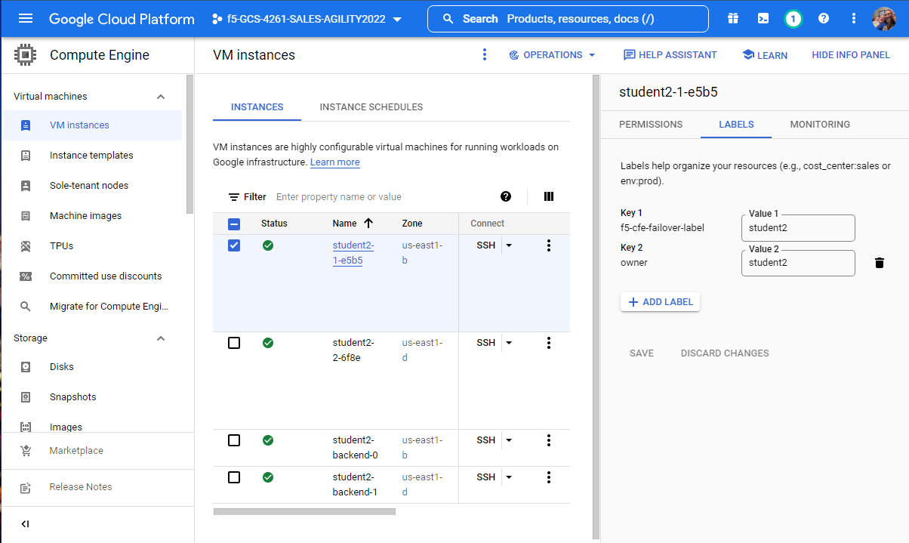

You can see that the CFE package is installed by navigating to
"iApps => Package Management LX" and note "f5-cloud_failover" package has been
installed on both devices.

.. image:: ./images/Lab4.4-AS3_CFE-BIGIP1_verifyExtension.png
   :scale: 60%
   :alt: Verify the CFE extension is loaded in TMUI

POST F5 Cloud Failover Declaration
----------------------------------

From the files tab click on "Lab4.4-CFE" => highlight all of the text in
"as3_cfe.json". => right click then select Make HTTP Request.

.. image:: ./images/Lab4.4-AS3_CFE-BIGIP1_Make_HTTPRequest.png
   :scale: 60%
   :alt: Make HTTP request

A "message:success" response indicates the f5-cloud-failover declaration was
successfully posted.

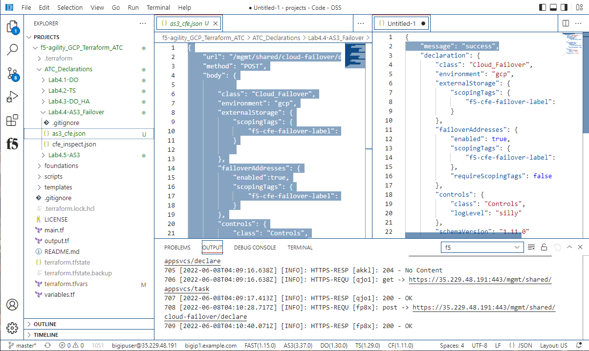

Post the declaration to BIG-IP2 as well.  The CFE configuration is not
synchronized as part of the DSC synchronization mechanism.

Review GCP specific configurations that Cloud Failover Extension can use
--------------------------------------------------------------------------

In your tab that has the Google CLoud Console open, in the Compute Engine,
select the VM that is BIG-IP1 and then click the three dots.  Select "View network details".

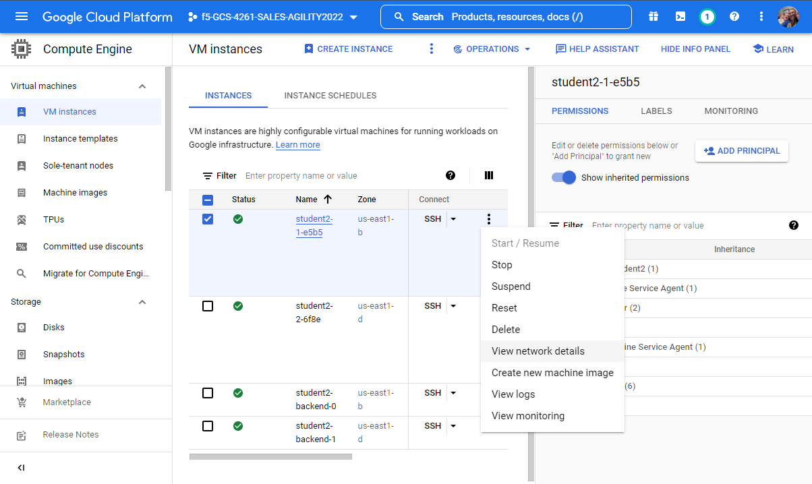

On this screen you should see that BIG-IP1 has Alias IP ranges assigned.

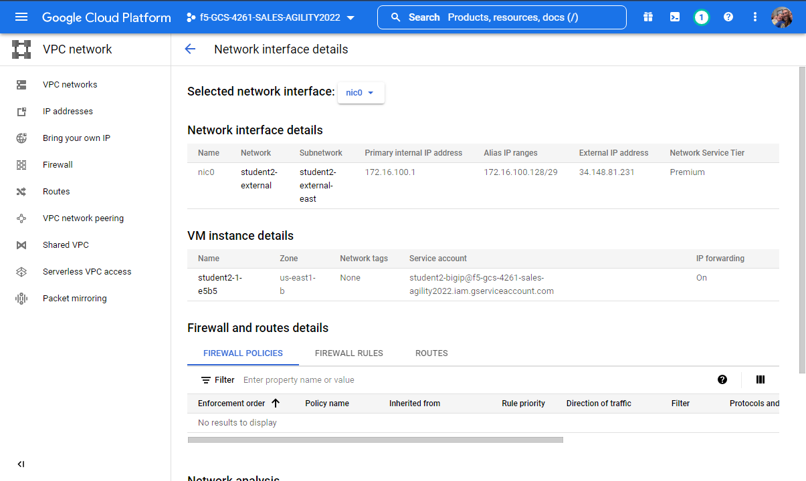

When we had terraform build BIG-IP1 (this was done in the main.tf file), we defined a secondary private ip 
on the external interface, which Google translates into Alias IP Ranges.

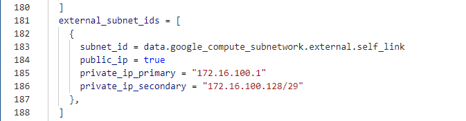

We have another Google Cloud Platform object that was created to facilitate moving traffic from one 
device to another, a Forwarding Rule.  In your Google Console, search for load balancer.  

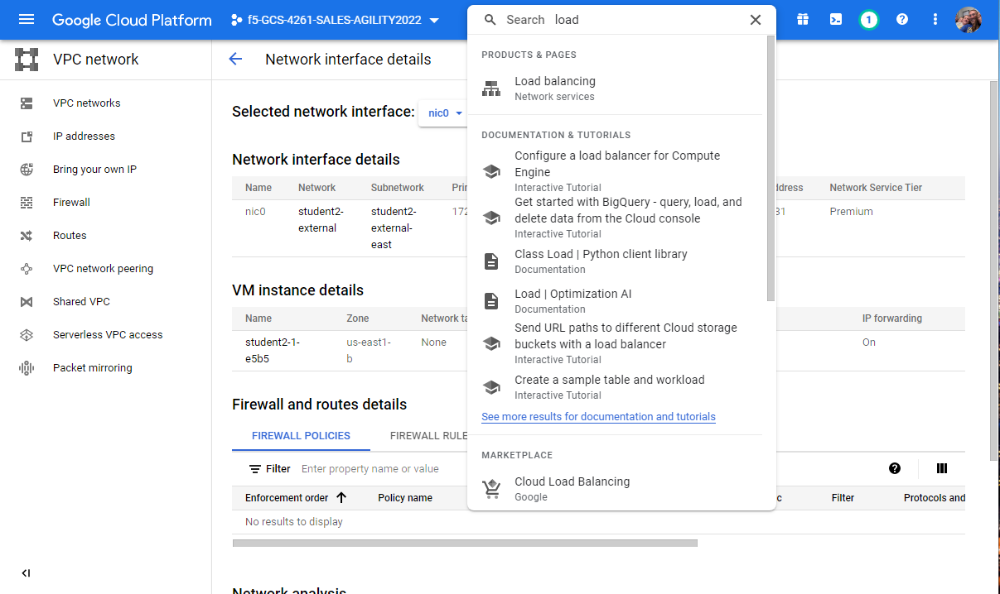

Now right click or command click and open the load balancing page in a new tab.  Once this is open, 
click on the advanced menu option. 

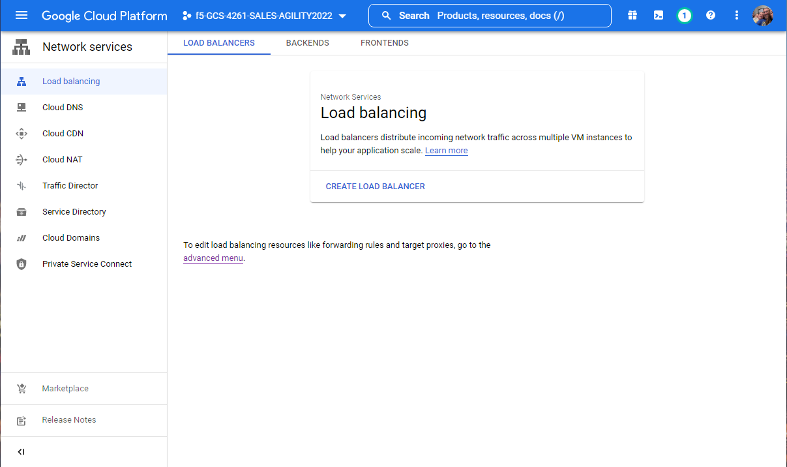

Find your student ID and you will see that there is an IP address and it is assigned to your BIGIP1.

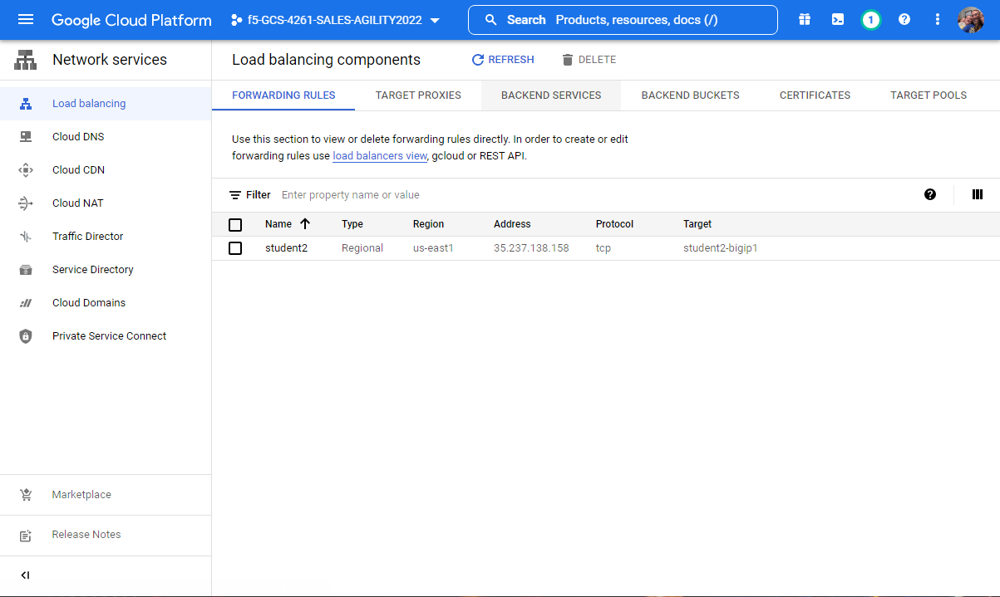

We used terraform (also done in the main.tf) to build this and also defined the targets for this forwarding rule.

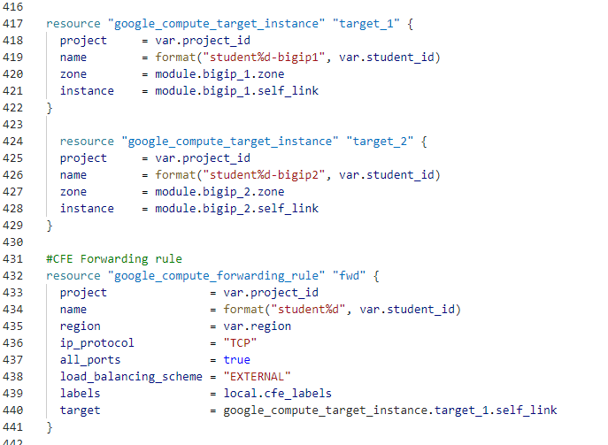

Test Failover
-------------

From Big-IP1, Device Management => Traffic Groups => traffic-group-1.

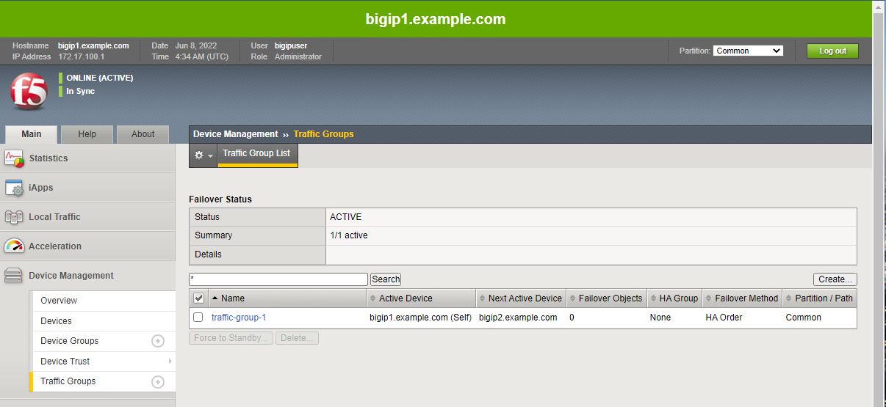

Force bigip1 to standby. Click [Force to Standby].

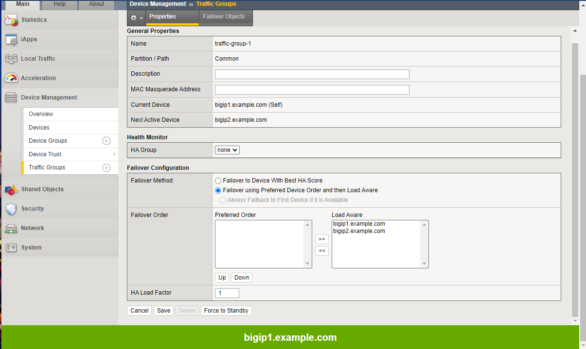

.. warning:: If you are not in the "Common" partition, the [Force to Standby] button will be greyed out.  Select /Common and it will now be active.

On Big-IP1, in the upper-left-hand corner, note "ONLINE (STANDBY)".

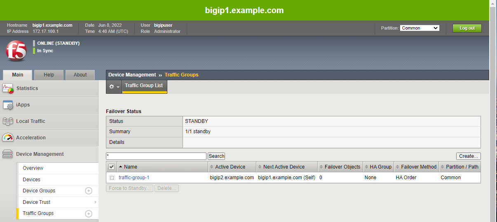

From Big-IP2, in the upper-left-hand corner, note "ONLINE (ACTIVE)". Big-IP2
was immediately promoted to active and Big-IP1 demoted to standby.

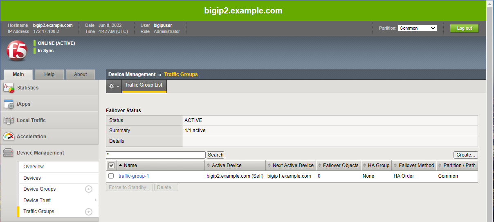

From Big-IP2, Device Management => Traffic Groups => traffic-group-1.

Force bigip2.f5lab.dev to standby. Click [Force to Standby].

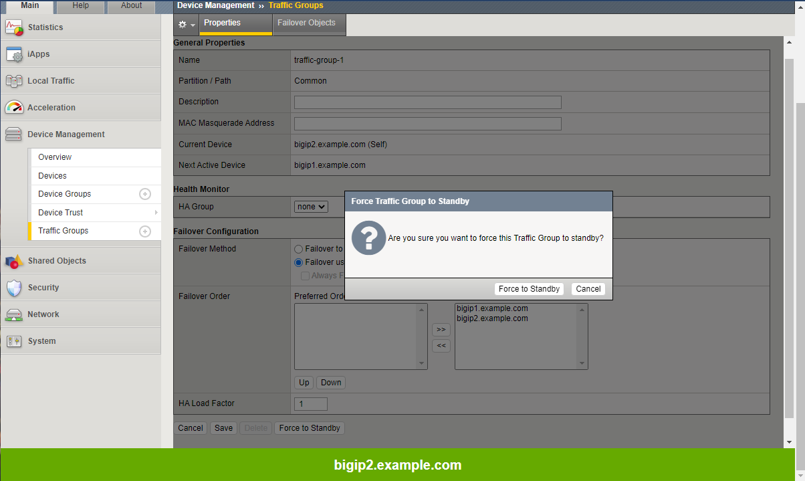

On Big-IP2, in the upper-left-hand corner, note "ONLINE (STANDBY)".

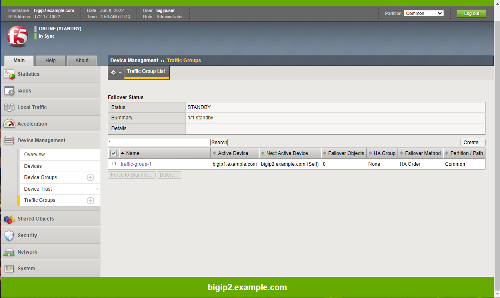

From Big-IP1, in the upper-left-hand corner, note "ONLINE (ACTIVE)". Big-IP1 is
now back to active.

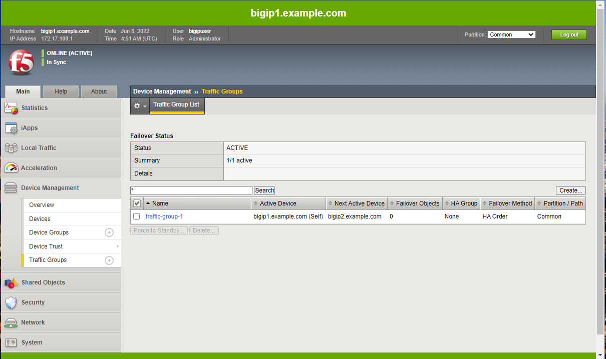
