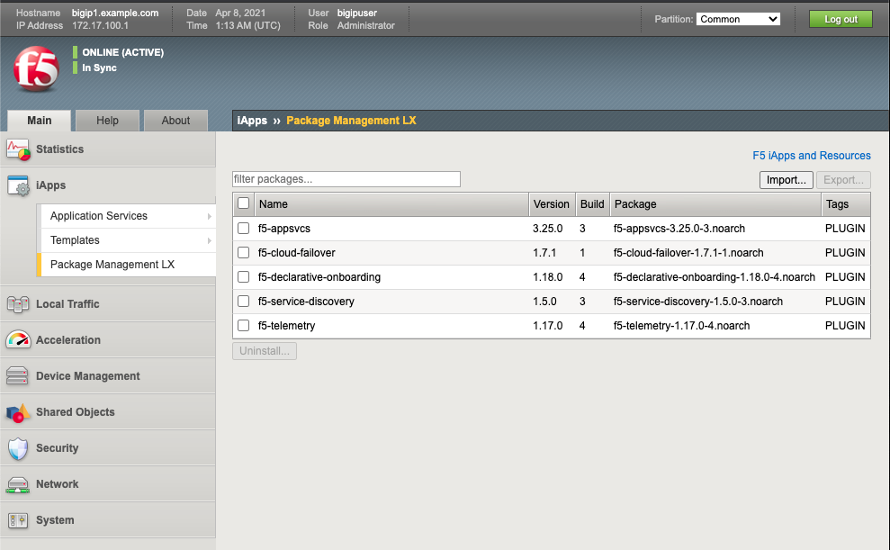
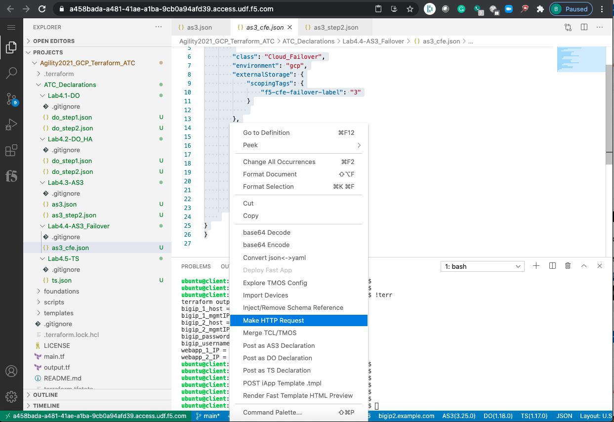
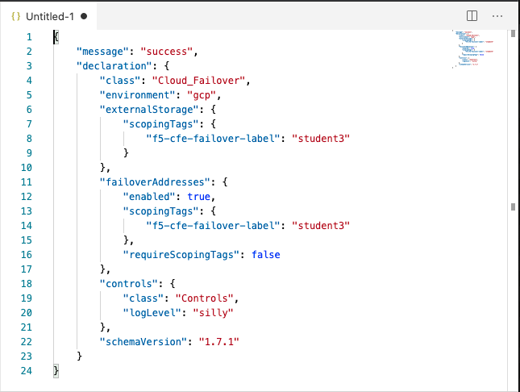
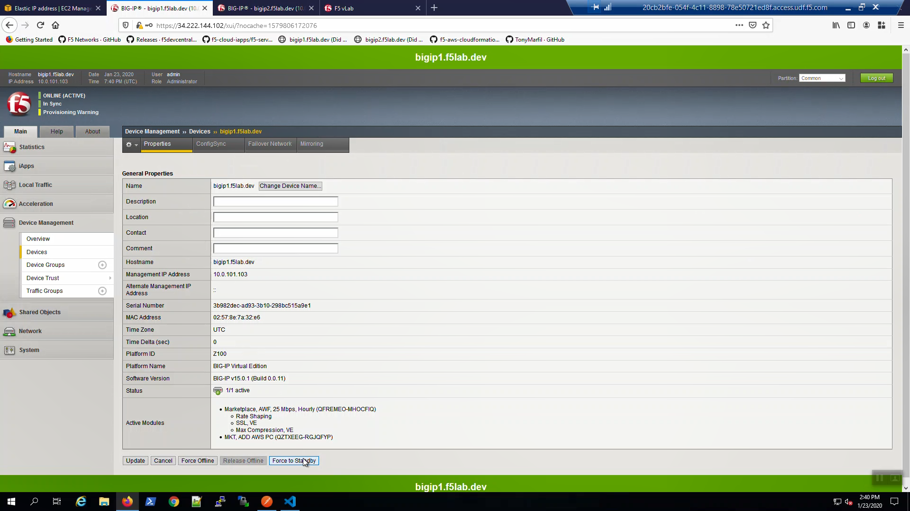
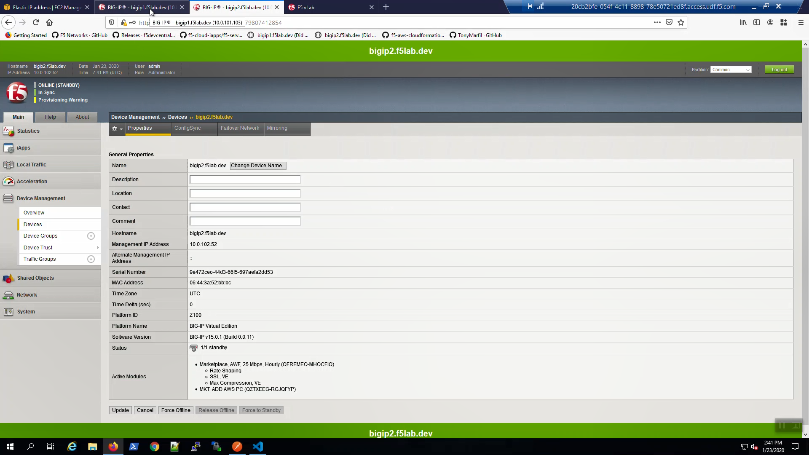
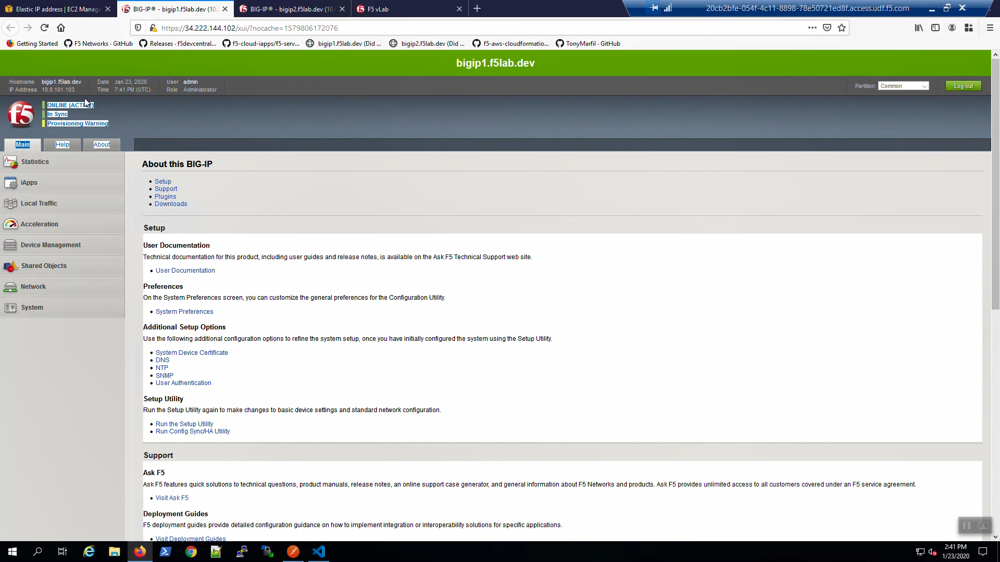

Check F5 Cloud Failover is Ready
--------------------------------

Big-IP1 => iApps => Package Management LX => note "f5-cloud_failover" package has been installed. 

Do the same for BIG-IP2

POST F5 Cloud Failover Declaration
----------------------------------

From the files tab click on "Lab4.4-CFE" => highlight all of the text in "as3_cfe.json". => right click then select Make HTTP Request.

A "message:success" response indicates the f5-cloud-failover declaration was successfully posted.

Test Failover
-------------

From Big-IP1, Device Management => Devices => bigip1(Self).

.. image:: ./images/11_device_bigip1.png
	   :scale: 50%

Force bigip1 to standby. Click [Force to Standby].

On Big-IP1, in the upper-left-hand corner, note "ONLINE (STANDBY)".

.. image:: ./images/13_device_bigip1_standby.png
	   :scale: 50%

From Big-IP2, in the upper-left-hand corner, note "ONLINE (ACTIVE)". Big-IP2 was immediately promoted to active and Big-IP1 demoted to standby.

.. image:: ./images/14_device_bigip2_active.png
	   :scale: 50%

From Big-IP2, Device Management => Devices => bigip2.f5lab.dev.

Force bigip2.f5lab.dev to standby. Click [Force to Standby].

.. image:: ./images/18_device_bigip2_force_to_standby.png
	   :scale: 50%

On Big-IP2, in the upper-left-hand corner, note "ONLINE (STANDBY)".

From Big-IP1, in the upper-left-hand corner, note "ONLINE (ACTIVE)". Big-IP1 is now back to active.

Back to the browser tab with the example application. [CTRL] + [F5] a few times to refresh the browser. We are using self-signed certificates in the lab. Bypass the TLS warnings. “Accept the Risk and Continue”.

.. image:: ./images/22_example_app_bigip1_bypass_warning.png
	   :scale: 50%

.. image:: ./images/23_example_app_bigip1.png
	   :scale: 50%
