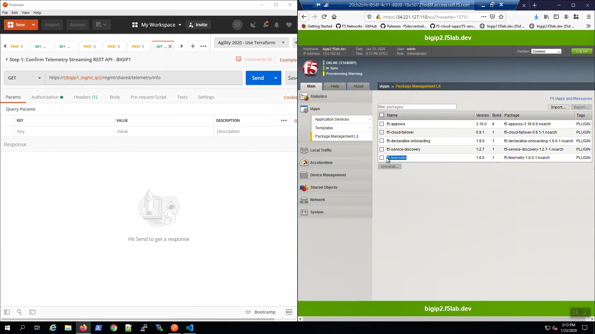
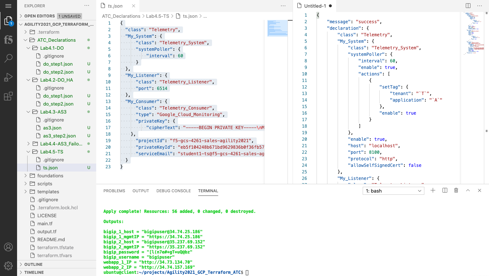
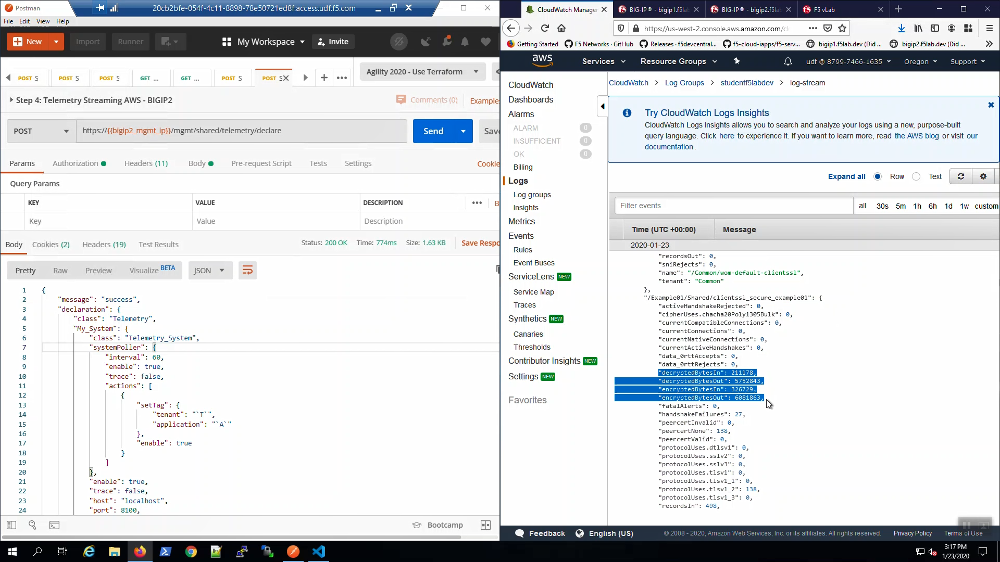

F5 Telemetry Streaming (TS) to GCP Monitoring
---------------------------------------------

From Big-IP1, iApps => Package Management LX. Note the f5-telemetry package is installed.

Do the same for Big-IP2.

From F5 VScode Extension, “Lab - Telemetry Streaming” => “Step 1: Confirm Telemetry Streaming REST API - BIGIP1” => [Send].

"Status: 200 OK" response signals that the Telemetry Streaming Extension (TS) is ready on Big-IP1.

.. image:: ./images/2_postman_telemetry_streaming_status_bigip1.png
	   :scale: 50%

From Postman, “Lab - Telemetry Streaming” => “Step 2: Confirm Telemetry Streaming REST API - BIGIP2” => [Send].

"Status: 200 OK" response signals that the Telemetry Streaming Extension (TS) is ready on Big-IP2.

.. image:: ./images/3_postman_telemetry_streaming_status_bigip2.png
	   :scale: 50%

From F5 VScode Extension, “Lab - Telemetry Streaming” => “Step 3: Telemetry Streaming AWS - BIGIP1” => [Send].
Click on Lab4.5-TS under the drop down menu, select "ts.json" request.
Right Click "Post as TS Declaration".

.. image:: ./images/1_ts1.png
	   :scale: 50%

"Status: 200 OK" response signals that the Telemetry Streaming Extension (TS) declaration successfully completed processing on Big-IP1.

Do the same for Big-IP2. From Postman, “Lab - Telemetry Streaming” => “Step 4: Telemetry Streaming AWS - BIGIP2” => [Send].

"Status: 200 OK" response signals that the Telemetry Streaming Extension (TS) declaration successfully completed processing on Big-IP2.

.. image:: ./images/6_postman_telemetry_streaming_completed_bigip2.png
	   :scale: 50%

From the GCP Console, Services => type "Monitoring" in the search box, choose "Monitoring" from the drop-down results.

.. image:: ./images/3_ts3.png
	   :scale: 50%

From the GCP Console, Monitoring => Metrics explorer 

.. image:: ./images/4_ts4.png
	   :scale: 50%

Click on query editor in the editor type fetch generie_node :: custom/system/cpu. Then click Run Query

.. image:: ./images/4_ts4.png
	   :scale: 50%

TODO		

Eventually you will see telemetry data 

.. image:: ./images/9_aws_console_cloudwatch_telemetry_streaming.png
	   :scale: 50%

