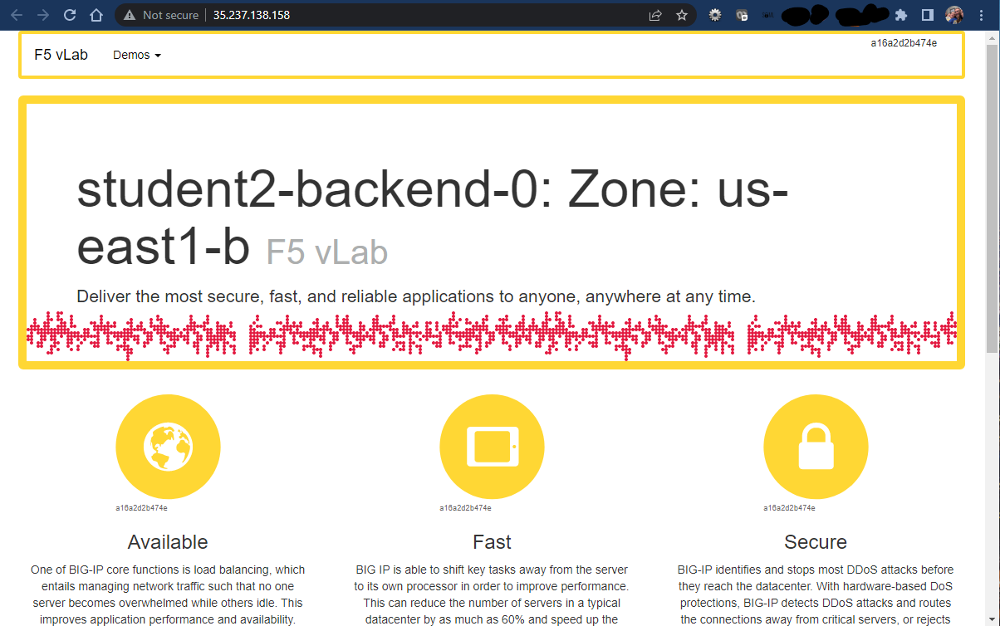
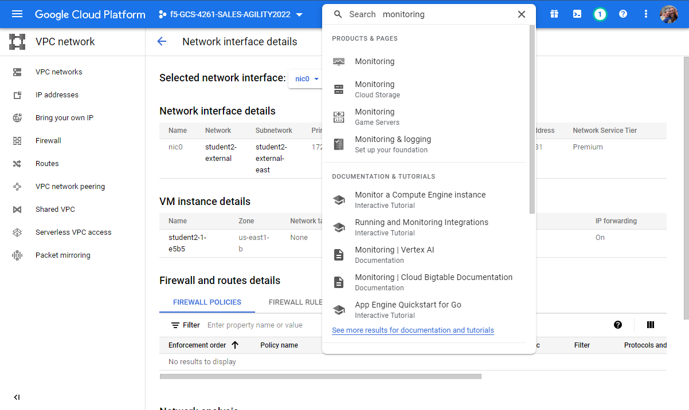
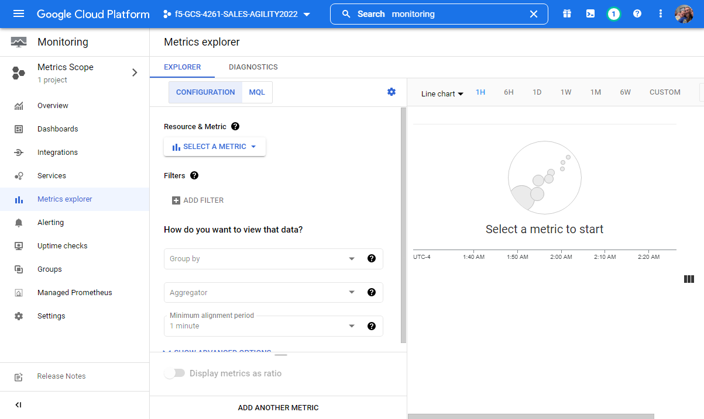
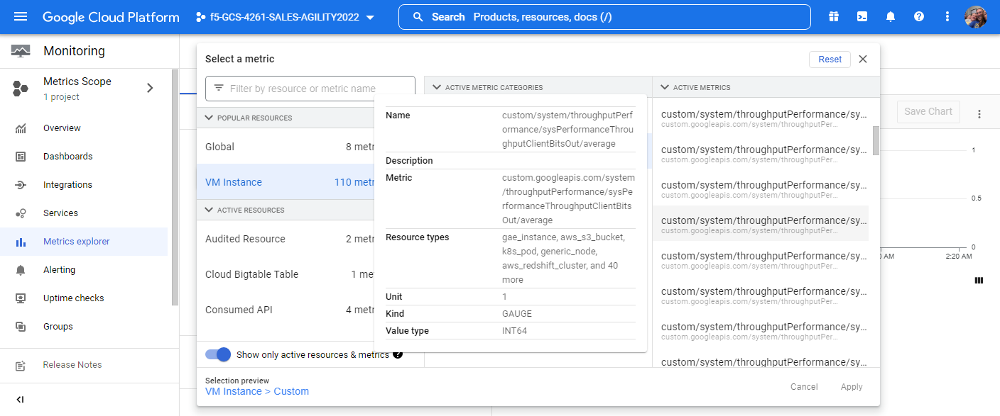
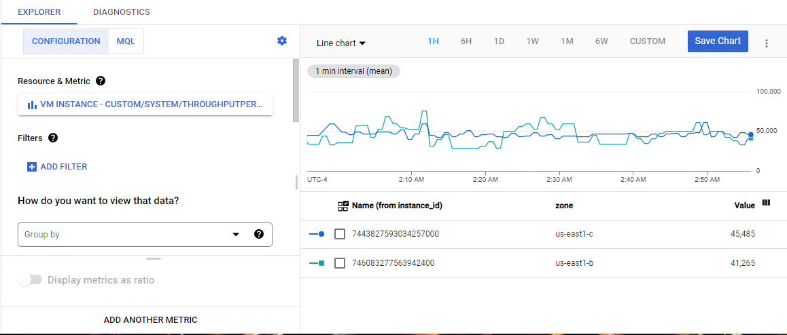

F5 Telemetry Streaming to Google Cloud Operations Suite’s Cloud Monitoring
==========================================================================

In the previous lab, you should have generated some traffic that will 
appear in the Google Cloud monitoring infrastructure.

Now from the Google Cloud Console, Services => type "Monitoring" in the search box,
choose the first "Monitoring" option from the drop-down results.

From Monitoring on the side panel => Metrics explorer.

Click on box below Resource & Metric, select VM Instance --> Custom --> 
custom/system/throughputPerformance/sysPerformanceThroughputClientBitsOut/average and press apply.

This may take a few minutes, but eventually you will see telemetry data start
to be shown.
