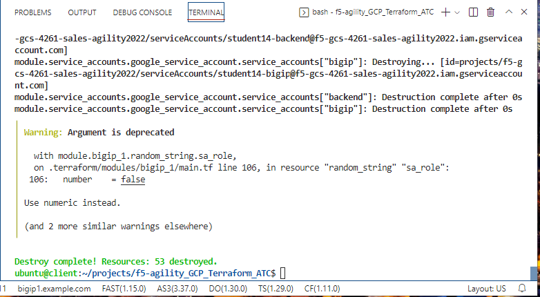

Terraform Destroy
=================

This is the end of using the F5 Automation Toolchain.  In this step we will be
removing all of the infrastructure that was created for your lab with
Terraform. To do that we'll run:

.. code-block:: bash
   
   terraform destroy -auto-approve

Go into the Google Cloud App. You'll find that there should be no resources for your
student ID. A terraform destroy command should clean up all resources that are
maintained in the state file.

We hope you enjoyed this lab. Please make sure to fill out a survey before
leaving!

Fin.
