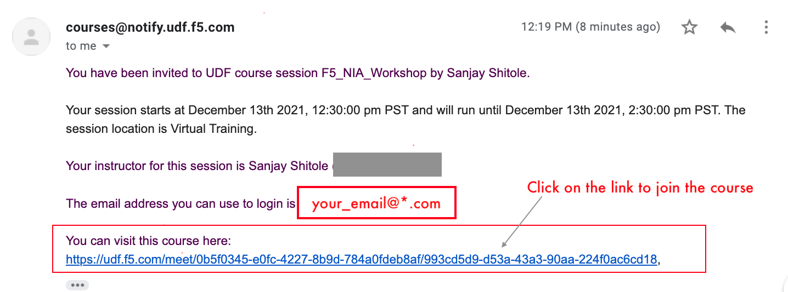
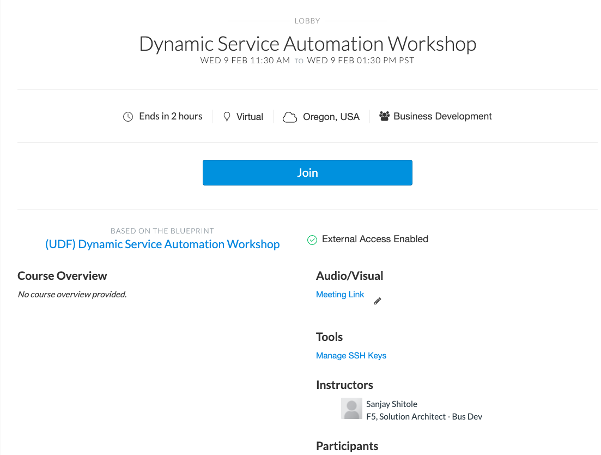
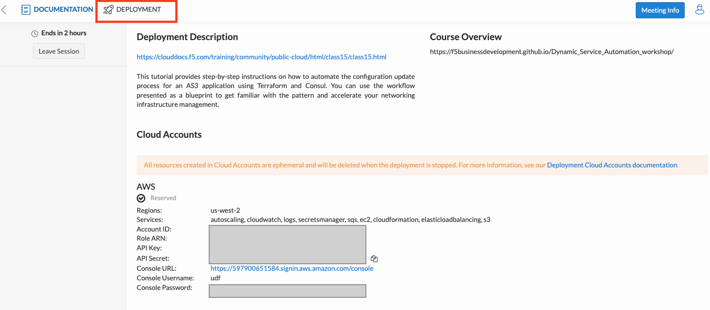
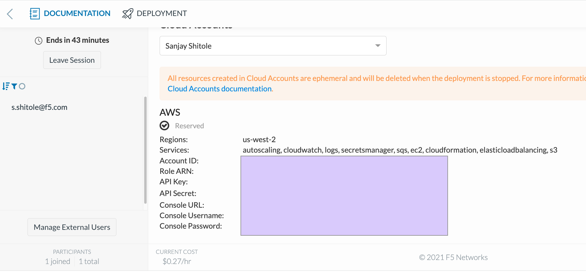

Login to F5's lab platform (Unified Demo Framework)
===================================================

Prior to this workshop, student must have received an email with your login instructions and a link to access the UDF course. We need this to access and deploy infrastructure on AWS for this lab.
Follow the link in your email invite and login to the lab environment.

Your Deployment => Systems => Client => Access => VS Code.



2. On clicking the link, you will enter the course lobby as shown below. Verify the course name (Dynamic Service Networking) and click Join.



3. Click on DEPLOYMENT buttom on the top left to begin provisioning your personal lab access server and network in AWS. Here we are creating a ubuntu server to access to AWS resources
Here we are creating a ubuntu server to access to AWS resources



4. Ensure the 'Region' is ``` us-west-2 ```
   Currently the lab is only design for AWS resources in us-west-2

5. On the browser, under the deployment tab, click on **Cloud Accounts** and look for the **API Key** and **API Secret** as shown below
   We will be using these AWS Secret Keys to authenticate the AWS Cloud to create infrastructure.



6. Copy the **API Key** & **API Secret key** into your clipboard

.. warning:: We will be returning to lecture at this point of the lab. We will
   allow the BIG-IPs to start up for all students during the lecture.
