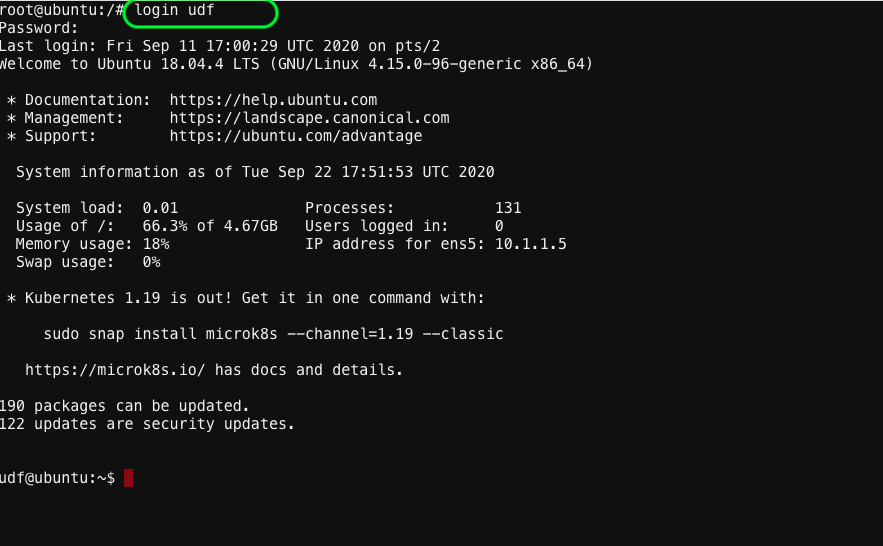

Access Ubuntu Shell 
=====================

7. Access your Ubunutu webshell by clicking on Components TAB & then click on Ubuntu –> Access –> WEB SHELL.

.. image:: ./images/7_your_deployment.png
   :scale: 50%
   :alt: UDF Access

8. Once you are on the CLI, at the prompt type: ``` login udf ``` & when prompted for Password, type ``` udf ```
   Our username for the ubuntu server  is ```udf``` we will use this account to create resources on AWS



9. Configure your API key and API secret key using the below commands. 
   **Note:** you will need to use your API key and API secret key you copied earlier in step 5 & 6

.. code-block:: bash

aws configure

    AWS Access Key ID [****************CGGT]:XXXXXXXXXXXXX

    AWS Secret Access Key [****************QmTY]:XXXXXXXXXXX


.. warning:: We will be returning to lecture at this point of the lab. We will
   allow the BIG-IPs to start up for all students during the lecture.
