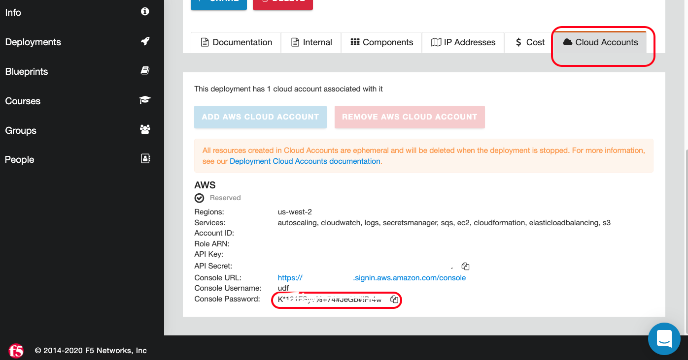
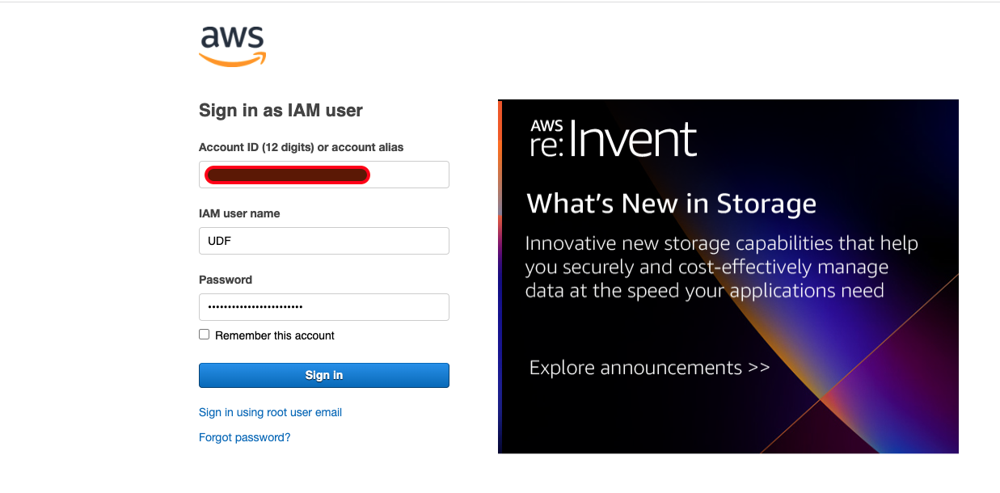
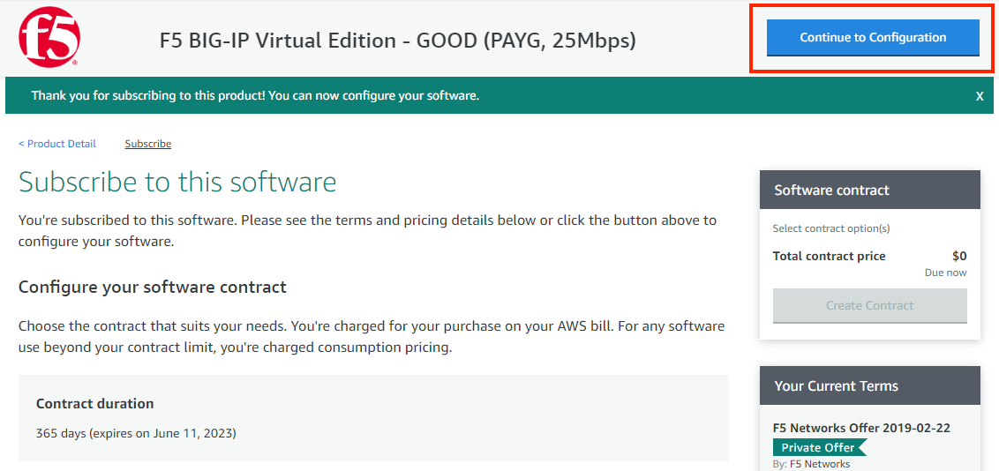
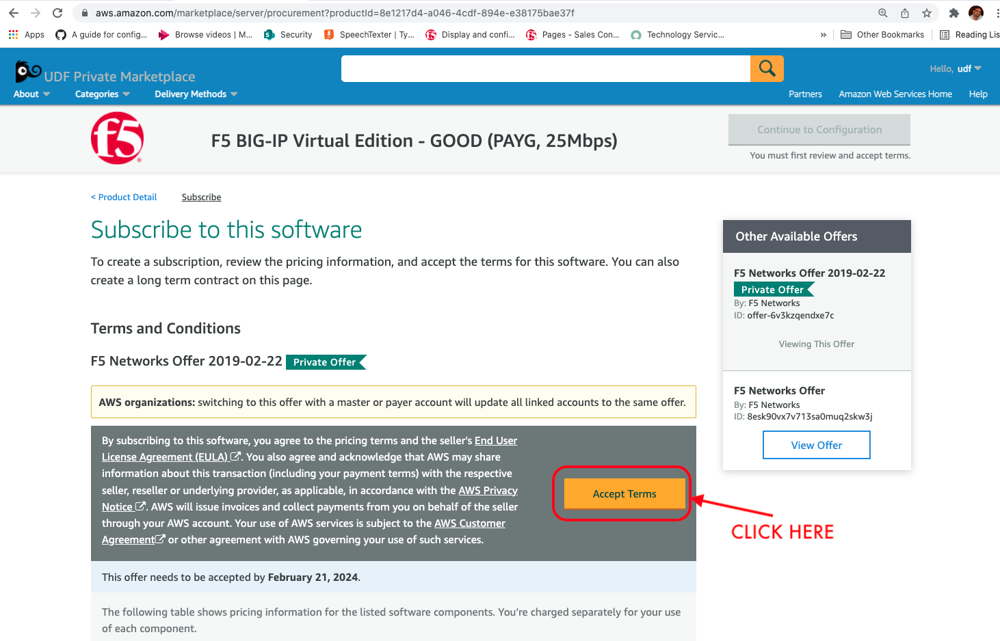
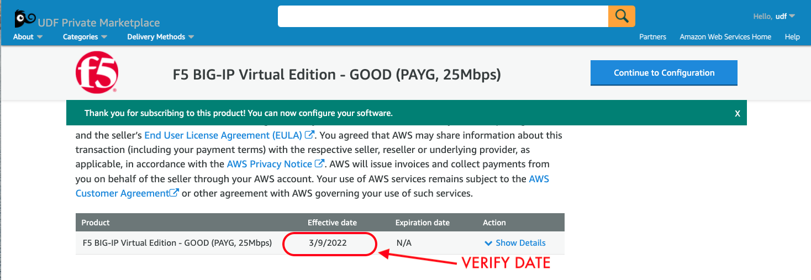

Subscribe to F5 BIG-IP from AWS marketplace
============================================

1. Login to AWS Console by going to UDF Blueprint –> Cloud Accounts –> Console URL (We are logging into AWS Console to subscribe BIG-IP VE)

2. Sign In into the AWS Conole make sure you use account
   and password you got from the previous step

3. To subscribe F5 BIG-IP on market place copy and paste the link https://aws.amazon.com/marketplace/pp?sku=8esk90vx7v713sa0muq2skw3j in the browser
   OR Search for F5 BIG-IP Virtual Edition - GOOD (PAYG, 25Mbps), Subscribe to the trial service and click ‘Accept’.

   **Note:**  Once you hit Accept it will take atleast one minute to change the pending status

4. Wait for the effective date to change from pending to an actual date

