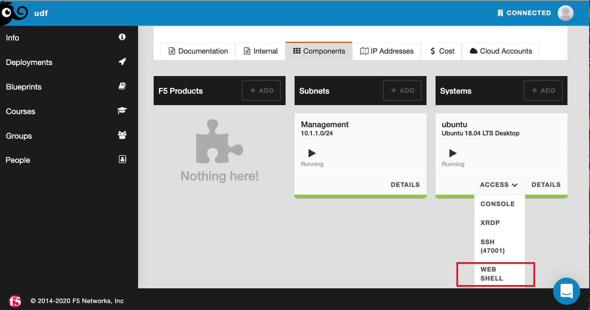
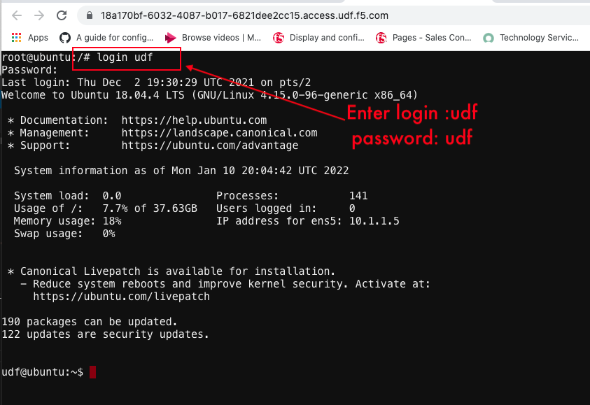

Login to Ubuntu using Web Shell
===============================
Now we need to access the ubuntu server and do web shell login, this we are doing so that 
we can use the terraform TF files to create infrastructure on AWS 

1. Open the Web Shell if not open and login to ``udf/udf``

2. Now login to ubuntu server with ``udf`` and password ``udf``

Once you are IN, Change Directory to as shown below, this we need to do inorder to run the terraform scripts for infra deployment.

.. code-block:: bash

   cd f5-terraform-consul-sd-webinar/
