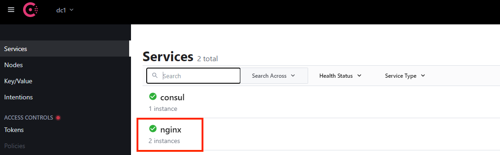

Deploy Consul Data Center BIG-IP and Backend application
========================================================

.. code-block:: bash
   
   $ cd terraform/

    
Generate a random password for your F5 BIG-IP instance.

.. code-block:: bash

   $ ./admin-shadow.sh

Use the ``terraform.tfvars.example`` template file to create a ``terraform.tfvars`` file. 
The example file is in the terraform folder.

.. code-block:: bash

   $ cp terraform.tfvars.example terraform.tfvars

Edit file ``terraform.tfvars`` to specify a prefix for the resources being created and an IP address to access the environment once deployed.

.. code-block:: bash

   $ terraform.tfvars 

`prefix = "your-prefix"   ---> This can be your initials``

`allow_from = "0.0.0.0/0"  ---> You can give your Labtop IP also instead of 0.0.0.0/0`

Once the configuration is complete, you can deploy the infrastructure with Terraform.

First, initialize Terraform.

.. code-block:: bash

   $ terraform init

**Note:** If ``terraform init`` fails with Error: Failed to install provider issue the command again.

Then, use ``terraform plan`` to check the resources that are going to be created.

.. code-block:: bash

   $ terraform plan

.. glossary::

   ...
   Plan: 30 to add, 0 to change, 0 to destroy.
   ...

Finally, apply the changes.

.. code-block:: bash
   
   $ terraform apply -auto-approve

.. glossary::

   ...
   Apply complete! Resources: 30 added, 0 changed, 0 destroyed.

   Outputs:
   
   Consul_UI = http://3.86.229.209:8500
   F5_IP = 52.44.244.96
   F5_Password = L5l81KPsxv
   F5_UI = https://52.44.244.96:8443
   F5_Username = admin
   F5_ssh = ssh -i terraform-20210803123725302700000001.pem admin@52.44.244.96
   ...

- The final part of the Terraform output provides you with the information to access your infrastructure.
  You can access your Consul datacenter UI using the address specified by the ``Consul_UI`` value.

