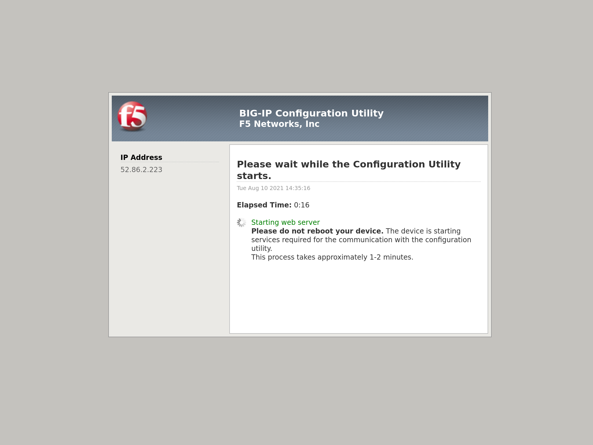

Verify Services on Consul and BIG-IP
====================================

- Using the ``Consul_UI`` IP address access the Consul

.. image:: ./images/assets.png
   :scale: 100%
   :alt: UDF Access

- From the Consul UI you can verify the datacenter contains two instances of NGINX running on two different nodes.

- By opening your browser at the URL specified by the ``F5_UI`` variable, you can access your F5 BIG-IP instance GUI.

- After the device finishes booting, use the ``F5_Username`` and ``F5_Password`` values to login.